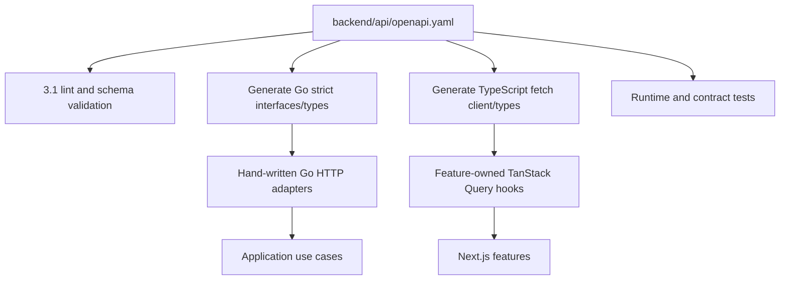

# OpenAPI And TypeScript Generation Workflow

## Purpose And Source Of Truth

OpenAPI 3.1 is the executable contract between the Go API and the Next.js TypeScript application. The canonical authored entrypoint is:

```text
backend/api/openapi.yaml
```

It is the source of truth for paths, parameters, security requirements, request/response schemas, error codes, examples, and operation IDs. Generated Go and TypeScript code is derived output and is never edited manually. Markdown explains intent and trade-offs; when it conflicts with the validated specification, the inconsistency must be fixed rather than allowing two contracts.

M0 Task 2 implements the initial compatibility fixture: public liveness/readiness,
the shared error and request-correlation shapes, opaque cookie security, and
`GET /api/v1/organizations/{organizationId}` as a future M1 tenant-route contract.
The organization operation is generated but has no handler or product behavior yet.

The current single-file contract accepts document-local JSON Pointer references only.
The repository checks this before any general-purpose OpenAPI resolver runs, preventing
unexpected file or network reads from authored `$ref` values. The source may later be
split when reviewability demands it, but that change must introduce an explicit,
allowlisted bundling boundary; external consumers still receive one canonical artifact.

## Contract Rules

Every operation defines:

- one globally unique, stable `operationId`;
- domain tag and concise authorization/permission description;
- all success and documented error responses using shared components;
- tenant `organizationId` path parameter for tenant-owned resources;
- opaque cookie-session security unless explicitly public/health-only, plus CSRF requirements on unsafe methods;
- `Idempotency-Key` and replay/conflict responses where required;
- `If-Match`, `ETag`, and precondition responses for versioned mutation;
- cursor, filter, and sort schemas for collections;
- representative valid and invalid examples;
- request/response size, format, nullability, and closed-object constraints where supported.

Reusable components include UUIDs, RFC 3339 timestamps, date-only fields, decimal money, currency, pagination metadata, error envelopes/details, request IDs, ETags, cursors, and idempotency headers. Tenant-owned schemas expose `organizationId` where useful for client validation but never allow callers to set or change ownership independently of the route.

The API describes the browser's opaque cookie session through an OpenAPI `apiKey` security scheme in `cookie`, and documents the session-bound CSRF header on unsafe methods. Cognito OIDC exchange, refresh, and provider tokens stay behind the Go identity/session boundary. A future service/tool bearer scheme must use explicitly selected operations and cannot be accepted ambiguously alongside a browser session. Environment-specific issuer/discovery URLs remain deployment configuration, not hardcoded production values in source.

## Generated Artifacts

```text
backend/
├── api/openapi.yaml                     # authored source
└── internal/gen/openapi/                 # generated Go types/strict server interfaces

frontend/
└── src/lib/api/generated/                # generated TypeScript types and fetch client
```

The implemented toolchain pins `ogen` 1.24.0 for strict Go server types/interfaces,
`@hey-api/openapi-ts` 0.99.0 for the generated TypeScript fetch client, Redocly CLI
2.51.0 for linting, and `oasdiff` 1.28.0 for semantic compatibility. The fixture
proves the OpenAPI 3.1 features, error unions, optional fields, headers, UUID/date-time
formats, and security scheme currently used by ClouDesk. A failed compatibility
fixture reopens the tool decision explicitly with an ADR and consumer-impact
evidence; it is not permission to downgrade the contract or silently ignore
unsupported schema keywords.

Generated Go interfaces terminate at transport adapters. Hand-written handlers translate generated request types to application commands and map typed results/errors back to generated response variants. Generation does not create domain services, repositories, SQL, or authorization.

The TypeScript output supplies request/response types and a typed transport. Client
authentication generation is disabled deliberately: browser JavaScript cannot and
must not read the HttpOnly session cookie; the hand-written runtime added in Task 4
will use same-origin credentials and attach CSRF only to unsafe methods. Feature-owned
TanStack Query hooks and query-key factories remain hand-written around that client
so cache keys always include `organizationId` and UI invalidation follows domain
behavior. Frontend code does not duplicate API DTOs with hand-written lookalikes.

Generated artifacts are committed for reviewable cross-stack changes and reproducible consumer builds. CI regenerates them from a clean checkout and fails on any diff. Tool versions and generation flags are pinned in repository manifests or immutable build images.

## Server Integration



The generated strict server layer parses and validates documented transport shape before dispatch. Server middleware still enforces authentication, tenant membership, body limits, rate limits, correlation, and timeouts. Application/domain validation remains authoritative for business rules. Runtime response validation is enabled in non-production contract/integration tests; production avoids a second unbounded serialization pass unless measurements justify it.

Unknown JSON fields are rejected where closed schemas are declared, preventing silently ignored client mistakes. The implementation also rejects ambiguous duplicate JSON keys before normal decoding if the selected generator/runtime does not do so.

## TypeScript Runtime Behavior

The generated client accepts an injected fetch implementation/interceptor chain that:

- sends same-origin credentials and adds the session-bound CSRF token to unsafe methods without exposing the HttpOnly session cookie;
- sets/returns request correlation and trace headers according to browser policy;
- preserves `organizationId` as an explicit path argument and query-key component;
- parses the shared error envelope into a typed application error;
- starts one centralized reauthentication/session-refresh path for an eligible `401`, without hidden mutation replay;
- never automatically retries non-idempotent mutations without the same caller-owned idempotency key;
- respects `Retry-After` and cancellation through `AbortSignal`.

The generated directory contains no application state, token storage, notifications, or React components.

## Contract Commands And Future CI Pipeline

The repository now exposes `pnpm generate:openapi`, `pnpm lint:openapi`, and
`pnpm check:generated`. Linting combines the OpenAPI ruleset, ClouDesk-specific
tenant/security/correlation assertions, schema validation with external references
disabled, and a breaking-change comparison against `OPENAPI_BASE_REF` (defaulting to
`origin/main`) when that ref contains a contract. Task 8 will invoke the same commands
in pull-request CI.

The complete M0 pipeline runs the following conceptual gates with pinned tools:

1. reject non-document references, then parse and lint the OpenAPI 3.1 document,
   resolve its internal references, and validate examples;
2. enforce local rules: tenant route shape, stable `operationId`, shared error responses, security declarations, bounded pagination, idempotency, and preconditions;
3. generate Go and TypeScript artifacts from a clean tree;
4. format generated artifacts and fail if the working tree differs;
5. compile/typecheck Go and TypeScript consumers;
6. run Go handler and frontend client contract fixtures;
7. compare the candidate contract with the target branch using a pinned semantic OpenAPI diff tool such as `oasdiff`;
8. publish a bundled spec artifact for review after all checks pass.

A formatter or successful code generation alone does not prove compatibility. The compatibility fixture includes every schema feature ClouDesk relies on and blocks generator upgrades that change emitted semantics unexpectedly.

## Breaking Changes And Versioning

The semantic diff gate blocks known breaking changes by default. A deliberate break requires a new URI major, an ADR, a consumer migration plan, and parallel support/retirement dates. [API conventions](conventions.md) define the compatibility policy, including enum additions that can break exhaustive generated clients.

Stable `operationId` values are part of the generated-client API and do not change during refactors. Schema names are also preserved when exported by generated code. Documentation-only descriptions and new optional endpoints still receive review but normally remain V1-compatible.

Deprecation appears in the OpenAPI `deprecated` field and operation description, with runtime `Deprecation`, `Sunset`, and successor `Link` headers where relevant. Deprecated operations remain in generation until their announced retirement.

## Contract Test Matrix

- Every documented success and error example validates against the bundled schema.
- Go handlers return only declared statuses, headers, and bodies.
- The generated TypeScript client correctly parses success, error, nullable, money, date/time, cursor, ETag, and async-status examples.
- Authentication and tenant parameters are required on every protected route.
- Cross-tenant path/resource combinations produce the documented concealed `404` response.
- Required idempotency and precondition headers are present and typed.
- Breaking-change fixtures demonstrate that field removal, required-input addition, response-status change, and operation ID rename fail CI.
- Generated output is deterministic on the supported development and CI platforms.

## Ownership And Change Process

The backend/API owner reviews transport and server feasibility; the frontend owner reviews generated consumer ergonomics; security reviews authentication, authorization disclosure, and sensitive schemas; database/domain owners review consistency and transaction consequences. A contract-changing pull request updates OpenAPI first or atomically with consumers, regenerates artifacts, updates relevant Markdown, and supplies compatibility evidence.

No team copies generated types into a second manually maintained model solely for convenience. Domain-specific frontend view models and Go domain types are valid when they represent a different concern and are mapped explicitly at the boundary.
