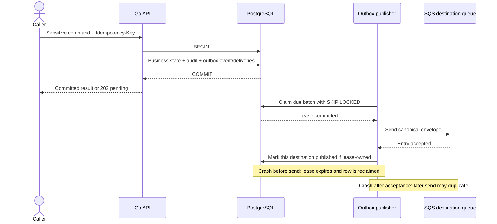

# Proposed Asynchronous Processing Architecture

## Purpose And Status

This document defines the target asynchronous-processing contract for ClouDesk. It
is a design, not an implemented runtime. It makes slow or failure-prone work durable
without turning the modular monolith into an initial microservice system.

The governing decisions are [modular monolith and independent workers](../decisions/ADR-004-modular-monolith-and-workers.md),
[Amazon SQS](../decisions/ADR-007-amazon-sqs-messaging.md),
[transactional outbox and inbox](../decisions/ADR-008-transactional-outbox-and-inbox.md),
and [persisted HTTP idempotency](../decisions/ADR-009-idempotency-keys.md). See also
the [Go backend](backend.md), [container view](containers.md), and
[resilience policy](resilience.md).

## Processing Guarantees

ClouDesk targets **at-least-once transport and effectively-once durable effects**,
not exactly-once delivery. The following invariants define that claim:

- PostgreSQL is authoritative. A business mutation and every required outbox event
  commit in one local transaction; the API never publishes directly to the broker.
- A successful commit may be published more than once. Every consumer is therefore
  idempotent and deduplicates by immutable event ID in its own durable boundary.
- A message is deleted from SQS only after its database effect, or a durable intent
  for a non-transactional external effect, has committed.
- There are no external network calls inside the source business transaction.
- Delayed, duplicate, and loosely ordered delivery are normal operating conditions.
  Loss, silent infinite retry, and unbounded concurrency are not.
- `organization_id` crosses every tenant-owned event, queue handler, inbox record,
  referenced database query, object key, and follow-up event.

HTTP `Idempotency-Key` and event deduplication solve different problems. The former
prevents accepting the same user command twice; the latter prevents duplicate broker
delivery from repeating a consumer effect. An HTTP key is never used as an SQS
message ID or consumer inbox ID.

## Broker Decision

The production target uses **Amazon SQS Standard queues**, one queue and DLQ per
workload/failure class. This is the smallest managed choice that provides durable
work queues, long polling, visibility leases, dead-letter redrive, elastic capacity,
and IAM integration in the selected AWS architecture.

| Candidate | Strengths | Costs and gaps for ClouDesk | Decision |
| --- | --- | --- | --- |
| Amazon SQS Standard | Managed durability and scaling, per-request cost, IAM, visibility timeout, native DLQ/redrive, no broker cluster | Duplicate and loosely ordered delivery; limited routing; AWS-specific production adapter | **Selected** for the production target; application semantics already require deduplication and do not need global ordering. |
| NATS with JetStream | Low latency, good developer ergonomics, flexible subjects and request/reply | ClouDesk would own or buy another stateful messaging control plane, capacity model, upgrades, backups, and cross-AZ recovery | Defer unless measured latency or multi-cloud portability outweighs the operational cost. Core NATS without JetStream is not a durable substitute. |
| RabbitMQ | Mature acknowledgements, exchanges, routing, priorities, and queue controls | Broker sizing, partition/failover behavior, upgrades, and routing complexity are disproportionate to the initial workload | Defer unless complex broker-side routing or priority semantics become a demonstrated requirement. |

Kafka is intentionally excluded: ClouDesk does not initially need a high-throughput,
long-retained event log, stream partition ownership, or event-sourced replay platform.
Local development uses the same application-level broker interface with a faithful
SQS-compatible emulator or test adapter; an in-memory adapter is limited to unit
tests because it cannot prove lease, duplicate, and redrive behavior.

### Queue Topology And Fan-Out

Initial queue classes are `notifications`, `documents`, `reporting`, and
`audit-projections`, each with its own DLQ. A class may share one worker binary in V1,
but it retains its own queue, concurrency limit, retry budget, and telemetry. Email
provider dispatch is a durable delivery-intent loop owned by Notifications rather
than a synchronous call from the queue handler.

SQS queues are competing-consumer work queues, not broadcast topics. When one domain
event has several consumers, the source transaction writes one immutable
`outbox_event` plus one `outbox_delivery` per registered destination queue. Each
delivery has independent claim, attempt, and publish state. This avoids partial
fan-out being represented by one ambiguous published flag and avoids introducing SNS
before fan-out scale justifies it. Routing is a versioned application registry; a
deployment must preserve old routes while old outbox rows remain publishable.

Workers must not depend on queue-level global ordering. For the few non-commutative
aggregate transitions, the envelope includes `aggregate_version`; the consumer
applies the transition only when its durable precondition holds. An older event is a
duplicate/stale no-op, while a future version whose prerequisite is absent is delayed
with a bounded retry and then quarantined. Read-model consumers should prefer
convergent upserts from authoritative state. FIFO queues remain a future, per-workload
decision only if measured evidence shows application-level ordering is inadequate.

## Synchronous Versus Asynchronous Work

| Workflow step | Mode | Reason and visible result |
| --- | --- | --- |
| Membership and permission decision | Synchronous | The command cannot safely proceed without the current authorization result. |
| Start/stop timer, edit project, issue/void invoice | Synchronous PostgreSQL transaction | The caller needs an authoritative committed result and invariant enforcement. |
| Audit fact required for a security or financial mutation | Same source transaction | The command must not commit without its minimum durable audit fact. Derived audit projections may remain async. |
| Invoice PDF and report/export generation | Asynchronous | CPU/storage work is slow, retryable, and represented by an explicit pending/ready/failed state. |
| In-app/email notification | Asynchronous | Provider availability must not roll back the source business fact. |
| Reporting projections and deadline/overdue evaluation | Asynchronous | Eventual consistency is acceptable and projection lag is observable. |
| S3 upload permission | Synchronous metadata/authorization; browser upload is direct | The API authorizes and records intent but does not proxy file bytes. |

An asynchronous command returns `202 Accepted` or a committed domain result with a
resource status such as `PENDING`; it never implies that a PDF, email, or export has
completed. The status resource and in-product failure state are the user contract,
not queue internals.

## Event Envelope And Compatibility

Every outbox event stores a canonical JSON envelope. The illustrative shape is:

```json
{
  "envelope_version": 1,
  "event_id": "0191c5d4-7d42-7a25-90c4-3b6cf35d5af1",
  "event_type": "billing.invoice.issued",
  "event_version": 1,
  "occurred_at": "2026-09-01T10:15:30.123Z",
  "producer": "billing",
  "organization_id": "0191c5b0-44df-7f42-b6e6-2de70ab86a42",
  "aggregate": {
    "type": "invoice",
    "id": "0191c5c8-2874-772a-8ef8-28d99e5268e3",
    "version": 4
  },
  "correlation_id": "request-or-workflow-id",
  "causation_id": "command-or-parent-event-id",
  "payload": {
    "invoice_id": "0191c5c8-2874-772a-8ef8-28d99e5268e3"
  }
}
```

- `event_id` is an immutable globally generated UUID; transport-generated SQS IDs
  have no domain meaning.
- `event_type` uses a stable `<context>.<aggregate>.<past-tense-fact>` name.
  `event_version` versions that fact's payload; `envelope_version` versions only the
  common metadata contract.
- `occurred_at` is a UTC instant from the source transaction. Consumers do not use it
  as proof of arrival order.
- `organization_id` is mandatory for tenant facts. A truly platform-global fact uses
  an explicitly different schema and queue rather than a null tenant silently.
- `correlation_id` follows the user-visible workflow and `causation_id` identifies
  the immediate command or parent event. Valid W3C trace context is carried in SQS
  message attributes; consumers create a new processing span linked to the producer.
- Payloads contain the smallest stable facts needed for the contract. Secrets,
  tokens, presigned URLs, email bodies, and large documents are forbidden. Large
  artifacts live in S3 and are referenced by an authorized identifier.

Additive optional fields are backward compatible. A field is never renamed,
repurposed, or given a new meaning in place. A breaking payload change creates a new
`event_version`; producers dual-publish or consumers dual-read for a bounded migration
window. Rolling deployments must keep the old and new versions readable until the
maximum queue/DLQ replay window has passed. Schemas and representative fixtures are
planned CI contracts, and consumers reject unsupported versions to quarantine rather
than guessing.

## Transactional Outbox Protocol

The conceptual persistence model separates event identity from delivery progress:

- `outbox_events`: `event_id`, tenant and aggregate metadata, canonical envelope,
  `occurred_at`, and creation timestamp;
- `outbox_deliveries`: `event_id`, destination, status, `available_at`,
  `attempt_count`, `lease_owner`, `lease_until`, last sanitized error, and
  `published_at`;
- a unique `(event_id, destination)` constraint prevents duplicate routing rows.

### Claim, Publish, And Acknowledge

1. The source use case begins one PostgreSQL transaction, validates authorization and
   invariants, writes the business state and required audit fact, then inserts the
   event and all destination-delivery rows. Commit is the only success boundary.
2. A publisher transaction selects a small due batch with
   `FOR UPDATE SKIP LOCKED`, writes a unique short lease and attempt metadata, then
   commits. Network calls never occur while row locks or a transaction are held.
3. Outside the transaction, the publisher sends each canonical envelope to its SQS
   destination. Batch sends acknowledge entries individually; one failed entry never
   marks its successful siblings as failed.
4. After SQS accepts an entry, a short transaction sets `published_at` only if the
   publisher still owns that lease. This is the outbox acknowledgement; it is distinct
   from a worker deleting the later SQS message.
5. Published deliveries and consumer inbox records are retained for an initial 30-day diagnostic and deduplication window and
   removed in bounded batches only after replay/audit policy permits. Event envelopes
   are removed only when every delivery is terminal and the retention window passed.



The protocol has no loss window after the source commit. It deliberately retains a
duplicate window: if the relay cannot know whether SQS accepted a timed-out request,
or crashes before `published_at`, it republishes after the lease expires. Consumer
deduplication closes that window at the durable-effect boundary.

Publication uses full-jitter exponential delay and a bounded event budget: the
initial policy is no more than 20 attempts or 24 hours, whichever comes first, with a
one-second base and 15-minute cap. Exhaustion marks the delivery `BLOCKED`, retains it
in PostgreSQL, and pages on the oldest blocked/lagging event; it is never silently
deleted. An operator may reset it only after diagnosing broker, payload, IAM, or route
failure. This policy is an initial target to tune from observed outage and recovery
data.

## Consumer Inbox And Durable Effects

For a database-only handler, inbox acceptance and the business/projection effect are
one atomic transaction:

1. Receive only when the worker pool has capacity; validate queue route, envelope,
   supported version, tenant scope, and required identifiers before business work.
2. Begin a bounded PostgreSQL transaction and insert an inbox row keyed by
   `(organization_id, consumer_name, event_id)`.
3. If it already exists with matching immutable metadata, commit/close and delete the
   SQS duplicate. A metadata mismatch is a security/integrity finding and is
   quarantined, not treated as a harmless duplicate.
4. Apply the tenant-scoped effect and write any follow-up outbox events in that same
   transaction. Commit once.
5. Delete the SQS message. A crash after commit but before delete causes redelivery;
   the committed inbox record makes it a no-op.

An external call cannot be atomically committed with PostgreSQL. In that case the
consumer transaction stores the inbox row plus a durable, uniquely keyed delivery or
generation intent, then acknowledges SQS. A separate bounded dispatcher performs the
provider/S3 call without holding a transaction, using a stable provider idempotency
token or deterministic object key where supported, and records `PENDING`,
`PROCESSING`, `DELIVERED`, `FAILED_RETRYABLE`, or `FAILED_PERMANENT` (and
`SUPPRESSED` for a notification rejected by policy). Thus inbox acceptance means the
work is durably owned locally, not that an email or object write already happened.

```mermaid
sequenceDiagram
    participant SQS as SQS queue
    participant Worker
    participant DB as PostgreSQL inbox/effect
    participant External as Optional provider or S3 dispatcher

    SQS->>Worker: Receive event (visibility lease)
    Worker->>Worker: Validate route, schema, tenant, version
    Worker->>DB: BEGIN; insert inbox row
    alt Inbox already committed
        DB-->>Worker: Duplicate
        Worker->>SQS: Delete message
    else Database-only effect
        Worker->>DB: Apply effect + follow-up outbox; COMMIT
        Worker->>SQS: Delete message
    else External effect required
        Worker->>DB: Insert durable effect intent; COMMIT
        Worker->>SQS: Delete message
        DB-->>External: Claim pending intent
        External->>External: Call with stable idempotency token
        External->>DB: Record outcome or bounded next attempt
    end
    Note over Worker,SQS: Failure before commit: do not delete; event is redelivered
    Note over Worker,SQS: Crash after commit: inbox makes redelivery harmless
```

Inbox records are retained for at least the maximum source/DLQ replay window plus a
safety margin; financial and audit consumers may require longer policy. Cleanup is
bounded, age-based, and monitored. Routine replay never deletes inbox records.

## Retries, Visibility, And Poison Messages

Retries are owned by one layer and classified before they occur:

| Failure class | Examples | Action |
| --- | --- | --- |
| Transient and retry-safe | Timeout before a known-safe read, throttling, temporary database connection loss, provider `429`/`5xx` | Release/reschedule with bounded full-jitter backoff; respect a trustworthy `Retry-After`. |
| Optimistic or serialization conflict | Concurrent state change, PostgreSQL serialization failure | Re-read and retry the whole short transaction only within its small local budget; otherwise surface conflict/fail the attempt. |
| Permanent domain failure | Resource deliberately removed, invalid transition, permanent address rejection | Record a safe terminal reason and quarantine/DLQ without blind retry. |
| Poison or integrity failure | Malformed JSON, unsupported version, missing/mismatched tenant, impossible invariant | Do not execute domain work; copy to the queue's quarantine/DLQ and delete the source only after that copy succeeds. Alert on integrity/security cases. |
| Unknown external outcome | Provider timeout after request transmission | Retry only with the same provider idempotency token; otherwise stop for reconciliation rather than risk a duplicate effect. |

Starting retry budgets are deliberately workload-specific and must be validated by
load and fault tests:

| Workload | Total receive/dispatch attempts | Backoff policy | Hard processing budget per attempt |
| --- | ---: | --- | --- |
| Database projections and in-app notification intake | 5 | Full jitter, 5-second base, 5-minute cap | 30 seconds |
| Document generation and bounded exports | 4 | Full jitter, 30-second base, 15-minute cap | 10 minutes |
| Email provider delivery intent | 6 and no more than 24 hours total age | Full jitter, 30-second base, 1-hour cap; honor provider throttling | 15 seconds per provider call |

The SQS redrive `maxReceiveCount` matches the queue attempt budget. A handler does not
run an additional whole-message retry loop inside one receive. Narrow SDK transport
retries and a maximum of two short PostgreSQL serialization retries are counted and
must still fit the attempt deadline. Cancellation and an expired deadline always stop
retry.

The initial visibility timeout exceeds the handler deadline plus delete/commit safety
margin. A long-running handler extends visibility only while it can prove progress,
never past its hard job deadline or shutdown grace, and stops extension before
abandoning the message. A retryable failure changes visibility to the calculated
backoff instead of hot-looping. If extension fails, processing is cancelled unless
the effect can still be completed safely and deduplicated.

## DLQ And Controlled Replay

Every source queue has a separately permissioned DLQ with retention longer than the
source queue and the expected incident-response window. Alerts fire on any DLQ
arrival, sustained source queue age, redrive rate, and repeated event type/error code;
payloads are not copied into alerts or logs.

Replay is an operational change, not an automatic infinite loop:

1. Pause or rate-limit the affected consumer if the failure is still active.
2. Inspect sanitized metadata and a minimal sample; identify code, schema, tenant,
   provider, or data repair and record the operator/ticket.
3. Confirm that the deployed consumer supports the stored event version and that its
   inbox/external-effect key makes redelivery safe.
4. Redrive a small canary batch to the original source queue, preserving `event_id`,
   tenant, correlation, and attempt history; observe completion, duplicates, latency,
   and downstream saturation.
5. Increase the bounded redrive rate only while error and saturation thresholds remain
   healthy. Stop automatically if the original failure recurs.
6. Record completion or the remaining quarantined set in the incident/audit trail.

A normal DLQ redrive preserves the event ID: already committed effects are suppressed
by the inbox. A deliberate recomputation or compensating action is a new command and
new event ID with `replay_of`/causation metadata; operators do not delete inbox rows to
force business effects. Cross-tenant bulk replay is prohibited.

## Backpressure And Scaling

- Every worker has a bounded pool, bounded handoff channel, per-dependency semaphore,
  and per-message deadline. There are no fire-and-forget goroutines.
- Long polling requests no more work than the available local slots. Intake pauses
  before all PostgreSQL connections, memory, CPU, or provider quota is consumed.
- Notification, document, reporting, and audit queues isolate failure and allow
  different concurrency and resource limits. A large report cannot starve invoice
  notifications.
- API, outbox, and heavy workers have separate PostgreSQL connection budgets. The sum
  across maximum replicas, plus migration and operational reserve, stays below the RDS
  limit.
- Worker autoscaling uses oldest-message age and queue depth per ready worker, with
  maximum replicas constrained by database/provider budgets. CPU and memory are
  secondary safety signals, not the only queue scaling input.
- A broker outage stops new publication attempts through backoff/circuit control while
  source commands continue to commit outbox rows. Outbox age and row count have an
  explicit high-water alert; if PostgreSQL protection thresholds are reached,
  non-critical async-producing operations are rejected or deferred with `503` rather
  than allowing unbounded database growth.

Queue depth alone is not proof that workers should scale: poison traffic, a provider
quota, or database saturation requires reducing intake or repairing the dependency.

## Verification Targets

Future implementation must prove these semantics with real PostgreSQL and an
SQS-compatible integration environment:

- rollback creates neither business state nor outbox delivery;
- two publishers cannot own one active lease, while an expired lease is reclaimed;
- crash before send, after broker acceptance, and after local publish acknowledgement
  causes no loss and only deduplicated duplicates;
- partial batch success marks only accepted destinations published;
- duplicate and out-of-order events preserve one tenant-scoped durable effect;
- crash before/after inbox commit and before/after SQS deletion is recoverable;
- unsupported, malformed, and tenant-mismatched messages are quarantined safely;
- retry budgets, visibility extension, DLQ redrive, and canary replay are bounded;
- pool saturation stops polling and shutdown leaves unfinished work visible for
  redelivery.
