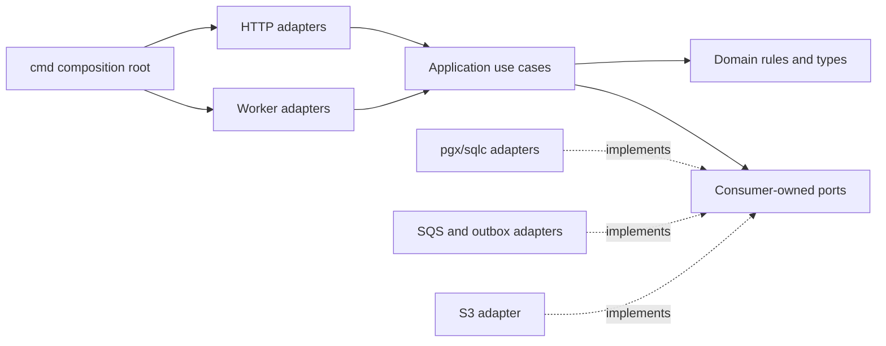

# Proposed Go Backend Architecture

## Purpose And Status

This document defines the proposed Go application architecture for ClouDesk. It is an implementation target, not a description of deployed software. The design supports a modular monolith plus independently deployed workers while keeping business rules, tenant authorization, and PostgreSQL transactions explicit.

Related contracts are [API overview](../api/overview.md), [API conventions](../api/conventions.md), [idempotency](../api/idempotency.md), and [OpenAPI workflow](../api/openapi.md). The conceptual database and asynchronous-processing designs remain authoritative for schema details and broker policy.

## Design Goals

- Prefer ordinary Go packages, constructors, interfaces at consumer boundaries, and explicit wiring.
- Keep transport parsing, application orchestration, domain rules, and persistence adapters separate without creating a framework inside the repository.
- Make `organization_id` mandatory at every tenant-owned application and persistence boundary.
- Keep PostgreSQL as the source of truth. Redis and process memory must not hold irreplaceable state.
- Keep the request path synchronous only when the caller needs an immediate authoritative outcome; move slow or failure-prone side effects to the transactional outbox.
- Bound every goroutine, queue consumer, database operation, and external call by capacity, cancellation, and a deadline.

## Proposed Repository Structure

```text
backend/
├── cmd/
│   ├── api/main.go
│   ├── outbox-publisher/main.go
│   ├── notification-worker/main.go
│   └── invoice-worker/main.go
├── api/
│   └── openapi.yaml
├── internal/
│   ├── app/                         # composition roots and process lifecycle
│   ├── gen/
│   │   ├── openapi/                 # generated; never edited by hand
│   │   └── sqlc/                    # generated; never edited by hand
│   ├── platform/
│   │   ├── authn/                   # OIDC callback plus application-session adapter
│   │   ├── database/                # pgx pool, transaction runner
│   │   ├── events/                  # outbox and SQS adapters
│   │   ├── httpserver/              # middleware and server lifecycle
│   │   ├── objectstore/             # S3 adapter
│   │   └── telemetry/               # logs, metrics, and traces
│   ├── identity/                     # mapped users and application identity use cases
│   ├── organizations/
│   ├── memberships/
│   ├── clients/
│   ├── projects/
│   ├── tasks/
│   ├── comments/
│   ├── timetracking/
│   ├── invoices/
│   ├── files/
│   ├── notifications/
│   ├── reporting/
│   └── audit/
├── migrations/
├── queries/                         # sqlc input, grouped by module
├── tests/                           # cross-module and process-level fixtures
├── go.mod
└── go.sum
```

Each domain package should stay small and cohesive. A typical module may contain `model.go`, `service.go`, `repository.go`, `errors.go`, and `http.go`, with a `postgres/` subpackage only when the persistence adapter is large enough to justify it. These filenames are a convention, not required layers. Do not add interfaces for every concrete type, a dependency-injection container, generic base repositories, or generic CRUD services.

## Dependency Direction



- `cmd` and `internal/app` construct concrete dependencies and own process lifecycle.
- HTTP handlers and message consumers translate external contracts to application commands and queries. They contain no SQL or domain decisions.
- Application services authorize operations, coordinate domain rules, select transaction boundaries, and call narrow ports.
- Domain types and rules do not import HTTP, generated OpenAPI packages, pgx, sqlc, AWS SDKs, or telemetry exporters.
- Adapter packages may import domain/application contracts. Domain packages must not import adapters.
- Synchronous cross-module calls use a narrow exported application API. Reliable side effects across modules use committed domain events through the outbox; modules must not query another module's tables directly.

Interfaces belong in the package that consumes them. A concrete repository does not need a matching interface until a use case requires that seam.

## HTTP Request Path

The proposed middleware order is:

1. recover panics and emit a sanitized internal error;
2. accept or generate a validated `X-Request-ID` and start the server trace;
3. apply security headers, body-size limits, and route-level rate limiting;
4. authenticate the opaque application session through the identity adapter and enforce CSRF controls for unsafe browser methods;
5. parse `organizationId` from tenant route parameters;
6. verify an active membership and construct an immutable request principal;
7. dispatch the generated strict OpenAPI handler;
8. authorize the required permission in the application use case;
9. execute domain and persistence work;
10. map the result or typed error to the documented response.

`/health/live`, `/health/ready`, and the OIDC-independent startup path bypass tenant middleware. `/api/v1/me` and the top-level organization collection require authentication but no selected organization. Every tenant-owned route is nested under `/api/v1/organizations/{organizationId}/...`; `X-Organization-ID` is not an authorization input.

Authentication proves the principal identity. It does not prove tenant membership or permission. A non-member organization path returns the same not-found behavior used for inaccessible tenant resources, limiting tenant enumeration. The application layer repeats permission checks for sensitive actions rather than trusting presentation-layer middleware alone.

### Validation Boundaries

- The generated transport layer validates content type, parameter shape, required fields, bounds, and documented schema constraints.
- Handlers normalize no business data silently; they translate transport DTOs into explicit commands.
- Application/domain code validates invariants such as invoice transitions, time-entry overlap policy, currency consistency, and membership status.
- Database constraints remain the final integrity boundary. Constraint errors are mapped to stable domain errors, never returned verbatim.

Transport DTOs, domain values, and database rows may be distinct when their exposure or lifecycle differs. Mechanical copying layers are unnecessary when one type safely serves both application and domain concerns.

## Tenant Scope And Authorization

The typed application scope contains at least `OrganizationID`, `PrincipalID`, `MembershipID`, and evaluated role/permissions. Handlers pass it explicitly to use cases. Repository methods take `organizationID` as a required argument and tenant-aware SQL predicates include it even when the resource ID is globally unique.

```go
// Illustrative signature, not implementation.
func (s *Service) UpdateProject(ctx context.Context, scope Scope, cmd UpdateProject) (Project, error)

type ProjectRepository interface {
    FindByID(ctx context.Context, organizationID, projectID UUID) (Project, error)
}
```

Do not let repositories recover tenant identity from an untyped context value. Context carries cancellation, trace state, and request-scoped metadata; explicit arguments make unscoped calls visible in code review and generated SQL. Tenant-aware foreign keys and selected PostgreSQL RLS policies add defense in depth, but application authorization and scoped SQL remain mandatory.

Background jobs and outbox payloads carry `organization_id`, actor metadata when relevant, and a stable event ID. Consumers validate that every referenced row belongs to that organization. Cache and object keys include organization scope.

## Use Cases And Transaction Boundaries

Application use cases, not handlers or repositories, own transaction selection. A transaction includes only database work required for one atomic business decision. Examples include:

- start one active timer while enforcing the global per-user active-timer constraint;
- update an invoice under an expected version;
- issue or void an invoice and append its audit and outbox events;
- create a tenant resource and persist the idempotent response record;
- change a membership role and append the security audit event.

The database adapter exposes a narrow transaction runner backed by `pgx.Tx`; sqlc query sets are rebound with `WithTx`. The callback receives transaction-bound repositories or a transaction-bound query context. Nested transactions are rejected unless a later use case has a documented savepoint requirement.

No network call occurs while a database transaction is open. S3, email, Cognito administration, and SQS publication happen after commit or through the transactional outbox. Keep transactions short, pass the request context to every statement, and choose explicit isolation/locking only for the invariant involved:

- use unique/check/exclusion constraints before application-only checks;
- use `SELECT ... FOR UPDATE` for a short, known row set when serializing a state transition;
- use optimistic `version` comparisons for collaborative settings and invoices;
- use `SERIALIZABLE` only for a measured invariant that cannot be expressed more directly, with a bounded retry of serialization failures at the whole-use-case boundary.

Outbox rows are inserted in the same transaction as the authoritative state. Publication is not part of that transaction, so a publisher crash may produce a duplicate; consumers must deduplicate.

## Context, Deadlines, And External Calls

- `context.Context` is the first parameter of every blocking operation. It is never stored in a struct and is never replaced with `context.Background()` on a request path.
- The server supplies an overall request deadline below the ALB timeout. Each database or external dependency call receives a smaller child budget.
- Cancellation propagates through handlers, use cases, pgx calls, and adapters. A cancelled request maps to a client-disconnect or timeout outcome without logging a false application fault.
- Workers derive job contexts from the process root and a per-message timeout. Trace/correlation data is extracted from message attributes, not by serializing a Go context.
- Retries occur only at an owner boundary that knows the operation is retry-safe. They are bounded, use exponential backoff with jitter, respect `Retry-After` where relevant, and stop when the context expires.

Default timeout values should be configuration with tested bounds, not constants spread through modules. A later load test must tune them from observed latency.

The HTTP server also configures finite header-read, request-body, idle, and shutdown limits. A blanket write timeout must not accidentally terminate a deliberately streamed response; streaming is introduced only with a route-specific policy.

### Connection and concurrency budgets

The pgx pool maximum is a per-process share of the RDS connection budget, not a generic high default. Capacity planning reserves connections for migrations and operations, then budgets the remainder across maximum API replicas and each worker class. Pool acquisition has a context deadline and emits wait/saturation metrics. API, outbox, and heavy report workers use separately sized pools or roles so a queue backlog cannot consume every interactive connection.

Bulkheads are concrete bounded pools and dependency-specific concurrency limits. A circuit breaker is considered only for a repeatedly failing remote provider where fast rejection helps and recovery probing is well-defined; it is not placed around PostgreSQL or every internal function. Avoid stacked SDK, adapter, worker, and queue retries: one owner gets a documented retry budget.

## Error Model

Domain/application failures are typed and carry a stable internal kind plus safe metadata, for example `NotFound`, `Forbidden`, `Conflict`, `Invalid`, `PreconditionFailed`, and `DependencyUnavailable`. They wrap the diagnostic cause for logs while exposing only the client-safe mapping in [API errors](../api/errors.md).

Use `errors.Is`/`errors.As`; do not compare error strings. Wrap causes with operational context exactly once at each useful boundary. Log an error once at the process boundary with request/event ID and trace ID. Expected 4xx outcomes are metrics, not error-level stack traces. PostgreSQL, AWS, and OIDC error strings never enter API responses.

## Asynchronous Processes And Backpressure

### Outbox publisher

The publisher repeatedly claims a bounded batch of eligible rows with a short lease using `FOR UPDATE SKIP LOCKED`, commits the claim, publishes to the selected SQS queue, and then marks successful rows as published. A crash between publish and acknowledgement creates a duplicate by design. Expired claims are recoverable; poison or repeatedly failing publication attempts are observable and retained for intervention.

Ordering is guaranteed only where a domain explicitly supplies an ordering key and the chosen SQS queue supports it. Consumers must not assume global order. Outbox retention and cleanup are asynchronous, observable maintenance jobs.

### Workers

Each process uses a fixed or dynamically bounded worker pool and a bounded internal channel. It long-polls only when capacity is available. Queue messages are deleted only after the database transaction and side effect policy report success. Retryable failures leave or reschedule the message with bounded backoff; terminal failures reach a DLQ after the queue's configured receive limit.

Inbox deduplication is performed in the same database transaction as the consumer's authoritative database effects whenever possible. External side effects use provider idempotency tokens where available and persist a delivery state before/after the call so recovery is explicit.

Visibility extension is bounded by the job deadline and stopped on cancellation. Long invoice/report generation has its own pool and scaling signal so it cannot exhaust notification capacity. Goroutines are started only by process supervisors, tracked by an `errgroup` or equivalent owner, and joined on shutdown. Fire-and-forget goroutines are prohibited.

## Graceful Startup And Shutdown

All binaries use a signal-derived root context and a single lifecycle supervisor.

### API

1. Load and validate configuration, construct dependencies, and verify required startup conditions.
2. Start HTTP serving; readiness becomes true only after routing and required dependencies are usable.
3. On `SIGTERM`, mark not-ready, allow load-balancer propagation, and call `http.Server.Shutdown` with a finite drain deadline.
4. Reject new work, wait for in-flight handlers, then close idle HTTP transports, telemetry providers, and the pgx pool.
5. Force-close only after the deadline and exit non-zero if shutdown could not complete safely.

### Workers and publisher

1. Mark not-ready and stop polling/claiming new work.
2. Cancel long polling, allow in-flight jobs a finite grace period, and keep extending visibility only inside that period.
3. Acknowledge completed jobs; leave unfinished messages unacknowledged for redelivery.
4. Flush bounded telemetry, release database/SQS clients, join all goroutines, and exit.

Liveness reports whether the process event loop is alive and must not depend on PostgreSQL, Redis, SQS, or S3. Readiness removes the process from work when a required dependency or internal saturation condition prevents useful service. Optional Redis failure degrades rate-limit/cache features according to the security policy and does not automatically restart healthy processes.

## Observability Seams

HTTP, database, SQS, and AWS SDK adapters emit OpenTelemetry spans and RED metrics. Application services add low-cardinality domain metrics at completed decision points. Logs are structured and include service, environment, request/event ID, trace ID, route template, status/error code, and organization ID where policy permits. They exclude tokens, request bodies, presigned URLs, tax details, and unnecessary personal data.

Async envelopes preserve W3C trace context as message attributes when valid, but a consumer creates a new processing span linked to the producer rather than pretending one indefinitely long trace is a synchronous request.

## Testing Strategy And Seams

- Domain table tests cover state machines, monetary rounding, permission decisions, and time-tracking invariants without mocks.
- Application tests use small hand-written fakes for consumer-owned ports and verify transaction/outbox/idempotency orchestration.
- HTTP tests exercise generated strict handlers with `httptest`, including authentication, tenant mismatch, authorization, validation, errors, ETags, and cancellation.
- Repository integration tests use real PostgreSQL through Testcontainers, run migrations, and prove tenant predicates, constraints, locks, optimistic versions, transaction rollback, and RLS defense where enabled.
- Worker integration tests inject duplicate/out-of-order messages, cancellation, visibility expiry, poison messages, and shutdown with in-flight jobs.
- Contract tests validate examples and responses against OpenAPI and regenerate both Go and TypeScript artifacts deterministically.
- Process tests send `SIGTERM` to API and worker binaries and assert readiness changes, intake stops, bounded draining completes, and unfinished work is recoverable.
- Race tests (`go test -race`) cover worker pools and concurrent timer/idempotency cases; fuzz tests target cursor, UUID, filter, and event-envelope parsers.

Mocks of pgx or AWS SDK internals are not the primary confidence layer. Test at domain boundaries with fakes and at adapter boundaries with real services or faithful local emulators.

## Evolution Constraints

The API and workers initially share the same module packages and release artifact source. Extracting a service is justified only by measured independent scaling, a distinct availability/security boundary, sustained workload interference, or stable team ownership. Before extraction, the candidate module must already own its data access and communicate across the boundary through a documented application contract or event. Extraction must not create cross-service transactions or a shared-database pseudo-service.
