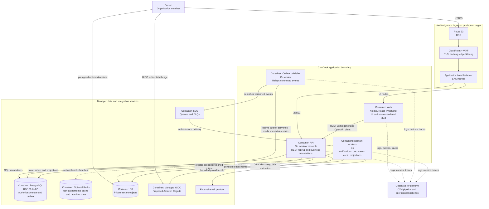

# ClouDesk Container Architecture

## Purpose

This document proposes the C4 container view and runtime responsibilities for
ClouDesk. Here, “container” means a separately executable application or data store,
not necessarily a Docker container. Nothing in this view is currently deployed.

See the [system context](system-context.md) for actors and trust boundaries, the
[architecture overview](overview.md) for internal modules, and
[scalability and evolution](scalability.md) for scaling and extraction criteria.

## Deployment Horizons

| Horizon | Runtime shape |
| --- | --- |
| V1 local application | Next.js web, Go API, PostgreSQL, and feature-required Go workers. Local substitutes may provide OIDC, object storage, email capture, and queues. Redis is omitted until a justified use case exists. |
| Production target | CloudFront and WAF route to an ALB; Next.js, Go API, and workers run as separate EKS workloads; RDS PostgreSQL, SQS, S3, and managed OIDC are managed dependencies. Redis is introduced only for measured cache or distributed rate-limit needs. |
| Future evolution | Heavy workers may gain dedicated node pools or become services. Read replicas, a reporting store, progressive delivery, and multi-region are added only after their explicit triggers are met. |

EKS is a production platform target, not a prerequisite for building the local V1.
The application remains one modular product even though API and worker processes have
different scaling and failure profiles.

## C4-Style Container Diagram

The browser may call `/api/v1` through the same public origin even when a Next.js
server component also calls the API internally. The web container never bypasses the
API to access PostgreSQL. Reliable business events never rely on a direct
API-to-broker publish; the API commits to PostgreSQL and the outbox publisher relays
afterward.

## Container Responsibilities

### Web

- Presents login, onboarding, dashboard, client, project, task, timer, invoice, team,
  notification, report, and settings experiences.
- Uses Next.js App Router, React, TypeScript, Tailwind CSS, TanStack Query, and an
  OpenAPI-generated client as proposed frontend choices.
- Owns presentation, interaction state, accessibility, and permission-aware UX.
- Does not enforce business authorization, calculate authoritative invoice totals, or
  access databases or S3 credentials directly.
- Scales horizontally and keeps no critical session or business state in local memory.

### API

- Exposes the versioned JSON REST contract under `/api/v1`.
- Maps authenticated provider subjects to local users, selects organization context,
  authorizes permissions, validates commands, and executes domain use cases.
- Owns synchronous business invariants and PostgreSQL transactions through the modular
  boundaries in the [architecture overview](overview.md).
- Issues short-lived, operation-specific S3 presigned URLs after tenant-aware
  authorization.
- Commits integration-event intent to the transactional outbox; it does not wait for
  email, PDF generation, or reporting projections.
- Scales horizontally and propagates request deadlines and cancellation.

### Outbox publisher

- Claims `outbox_deliveries` in bounded batches and read-joins immutable
  `outbox_events` envelopes using concurrency-safe database semantics.
- Publishes versioned event envelopes to SQS, records delivery progress, and exposes
  oldest-event age, attempt, and failure metrics.
- Preserves at-least-once semantics: a crash after broker acceptance but before local
  acknowledgement can publish a duplicate, so consumers must deduplicate.
- Uses bounded retry with backoff and jitter; broker failure leaves records durable in
  PostgreSQL for later delivery.
- Scales only after claim coordination, database load, and ordering requirements are
  measured.

### Domain workers

Separate executables are justified where scaling, IAM, dependencies, or failure modes
differ. The proposed initial worker classes are:

| Worker | Responsibility | Primary scaling signal | Least-privilege dependencies |
| --- | --- | --- | --- |
| Notification worker | Create in-app notifications and call the email provider | Queue age and provider throughput | SQS, notification tables, email credentials |
| Document worker | Generate invoice PDFs and reports, then store results | Queue age, CPU, memory, job duration | SQS, invoice read contract, file metadata, scoped S3 writes |
| Audit/projector worker | Append inbox-deduplicated external/provider audit facts and update derived read models; it never replaces the required audit row committed with a tenant business command | Queue age and projection lag | SQS and narrowly owned audit/projection tables |

Workers use bounded concurrency, extend visibility only while making progress, and
stop accepting messages during graceful shutdown. Processing records an inbox entry
and the effect in one transaction where possible. Exhausted messages move to a DLQ;
replay is controlled and remains idempotent.

Worker grouping is reversible. V1 may run multiple handlers in one worker binary when
that reduces operational overhead, provided queues, concurrency limits, telemetry,
and IAM do not silently grant unrelated capabilities.

### PostgreSQL

- Is authoritative for users, organizations, memberships, business records, file
  metadata, notifications, audit records, idempotency keys, outbox events, and consumer
  inbox records.
- Provides ACID transactions, constraints, optimistic versions where needed, and
  tenant-aware access paths.
- Is one database initially, with logical table ownership per module. Co-location does
  not authorize cross-module writes.
- Uses RDS PostgreSQL Multi-AZ for the production target; Aurora is deferred pending a
  demonstrated technical and economic need.

### SQS And DLQs

- Provides managed queues for at-least-once integration-event and job delivery.
- Is chosen over Kafka because ClouDesk initially needs durable work queues, not a
  high-volume retained event log. NATS and RabbitMQ would add operational ownership
  without a current requirement.
- Uses queue-specific visibility timeouts, maximum receive counts, and DLQs matched to
  job duration and retry safety.
- Does not replace the PostgreSQL outbox or become the source of truth.

### S3

- Stores private attachments, invoice PDFs, generated reports, and exports.
- Receives browser transfers only through short-lived presigned URLs and worker writes
  through workload IAM.
- Does not own authorization or lifecycle state; PostgreSQL metadata does.
- Uses tenant-scoped non-guessable keys, encryption, version/lifecycle policies, and
  restricted content disposition.

### Optional Redis

- May provide distributed rate-limit counters, short-lived coordination, or a cache of
  derived, reconstructible reads after evidence justifies it.
- Never stores the only copy of a token lifecycle, permission, timer, invoice, job, or
  idempotency result.
- Has endpoint-specific degraded behavior: cache misses fall through to PostgreSQL;
  rate controls use a documented conservative local/edge fallback or reject only the
  abuse-sensitive operation when safe enforcement is impossible.
- Is omitted from V1 if no measured need exists.

## Runtime Contracts

| Producer | Consumer | Contract | Consistency and failure semantics |
| --- | --- | --- | --- |
| Browser/Web | API | OpenAPI 3.1 JSON over HTTPS, `/api/v1` | Synchronous; stable error envelope, opaque cursor pagination, request ID, idempotency key for selected POSTs |
| API | PostgreSQL | Typed SQL and module-owned transactions | Strong consistency for committed business state; transient database failure returns no false success |
| API | Outbox publisher | Outbox row committed with the business change | Durable handoff; eventual publication, no dual-write gap |
| Outbox publisher | SQS | Versioned event envelope with event, organization, aggregate, occurred-at, correlation, causation, and trace identifiers | At least once; duplicates and delay are expected |
| SQS | Worker | Queue-specific message schema | Bounded attempts, visibility timeout, inbox deduplication, DLQ after exhaustion |
| API/Worker | S3 | AWS API or presigned HTTPS operation | Explicit deadline; metadata state reconciles partial or abandoned transfers |
| Worker | Email provider | Provider API request with provider idempotency where supported | Async; bounded retry; delivery failure does not roll back the source command |

OpenAPI and event schemas are versioned contracts. Their source definitions should be
validated in CI, and breaking changes require an explicit compatibility plan recorded
in the [ADR register](../decisions/README.md).

## Network And Security Placement

For the production target, CloudFront, WAF, and the public ALB form the ingress path.
Application pods, RDS, and Redis reside on private networks across multiple
Availability Zones. Security groups permit only required paths. Workloads reach AWS
services through workload identity and VPC endpoints when traffic volume and NAT cost
justify them.

The API is the authorization choke point for tenant resources. SQS queue policies, S3
prefix permissions, database roles, Kubernetes service accounts, and network policy
provide defense in depth but do not replace application authorization.

## Lifecycle And Health

- `/health/live` proves that the process is running and not deadlocked; optional
  dependencies are excluded.
- `/health/ready` determines whether an API or web pod can accept traffic. Required
  local initialization and the ability to serve safely are included; optional Redis or
  email availability is excluded to avoid cascading restarts.
- Worker readiness means the process can safely receive new work. Liveness does not
  restart a healthy worker merely because its provider is unavailable.
- Startup probes allow migrations-independent process initialization without masking
  permanent configuration errors.
- On `SIGTERM`, HTTP workloads become unready, stop accepting new requests, drain
  in-flight work within a deadline, close dependencies, and exit. Workers stop polling,
  finish or safely abandon in-flight messages, and let unfinished work be redelivered.

Database migrations run as a controlled delivery step rather than from every API pod.
Deployments use backward-compatible expand-and-contract changes so old and new
replicas can coexist during rolling updates.
