# Proposed PostgreSQL Data Model

## Purpose And Status

This document defines the proposed relational model, integrity controls, access paths, and operational database practices for ClouDesk. It is an implementation contract for future migrations and SQL, not a description of an existing schema.

[ADR-003](../decisions/ADR-003-postgresql-system-of-record.md) makes PostgreSQL the system of record. [ADR-005](../decisions/ADR-005-sqlc-and-pgx.md) selects explicit SQL with `sqlc` and `pgx`; [ADR-008](../decisions/ADR-008-transactional-outbox-and-inbox.md) defines reliable events; [ADR-010](../decisions/ADR-010-multi-tenant-isolation.md) defines layered tenant isolation; and [ADR-020](../decisions/ADR-020-expand-contract-migrations.md) governs schema evolution.

## Modeling Conventions

- IDs are application-generated UUIDs. UUIDv7 is preferred when the chosen Go library is stable, but ordering never depends on UUID version; cursors always include an explicit sort key and `id` tie-breaker.
- `users`, `external_identities`, `application_sessions`, and short-lived OIDC login attempts are global identity data. V1 role-to-permission policy is versioned application code, not editable database state. An `organization` is the tenant root. Every tenant-owned row has a non-null `organization_id`.
- A tenant-owned entity has `PRIMARY KEY (id)` plus `UNIQUE (organization_id, id)`. Every relationship between tenant-owned entities uses a composite foreign key containing `organization_id`; an ID-only foreign key is forbidden.
- Pure association tables use composite primary keys beginning with `organization_id`. This makes tenant ownership part of row identity and prevents duplicate relationships.
- Timestamps are `timestamptz`, written in UTC. Civil dates such as invoice issue and due dates are `date`. A user's IANA time-zone name is display/reporting context, never a replacement for an instant.
- Mutable shared aggregates use `version bigint NOT NULL DEFAULT 1 CHECK (version > 0)`. Version increments are explicit in SQL, not trigger magic.
- Monetary totals are signed `bigint` minor units with a three-letter uppercase ISO currency code. Quantities and unit rates that can be fractional use bounded `numeric(19,6)`; floating-point types are forbidden for money.
- Enumerated lifecycle values use text plus named `CHECK` constraints initially. PostgreSQL enum types are avoided because rolling expansion and contraction of enum values is unnecessarily rigid.
- `jsonb` is reserved for non-relational snapshots and bounded metadata: event payloads, audit metadata, provider details, and report parameters. Fields used for ownership, authorization, lifecycle, uniqueness, joins, or routine filtering are relational columns.
- All user text has explicit maximum lengths in migrations and API validation. Normalized comparison columns are produced by application code with one versioned normalization rule.
- Foreign keys default to `ON DELETE RESTRICT`. `CASCADE` is limited to private child rows whose meaning cannot survive the parent, such as draft invoice lines or join rows. Historical financial, audit, time, and event records never cascade from mutable business records.

## Tenant Key Pattern

The physical pattern is deliberately repetitive:

```sql
CREATE TABLE projects (
    id uuid PRIMARY KEY,
    organization_id uuid NOT NULL REFERENCES organizations(id) ON DELETE RESTRICT,
    client_id uuid NOT NULL,
    -- domain columns omitted
    UNIQUE (organization_id, id),
    FOREIGN KEY (organization_id, client_id)
        REFERENCES clients (organization_id, id) ON DELETE RESTRICT
);
```

Repository methods accept `organization_id` as a required argument and match explicit tenant-prefixed routes such as `/api/v1/organizations/{organizationId}/projects/{projectId}`. The authorization layer verifies an active membership for the route organization, then passes that same organization ID through the use case, SQL parameters, outbox payload, audit fact, cache key, object key, and job. Lookups remain of the form `WHERE organization_id = $1 AND id = $2` even when RLS is enabled.

The only cross-tenant end-user queries are the authenticated principal's organization list through `memberships.user_id` and their single active timer through `time_entries.user_id`. Both filter by the server-mapped authenticated user, not caller-supplied identity. `GET /api/v1/me/active-timer` is the deliberate user-scoped exception to organization-prefixed routes; starting, stopping, and editing the returned time entry remain organization-scoped operations. Operational dispatchers have separate, narrowly granted database roles described under [RLS](#row-level-security-defense-in-depth).

## Relational Catalog

The column lists below identify durable business fields and keys. Migrations may add operational columns such as bounded provider diagnostics, but may not weaken the stated ownership or lifecycle constraints.

### Global Identity And Permission Catalog

| Table | Key columns and relationships | Required constraints and lifecycle |
| --- | --- | --- |
| `users` | `id` PK; `display_name`, `normalized_email`, `iana_timezone`, `status`, `version`, timestamps | `status IN ('ACTIVE','DISABLED')`; email is contact/discovery data, not an authorization identifier. Disabling revokes sessions while preserving membership and historical actor references. |
| `external_identities` | `id` PK; `user_id` FK to `users`; normalized `issuer`, immutable `subject`, provider metadata, timestamps | `UNIQUE (issuer, subject)`; a provider subject maps to exactly one user. Provider tokens and secrets are never stored here. Deleting a mapping is restricted while it is the user's only login path. |
| `oidc_login_attempts` | hashed attempt handle PK; encrypted/hashed state, nonce and PKCE material; safe return path; created/expiry/consumed timestamps | Short lived and single use; raw values never appear in logs. Index by `expires_at` supports bounded cleanup. Runtime identity role may create/consume only its own attempt. |
| `application_sessions` | hashed opaque session handle PK; `user_id` FK; optional encrypted provider refresh material; issued, last-seen, idle/absolute expiry; rotation-family/predecessor; revoked timestamp/reason; created/updated timestamps | Active handle hash is unique; expiry order and rotation lineage are checked. Rotation/revocation is transactional, predecessor reuse can revoke the family, and cleanup indexes cover `(user_id, revoked_at)` and expiry. Only the identity/session boundary may read or mutate sessions; no tenant API or Redis record is authoritative. |

`normalized_email` is not the stable identity key. Whether verified emails must be globally unique is an identity-provider policy, so the database does not silently merge users by email.

### Organizations, RBAC, And Membership

| Table | Key columns and relationships | Required constraints and lifecycle |
| --- | --- | --- |
| `organizations` | `id` PK; `name`, optional `slug`, `default_currency`, `iana_timezone`, invoice settings, `status`, `version`, timestamps | V1 permits `ACTIVE|SUSPENDED`; future closure migration adds `CLOSURE_PENDING|CLOSED`. Currency/time-zone checks apply; optional normalized slug is globally unique only if public slug routing is adopted. Tenant closure is an explicit workflow, never a direct cascade. |
| `memberships` | `id` PK; `organization_id`; `user_id`; `role_code`; optional composite `invited_by_membership_id`; `status`, `joined_at`, `revoked_at`, `version`, timestamps | `role_code IN ('OWNER','ADMIN','MANAGER','MEMBER','VIEWER')`; `UNIQUE (organization_id, id)`, `UNIQUE (organization_id, user_id)`, and `UNIQUE (organization_id, id, user_id)` for user-consistent child FKs; `status IN ('ACTIVE','SUSPENDED','REVOKED')`; joined/revoked timestamp checks. Pending invitations remain separate and create a membership only when accepted. The last active owner rule is enforced by a transaction that locks the organization's owner memberships. |
| `organization_invitations` | `id` PK; `organization_id`; `proposed_role_code`; inviter membership; `normalized_email`, `token_hash`, `status`, `expires_at`, acceptance fields, timestamps | Role code uses the same fixed vocabulary. `UNIQUE (token_hash)`; partial `UNIQUE (organization_id, normalized_email) WHERE status = 'PENDING'`; status and expiry checks. Store only a one-way token hash. Accepted/revoked/expired invitations are retained for a bounded audit window. |

V1's five role bundles and role-to-permission map are immutable, versioned backend policy. PostgreSQL stores only the checked role code; ordinary runtime users cannot edit grants because no role/permission grant tables exist. OpenAPI descriptions, frontend capability types, and role-matrix tests are generated or checked against the same policy version. Per-member overrides/custom roles require a new ADR and migration rather than ad hoc rows.

### Clients And Projects

| Table | Key columns and relationships | Required constraints and lifecycle |
| --- | --- | --- |
| `clients` | `id` PK; `organization_id`; display/legal names, normalized name, billing email/address, tax country/ID, preferred currency, notes, `status`, `version`, `archived_at`, timestamps | `UNIQUE (organization_id, id)`; `status IN ('ACTIVE','ARCHIVED')`; archive state and timestamp agree. Names are not forced unique. Tax uniqueness is not assumed across branches; validation is a tenant policy. |
| `client_contacts` | `id` PK; `organization_id`; composite `client_id`; name, email, phone, title, `is_billing`, timestamps | `UNIQUE (organization_id, id)`; at most one billing-primary contact per client through a partial unique index where `is_billing`. Hard delete is allowed only before the contact is snapshotted into issued billing history. |
| `projects` | `id` PK; `organization_id`; composite `client_id` and owner membership; name, description, `status`, dates, `billing_model`, budget/rate/currency, `version`, `archived_at`, timestamps | `UNIQUE (organization_id, id)`; lifecycle, date, money, and archive checks. Billing models are `HOURLY`, `FIXED`, `NON_BILLABLE`. Client reassignment is rejected after billable or invoiced history exists. |
| `project_members` | `(organization_id, project_id, membership_id)` PK; composite FKs to project and membership; timestamps | Membership must be active at the application boundary. Historical rows may remain after membership revocation so work attribution is not lost. |
| `project_tags` | `id` PK; `organization_id`; normalized/display name and color | `UNIQUE (organization_id, id)` and `UNIQUE (organization_id, normalized_name)`. |
| `project_tag_assignments` | `(organization_id, project_id, tag_id)` PK; composite FKs | Private join rows cascade when a tag assignment or an eligible unreferenced tag is removed. |

### Tasks And Collaboration

| Table | Key columns and relationships | Required constraints and lifecycle |
| --- | --- | --- |
| `tasks` | `id` PK; `organization_id`; composite `project_id` and creator membership; title, description, `status`, `priority`, due date, estimate seconds, completion/cancellation timestamps, `version`, timestamps | `UNIQUE (organization_id, id)` and `UNIQUE (organization_id, project_id, id)` for parent-aware FKs; status, priority, non-negative estimate, and lifecycle timestamp checks. `actual_tracked_seconds` is queried from time entries, not duplicated. |
| `task_assignees` | `(organization_id, task_id, membership_id)` PK; includes `project_id`; FK `(organization_id, project_id, task_id)` to tasks and FK `(organization_id, project_id, membership_id)` to project members | The redundant project key makes project eligibility a database invariant rather than an application-only check. |
| `task_labels` | `id` PK; `organization_id`; normalized/display name and color | `UNIQUE (organization_id, id)` and `UNIQUE (organization_id, normalized_name)`. |
| `task_label_assignments` | `(organization_id, task_id, label_id)` PK; composite FKs | Private join row; removal does not alter task history. |
| `comments` | `id` PK; `organization_id`; composite `task_id` and author membership; sanitized-source body, `edited_at`, `deleted_at`, deletion actor/reason, `version`, timestamps | `UNIQUE (organization_id, id)`; non-deleted body is non-empty and bounded; moderation creates a tombstone. Hard delete is reserved for retention/privacy workflows and leaves an audit fact. |

Task status transitions remain domain commands. A `CHECK` restricts vocabulary, while application transaction tests enforce the allowed transition graph because that rule depends on actor permissions and parent state.

### Time Tracking

| Table | Key columns and relationships | Required constraints and lifecycle |
| --- | --- | --- |
| `time_entries` | `id` PK; `organization_id`; `project_id`; optional `task_id`; `membership_id`; global `user_id`; start/end instants, `duration_seconds`, description, `source`, billable flag, resolved rate/currency snapshot, correction metadata, `version`, timestamps | `UNIQUE (organization_id, id)`; composite FKs to project member, `(organization_id, membership_id, user_id)`, and optional `(organization_id, project_id, task_id)`; `source IN ('TIMER','MANUAL')`; active rows have null end/duration and stopped rows have positive end/duration; rate and currency appear together. A partial unique index on `user_id WHERE ended_at IS NULL` allows at most one active timer for a user across all ClouDesk organizations. |

An invoiced time entry is identified by the unique relationship in `invoice_line_time_entries`, not by a second mutable invoice truth on `time_entries`. Corrections to linked entries are rejected; void/replacement or a future credit-note workflow preserves financial history.

Timer start derives `user_id` from the authenticated principal, locks that global user row, validates the active membership plus project/task in the requested organization, and inserts the tenant-owned timer. The partial unique user index is the final race barrier, including simultaneous starts in different organizations. Timer stop selects `WHERE organization_id = $1 AND id = $2 AND user_id = $3 FOR UPDATE`, computes duration from a server timestamp, updates version, writes audit/outbox records when required, and completes the idempotency record in one transaction. Concurrent safe retries replay the committed response; a stale expected version returns `412 VERSION_MISMATCH`, while a current-version domain conflict returns `409`. Suspending or revoking a membership locks the user and closes any active timer for that membership in the same audited transaction, so the user-scoped lookup cannot strand an inaccessible timer.

### Invoicing

| Table | Key columns and relationships | Required constraints and lifecycle |
| --- | --- | --- |
| `invoice_counters` | `(organization_id, series)` PK; `next_value`, `version`, timestamps | `next_value > 0`; row locked only while issuing. Number allocation and invoice issue commit together, so a rolled-back issue does not consume a number. Voided numbers are never reused. |
| `invoices` | `id` PK; `organization_id`; composite `client_id`; nullable `invoice_number`, `series`; issue/due dates; currency; client/legal/address/tax snapshots; `state`; subtotal/discount/tax/total/amount-paid minor units; optional composite PDF file; sent/void fields; `version`, timestamps | `UNIQUE (organization_id, id)` and partial `UNIQUE (organization_id, series, invoice_number) WHERE invoice_number IS NOT NULL`; state/date/money checks. Drafts have no number/issue date. Issued states require them. Totals are non-negative and `total = subtotal - discount + tax`; paid amount cannot be negative. |
| `invoice_lines` | `id` PK; `organization_id`, `invoice_id`; line position, source/type, description, decimal quantity/unit rate, subtotal/discount/tax/total minor units, tax/metadata snapshots, timestamps | `UNIQUE (organization_id, id)`, `UNIQUE (organization_id, invoice_id, id)`, and `UNIQUE (organization_id, invoice_id, position)`; bounded numeric and money checks. Lines belong privately to their invoice but become immutable when the invoice leaves `DRAFT`. |
| `invoice_line_time_entries` | `(organization_id, invoice_line_id, time_entry_id)` PK; includes `invoice_id`; composite FKs to line and time entry | `UNIQUE (organization_id, time_entry_id)` prevents one time entry from being reserved by two invoices. The invoice/line composite FK prevents cross-invoice attachment. |

Header totals are stored snapshots for reliable reads and audit. A small, versioned deferred constraint trigger verifies at commit that header totals equal the sum of current lines; a separate guard trigger rejects line/snapshot changes once state is not `DRAFT`. These triggers enforce cross-row invariants that ordinary `CHECK` constraints cannot express; all calculations still occur explicitly in application SQL and are unit/integration tested.

Draft mutation uses `UPDATE ... WHERE organization_id = $1 AND id = $2 AND version = $3 AND state = 'DRAFT'`. Issuance locks the scoped invoice, then its counter, then selected time entries in UUID order; validates the expected version and snapshots; allocates the number; updates state/totals; and inserts audit, outbox, and idempotency results before commit. Every issuance path uses this lock order. A stale concurrent editor receives `412 VERSION_MISMATCH`; a request with a current version but incompatible invoice state receives `409`. Concurrent invoice issues serialize only on the organization's short-lived counter lock.

`OVERDUE` is a read projection from due date and unpaid balance rather than an independently mutable financial state. A materialized notification marker may prevent repeated reminders, but it does not change invoice truth. `SENT`, payment reconciliation, and `VOID` are audited commands; issued snapshots are corrected by void/replacement, not mutation.

### Files

| Table | Key columns and relationships | Required constraints and lifecycle |
| --- | --- | --- |
| `files` | `id` PK; `organization_id`; uploader membership; opaque `storage_key`, original filename, media type, expected/actual bytes, checksum, `status`, `scan_status`, retention/deletion fields, `version`, timestamps | `UNIQUE (organization_id, id)` and `UNIQUE (storage_key)`; size bounds; status/scan transition checks; key is generated by the server and tenant-prefixed. PostgreSQL owns metadata/lifecycle, while S3 owns bytes. |
| `project_files` | `(organization_id, project_id, file_id)` PK; composite FKs | Explicit join preserves both tenant and resource integrity. |
| `task_files` | `(organization_id, task_id, file_id)` PK; composite FKs | Explicit join; task authorization governs access. |
| `comment_files` | `(organization_id, comment_id, file_id)` PK; composite FKs | Explicit join; tombstoning a comment does not immediately destroy a retained attachment. |

Organization-level files need no owner join. Invoice PDFs use the invoice's composite `pdf_file_id` reference. This avoids an unvalidated polymorphic `(resource_type, resource_id)` foreign key. Deletion first transitions metadata to `DELETION_PENDING` and emits an outbox intent; idempotent S3 cleanup then marks `DELETED`. Reads never issue URLs for pending, quarantined, or deleted objects.

### Notifications, Reports, And Audit

| Table | Key columns and relationships | Required constraints and lifecycle |
| --- | --- | --- |
| `notifications` | `id` PK; `organization_id`; recipient membership; source event ID/type, template version, bounded payload, `read_at`, timestamps | `UNIQUE (organization_id, id)` and `UNIQUE (organization_id, recipient_membership_id, source_event_id, template_version)`; in-app facts remain queryable after email failure. |
| `notification_preferences` | `organization_id`; recipient membership; `event_type`; `channel`; `enabled`; `version`, timestamps | PK `(organization_id, recipient_membership_id, event_type, channel)`; channel is `IN_APP|EMAIL`. Missing rows use documented defaults. Mandatory security/billing combinations cannot be disabled and are rejected by policy/tests; tenant/member scoping and optimistic versioning apply. |
| `notification_deliveries` | `id` PK; `organization_id`; composite notification; `channel`, destination snapshot, `status`, attempt counters/times, provider message ID/error class, timestamps | `UNIQUE (organization_id, id)` and a stable dedupe unique key over notification/channel/template; status and non-negative-attempt checks. Provider secrets and full sensitive bodies are excluded. |
| `report_exports` | `id` PK; `organization_id`; requester membership; normalized report kind/parameters/date range; `status`; optional composite result file; expiry/error fields; `version`, timestamps | `UNIQUE (organization_id, id)`; bounded date range and lifecycle checks. Creation writes an outbox event; workers update this row idempotently. Precomputed summary tables are deferred until measured query plans justify them. |
| `audit_events` | `id` PK; `organization_id`; `actor_type`; nullable actor user/membership/workload identity; `action`, `outcome`, optional reason code; resource type/ID; occurred time; request/trace/correlation/causation IDs; source, schema version, bounded metadata | `UNIQUE (organization_id, id)` plus source-event dedupe where projected. Required tenant business/security facts are inserted by the API/worker in the same transaction as the protected change. Append-only grants and a reject-update/delete trigger apply. Generic resource identity survives resource purge; bounded metadata is allowlisted/redacted. |
| `security_audit_events` | `id` PK; nullable `user_id`; actor type; issuer/subject hash; action, outcome, optional reason; occurred time; request/trace/correlation/causation IDs; source, schema version, bounded metadata | Global, append-only table only for approved pre-tenant identity/session/provider facts. The identity boundary writes direct session facts; an inbox-aware projector may add separately durable external provider facts. Access is restricted to security operations; tenant APIs cannot query it. Tenant-specific security actions use `audit_events`. |

The conceptual [Audit event model](../domains/audit.md) maps to these two physical
tables: `organization_id` selects `audit_events`; a null tenant is legal only in
`security_audit_events`. Actor variants use nullable typed columns plus a checked
`actor_type`; low-frequency allowlisted extensions live in schema-versioned metadata,
not arbitrary payloads. Required business audit writes never depend on the projector.

Operational dashboards use bounded, tenant-scoped aggregates over authoritative rows. A daily summary schema is introduced only after `EXPLAIN` evidence shows repeated OLTP harm; it must retain organization, source watermark, calculation version, and currency dimensions.

### Reliable Events And Request Idempotency

| Table | Key columns and relationships | Required constraints and lifecycle |
| --- | --- | --- |
| `outbox_events` | `id` event PK; `organization_id`; aggregate type/ID/version, event type/schema version, `occurred_at`, canonical payload/headers, created timestamp | Immutable event fact. `UNIQUE (organization_id, id)` and optional `UNIQUE (organization_id, aggregate_type, aggregate_id, aggregate_version, event_type)` where one fact per aggregate version is required. Payload and trace context always include tenant identity. |
| `outbox_deliveries` | `(event_id, destination)` PK/FK to `outbox_events`; status, `available_at`, attempts, lease owner/expiry, `published_at`, last sanitized error | One row per destination queue isolates fan-out progress. Checks prevent negative attempts and invalid lease/publish states; a delivery is published only after its exact SQS entry is accepted. |
| `processed_events` | `(consumer_name, organization_id, event_id)` PK; event type/schema, payload hash, processed time, result metadata | A secondary `UNIQUE (consumer_name, event_id)` treats a global event ID collision across organizations as invalid rather than as a second event. Insert occurs in the same transaction as the consumer's durable effect. A duplicate causes acknowledgment without repeating the effect only after organization/payload-hash comparison. |
| `idempotency_keys` | `id` PK; nullable `organization_id`; `principal_user_id`; optional tenant actor membership; operation ID, key hash, request fingerprint, response status/allowlisted headers/body, resource type/ID, created/completed/expiry times | Partial `UNIQUE (organization_id, principal_user_id, operation, key_hash) WHERE organization_id IS NOT NULL`, plus `UNIQUE (principal_user_id, operation, key_hash) WHERE organization_id IS NULL` for allowlisted pre-tenant operations. Organization is null only for organization creation and other explicitly approved pre-tenant commands. Expiry and response-size checks apply. |

Business mutation, audit fact, canonical outbox event, and its registered destination deliveries are inserted in one PostgreSQL transaction. Publishing never occurs inside that transaction. The publisher claims delivery rows in small batches with `FOR UPDATE SKIP LOCKED`, commits a short lease, publishes to SQS, then marks each accepted delivery successful. A crash after publish but before marking success produces a duplicate by design.

A consumer begins a tenant-scoped transaction, validates envelope organization and schema, attempts the tenant-keyed `processed_events` insert, applies the business effect and any resulting outbox/audit writes, then commits before acknowledging SQS. External effects use their own stable idempotency token; they cannot be made atomic with PostgreSQL. Failed messages follow bounded retry and DLQ policy. Published outbox events and processed records have a proposed minimum 30-day retention, longer than the SQS replay window; replay tooling must refuse a range outside available dedupe history without an explicit recovery procedure.

For API idempotency, authorization runs first. The request then takes a non-blocking transaction-scoped advisory lock derived from the full tenant/principal/operation/key tuple. A concurrent holder produces `409 IDEMPOTENCY_IN_PROGRESS`; no `in_progress` row is committed. Under the lock, the same key and fingerprint replays a completed stored response, while a changed fingerprint returns `409 IDEMPOTENCY_KEY_REUSED`. Otherwise the response snapshot, business mutation, audit, and outbox commit together. A crash rolls all of them back and releases the lock. General keys are retained at least 24 hours and invoice/report-export keys at least 7 days, subject to the published API contract. Response snapshots are size-bounded, redacted, and never include bearer tokens or presigned URLs.

## Entity Relationship Diagram

The ERD shows ownership and durable references. Every relationship between tenant tables is physically composite with `organization_id`, even where Mermaid labels show the business ID for readability.

```mermaid
erDiagram
    USERS ||--o{ EXTERNAL_IDENTITIES : authenticates_with
    USERS ||--o{ APPLICATION_SESSIONS : owns
    USERS ||--o{ MEMBERSHIPS : joins
    USERS ||--o{ SECURITY_AUDIT_EVENTS : involved_in
    ORGANIZATIONS ||--o{ MEMBERSHIPS : contains
    ORGANIZATIONS ||--o{ ORGANIZATION_INVITATIONS : issues
    MEMBERSHIPS ||--o{ ORGANIZATION_INVITATIONS : invites

    ORGANIZATIONS ||--o{ CLIENTS : owns
    CLIENTS ||--o{ CLIENT_CONTACTS : has
    CLIENTS ||--o{ PROJECTS : commissions
    MEMBERSHIPS ||--o{ PROJECTS : owns
    PROJECTS ||--o{ PROJECT_MEMBERS : includes
    MEMBERSHIPS ||--o{ PROJECT_MEMBERS : participates
    ORGANIZATIONS ||--o{ PROJECT_TAGS : defines
    PROJECTS ||--o{ PROJECT_TAG_ASSIGNMENTS : tagged
    PROJECT_TAGS ||--o{ PROJECT_TAG_ASSIGNMENTS : applied

    PROJECTS ||--o{ TASKS : contains
    MEMBERSHIPS ||--o{ TASKS : creates
    TASKS ||--o{ TASK_ASSIGNEES : assigned
    PROJECT_MEMBERS ||--o{ TASK_ASSIGNEES : eligible_member
    ORGANIZATIONS ||--o{ TASK_LABELS : defines
    TASKS ||--o{ TASK_LABEL_ASSIGNMENTS : labeled
    TASK_LABELS ||--o{ TASK_LABEL_ASSIGNMENTS : applied
    TASKS ||--o{ COMMENTS : discusses
    MEMBERSHIPS ||--o{ COMMENTS : authors

    PROJECT_MEMBERS ||--o{ TIME_ENTRIES : records
    USERS ||--o{ TIME_ENTRIES : owns_timer_identity
    PROJECTS ||--o{ TIME_ENTRIES : tracks
    TASKS o|--o{ TIME_ENTRIES : attributes
    ORGANIZATIONS ||--o{ INVOICE_COUNTERS : numbers
    CLIENTS ||--o{ INVOICES : billed
    INVOICES ||--|{ INVOICE_LINES : contains
    INVOICE_LINES ||--o{ INVOICE_LINE_TIME_ENTRIES : bills
    TIME_ENTRIES ||--o| INVOICE_LINE_TIME_ENTRIES : allocated_once

    ORGANIZATIONS ||--o{ FILES : owns
    MEMBERSHIPS ||--o{ FILES : uploads
    PROJECTS ||--o{ PROJECT_FILES : attaches
    TASKS ||--o{ TASK_FILES : attaches
    COMMENTS ||--o{ COMMENT_FILES : attaches
    FILES ||--o{ PROJECT_FILES : linked
    FILES ||--o{ TASK_FILES : linked
    FILES ||--o{ COMMENT_FILES : linked
    FILES o|--o{ INVOICES : renders

    MEMBERSHIPS ||--o{ NOTIFICATIONS : receives
    MEMBERSHIPS ||--o{ NOTIFICATION_PREFERENCES : configures
    NOTIFICATIONS ||--o{ NOTIFICATION_DELIVERIES : delivers
    MEMBERSHIPS ||--o{ REPORT_EXPORTS : requests
    FILES o|--o{ REPORT_EXPORTS : produces
    MEMBERSHIPS o|--o{ AUDIT_EVENTS : acts
    ORGANIZATIONS ||--o{ AUDIT_EVENTS : records
    ORGANIZATIONS ||--o{ OUTBOX_EVENTS : emits
    OUTBOX_EVENTS ||--|{ OUTBOX_DELIVERIES : routes_to
    ORGANIZATIONS ||--o{ PROCESSED_EVENTS : consumes
    ORGANIZATIONS ||--o{ IDEMPOTENCY_KEYS : scopes
    USERS ||--o{ IDEMPOTENCY_KEYS : invokes
    MEMBERSHIPS o|--o{ IDEMPOTENCY_KEYS : invokes

    ORGANIZATIONS {
        uuid id PK
        text name
        text status
        bigint version
        timestamptz created_at
        timestamptz updated_at
    }
    USERS {
        uuid id PK
        text normalized_email
        text status
        bigint version
    }
    EXTERNAL_IDENTITIES {
        uuid id PK
        uuid user_id FK
        text issuer
        text subject
    }
    OIDC_LOGIN_ATTEMPTS {
        text handle_hash PK
        timestamptz expires_at
        timestamptz consumed_at
    }
    APPLICATION_SESSIONS {
        text handle_hash PK
        uuid user_id FK
        timestamptz idle_expires_at
        timestamptz absolute_expires_at
        text rotation_family_id
        timestamptz revoked_at
    }
    MEMBERSHIPS {
        uuid id PK
        uuid organization_id FK
        uuid user_id FK
        text role_code
        text status
        bigint version
    }
    ORGANIZATION_INVITATIONS {
        uuid id PK
        uuid organization_id FK
        text proposed_role_code
        text token_hash UK
        text status
    }
    CLIENTS {
        uuid id PK
        uuid organization_id FK
        text display_name
        text status
        bigint version
    }
    CLIENT_CONTACTS {
        uuid id PK
        uuid organization_id FK
        uuid client_id FK
        text email
    }
    PROJECTS {
        uuid id PK
        uuid organization_id FK
        uuid client_id FK
        uuid owner_membership_id FK
        text status
        text billing_model
        bigint version
    }
    PROJECT_MEMBERS {
        uuid organization_id PK,FK
        uuid project_id PK,FK
        uuid membership_id PK,FK
    }
    PROJECT_TAGS {
        uuid id PK
        uuid organization_id FK
        text normalized_name
    }
    PROJECT_TAG_ASSIGNMENTS {
        uuid organization_id PK,FK
        uuid project_id PK,FK
        uuid tag_id PK,FK
    }
    TASKS {
        uuid id PK
        uuid organization_id FK
        uuid project_id FK
        uuid creator_membership_id FK
        text status
        text priority
        bigint version
    }
    TASK_ASSIGNEES {
        uuid organization_id PK,FK
        uuid task_id PK,FK
        uuid membership_id PK,FK
        uuid project_id FK
    }
    TASK_LABELS {
        uuid id PK
        uuid organization_id FK
        text normalized_name
    }
    TASK_LABEL_ASSIGNMENTS {
        uuid organization_id PK,FK
        uuid task_id PK,FK
        uuid label_id PK,FK
    }
    COMMENTS {
        uuid id PK
        uuid organization_id FK
        uuid task_id FK
        uuid author_membership_id FK
        text body
        bigint version
    }
    TIME_ENTRIES {
        uuid id PK
        uuid organization_id FK
        uuid project_id FK
        uuid task_id FK
        uuid membership_id FK
        uuid user_id FK
        timestamptz started_at
        timestamptz ended_at
        bigint duration_seconds
        bigint version
    }
    INVOICE_COUNTERS {
        uuid organization_id PK,FK
        text series PK
        bigint next_value
    }
    INVOICES {
        uuid id PK
        uuid organization_id FK
        uuid client_id FK
        text invoice_number
        text state
        char currency
        bigint total_minor
        bigint version
    }
    INVOICE_LINES {
        uuid id PK
        uuid organization_id FK
        uuid invoice_id FK
        int position
        numeric quantity
        bigint total_minor
    }
    INVOICE_LINE_TIME_ENTRIES {
        uuid organization_id PK,FK
        uuid invoice_line_id PK,FK
        uuid time_entry_id PK,FK
        uuid invoice_id FK
    }
    FILES {
        uuid id PK
        uuid organization_id FK
        uuid uploader_membership_id FK
        text storage_key UK
        text status
        text scan_status
        bigint version
    }
    PROJECT_FILES {
        uuid organization_id PK,FK
        uuid project_id PK,FK
        uuid file_id PK,FK
    }
    TASK_FILES {
        uuid organization_id PK,FK
        uuid task_id PK,FK
        uuid file_id PK,FK
    }
    COMMENT_FILES {
        uuid organization_id PK,FK
        uuid comment_id PK,FK
        uuid file_id PK,FK
    }
    NOTIFICATIONS {
        uuid id PK
        uuid organization_id FK
        uuid recipient_membership_id FK
        uuid source_event_id
        timestamptz read_at
    }
    NOTIFICATION_PREFERENCES {
        uuid organization_id PK,FK
        uuid recipient_membership_id PK,FK
        text event_type PK
        text channel PK
        boolean enabled
        bigint version
    }
    NOTIFICATION_DELIVERIES {
        uuid id PK
        uuid organization_id FK
        uuid notification_id FK
        text channel
        text status
    }
    REPORT_EXPORTS {
        uuid id PK
        uuid organization_id FK
        uuid requester_membership_id FK
        uuid result_file_id FK
        text status
        bigint version
    }
    AUDIT_EVENTS {
        uuid id PK
        uuid organization_id FK
        text actor_type
        uuid actor_user_id FK
        uuid actor_membership_id FK
        text action
        text outcome
        text resource_type
        uuid resource_id
        text correlation_id
        text causation_id
        int schema_version
        timestamptz occurred_at
    }
    SECURITY_AUDIT_EVENTS {
        uuid id PK
        uuid user_id FK
        text actor_type
        text action
        text outcome
        text correlation_id
        int schema_version
        timestamptz occurred_at
    }
    OUTBOX_EVENTS {
        uuid id PK
        uuid organization_id FK
        text event_type
        int schema_version
        timestamptz occurred_at
    }
    OUTBOX_DELIVERIES {
        uuid event_id PK,FK
        text destination PK
        text status
        timestamptz available_at
        int attempt_count
        timestamptz published_at
    }
    PROCESSED_EVENTS {
        text consumer_name PK
        uuid organization_id PK,FK
        uuid event_id PK
        timestamptz processed_at
    }
    IDEMPOTENCY_KEYS {
        uuid id PK
        uuid organization_id FK
        uuid principal_user_id FK
        uuid actor_membership_id FK
        text operation
        text key_hash
        text request_fingerprint
        int response_status
        timestamptz expires_at
    }
```



## Constraints Beyond Foreign Keys

Database constraints are named, migration-reviewed, and exercised by repository integration tests. The required categories are:

- **Lifecycle:** valid status vocabulary; timestamp presence must agree with state; terminal issued/audit facts cannot return to mutable states.
- **Numeric:** positive durations, estimates, quantities, counter values, file sizes, and retry counts; bounded rates and totals; consistent currency/rate pairs.
- **Temporal:** `ended_at > started_at`, project end not before start, invoice due not before issue, invitation/file/idempotency expiry after creation.
- **Uniqueness:** membership per organization/user, external issuer/subject, opaque session handle hash, invoice number per organization/series, one active timer per global user, one invoice allocation per time entry, stable notification dedupe, event/consumer inbox identity, and tenant/principal/operation/idempotency key (or principal/operation/key for an allowlisted pre-tenant command).
- **Immutable history:** issued invoice snapshots and lines, processed audit facts, and processed-event identities cannot be updated through normal application roles.
- **Tenant consistency:** all child relationships include organization in their FK. SQL tests attempt deliberate mismatched tenant inserts and must fail.

Rules that depend on authorization, external state, or multi-row policy remain explicit application transactions backed by locks and tests. Examples are allowed task transitions, active-membership checks at the instant of action, client reassignment after billing, and preservation of the last owner.

## Indexes And Access Paths

Primary and unique constraints create their supporting B-tree indexes. Add only indexes tied to released queries, and verify them with representative cardinality. Proposed initial secondary indexes are:

| Access path | Supporting index shape |
| --- | --- |
| Principal's organizations | `memberships (user_id, status, organization_id, id)`; this deliberate identity-leading exception is filtered by authenticated `user_id`. |
| Membership administration | `(organization_id, status, updated_at DESC, id DESC)` and `(organization_id, role_code, status)` |
| Session lifecycle | `application_sessions (user_id, revoked_at, absolute_expires_at)` plus expiry indexes on `idle_expires_at`/`absolute_expires_at`; `oidc_login_attempts (expires_at)` for bounded cleanup |
| Client list | `(organization_id, status, updated_at DESC, id DESC)`; `(organization_id, normalized_name, id)` only for an advertised name sort/search path |
| Project list | `(organization_id, status, updated_at DESC, id DESC)`, `(organization_id, client_id, status, updated_at DESC, id DESC)`, and `(organization_id, owner_membership_id, status, updated_at DESC, id DESC)` |
| Project tasks | `(organization_id, project_id, status, updated_at DESC, id DESC)` and `(organization_id, project_id, due_at, id)` for due work |
| Assignee tasks | `task_assignees (organization_id, membership_id, project_id, task_id)` joined to a task ordering index |
| Task comments | `(organization_id, task_id, created_at ASC, id ASC)` |
| Active timer | global partial unique `(user_id) WHERE ended_at IS NULL`; the row still carries organization and composite membership/project/task FKs. `GET /api/v1/me/active-timer` uses `(user_id, ended_at)` under its self-only RLS policy. |
| Time reports | `(organization_id, membership_id, started_at DESC, id DESC)`, `(organization_id, project_id, started_at DESC, id DESC)`, and `(organization_id, task_id, started_at DESC, id DESC) WHERE task_id IS NOT NULL` |
| Invoice list | `(organization_id, state, issue_date DESC, id DESC)`, `(organization_id, client_id, issue_date DESC, id DESC)`, and partial `(organization_id, due_date, id) WHERE state IN ('ISSUED','SENT','PARTIALLY_PAID')` |
| File reconciliation | `(organization_id, status, created_at, id)` and partial `(status, created_at, id) WHERE status IN ('PENDING_UPLOAD','DELETION_PENDING')` for the dedicated cross-tenant reconciler role |
| Recipient notifications | `(organization_id, recipient_membership_id, created_at DESC, id DESC)` and a partial unread variant if measurements justify it |
| Notification preferences | PK lookup `(organization_id, recipient_membership_id, event_type, channel)`; optional list index is unnecessary unless access patterns prove it |
| Audit browsing | `(organization_id, occurred_at DESC, id DESC)` plus `(organization_id, resource_type, resource_id, occurred_at DESC, id DESC)` |
| Report jobs | `(organization_id, requester_membership_id, created_at DESC, id DESC)` and partial `(status, created_at, id) WHERE status IN ('PENDING','PROCESSING')` for the job role |
| Outbox publisher | `outbox_deliveries`: partial `(available_at, event_id, destination) WHERE published_at IS NULL`; `outbox_events`: `(organization_id, aggregate_type, aggregate_id, occurred_at, id)` for inspection |
| Inbox/idempotency cleanup | `processed_events (processed_at)` and `idempotency_keys (expires_at)`; cleanup runs in bounded batches |

Indexes used only by cross-tenant operational jobs intentionally start with job state/time rather than organization. Those tables are exposed only through dedicated roles and fixed SQL. Business list indexes remain tenant-leading.

Text search starts with normalized prefix search where adequate. `pg_trgm`/GIN is added only after product requirements and query plans show a need; broad `%term%` scans are not released without it. BRIN indexes and partitioning are deferred until audit, event, or time-entry volume demonstrates pruning benefit. Redundant indexes are checked with `pg_stat_user_indexes` because every index increases write and vacuum cost.

## Cursor Pagination

Collection pagination follows the [opaque cursor contract](../api/pagination.md). Each cursor binds organization, resource, normalized filters, sort, last ordered values, and the unique ID. For descending project updates, the SQL shape is:

```sql
SELECT id, name, status, updated_at
FROM projects
WHERE organization_id = $1
  AND status = $2
  AND (updated_at, id) < ($3, $4)
ORDER BY updated_at DESC, id DESC
LIMIT $5 + 1;
```

`OFFSET` is forbidden for unbounded product collections. Each allowlisted filter/sort combination must have a matching index and integration tests for equal sort values, tenant/cursor mismatch, inserts between pages, tampering, maximum limit, and absence of duplicate rows on an unchanged dataset. Exact counts are separate bounded aggregate endpoints, not an implicit cost on every page.

## Transaction And Concurrency Model

`READ COMMITTED` is the default. Correctness comes from constraints, explicit scoped row locks, version predicates, and short transaction boundaries. `SERIALIZABLE` is reserved for a measured invariant that cannot be expressed safely otherwise. Deadlock and serialization retries are bounded, jittered, and applied only to whole idempotent transactions.

Required atomic units are:

1. Organization creation, owner membership with fixed `OWNER` role code, audit fact, outbox event/delivery, and idempotency response.
2. Any reliable business mutation together with its audit fact and outbox event.
3. Timer start/stop or manual correction together with version and idempotency state.
4. Invoice draft line/source reservation, total recomputation, and version update.
5. Invoice issue/void/send-state command, number/snapshots where applicable, audit, outbox, and idempotency state.
6. Consumer inbox insert, durable local effect, resulting audit/outbox rows, and job state update.
7. File metadata transition and its durable scan/delete intent; S3 itself remains an idempotent asynchronous external effect.

Transactions do not include network calls to Cognito, S3, SQS, email, or Redis. They use request contexts with deadlines and never remain open while rendering responses or doing CPU-heavy work.

### Optimistic Concurrency

Organizations, roles, memberships, clients, projects, tasks, comments, time entries, invoices, files, and report jobs carry a version where shared edits or worker/API races can lose information. An update has this shape:

```sql
UPDATE invoices
SET state = $4, version = version + 1, updated_at = statement_timestamp()
WHERE organization_id = $1
  AND id = $2
  AND version = $3
RETURNING *;
```

Zero rows triggers a second tenant-scoped existence read: missing or inaccessible is `404`; existing with a different version is `412 VERSION_MISMATCH`. A valid current version whose requested transition conflicts with domain state remains `409`. HTTP resources expose the version as an `ETag`/`If-Match` contract. Blind timestamp-based concurrency and last-write-wins are not used for financial or settings changes.

### Pessimistic Locking

- Timer start locks the authenticated global user row, then validates the tenant membership and checks/inserts the active timer. Timer stop locks the organization-scoped timer row. The partial unique `user_id` index remains the final cross-organization invariant.
- Invoice operations lock in the order invoice, organization/series counter, then time entries ordered by ID. All code paths use the same order and keep the counter lock only for number allocation.
- Last-owner membership changes lock active owner memberships for one organization in deterministic ID order before checking the invariant.
- Outbox claims use `FOR UPDATE SKIP LOCKED` in small batches and a lease. They never retain locks during broker I/O.
- Cleanup and backfill jobs use bounded key ranges or `SKIP LOCKED`; they yield to interactive traffic and persist checkpoints.

Commit outcome can be ambiguous when a connection drops during RDS failover. The API does not blindly replay a non-idempotent transaction. It reconnects, then resolves the operation through the scoped idempotency record or resource state.

## Row-Level Security Defense In Depth

Application authorization and explicit tenant SQL are primary. RLS is a second barrier against an accidentally omitted predicate, not the source of RBAC policy.

Tenant tables enable and force RLS for normal API/worker owners. A representative policy is:

```sql
USING (
  organization_id = NULLIF(current_setting('app.organization_id', true), '')::uuid
)
WITH CHECK (
  organization_id = NULLIF(current_setting('app.organization_id', true), '')::uuid
);
```

Each tenant operation begins a `pgx` transaction on its checked-out connection, executes transaction-local `set_config` calls for `app.organization_id` and the server-mapped `app.user_id`, and only then runs generated queries. The local settings clear on commit/rollback, preventing pooled-connection tenant or identity bleed. A missing organization context denies all ordinary tenant rows. Tests must reuse pooled connections across alternating organizations/users and verify both reads and writes fail closed.

Narrow identity-scoped policies support the allowlisted pre-tenant routes. `memberships` permits self-only selection by the server-mapped `app.user_id` for `GET /api/v1/organizations`. `time_entries` has an additional `SELECT`-only policy for `ended_at IS NULL AND user_id = NULLIF(current_setting('app.user_id', true), '')::uuid`; it supports only `GET /api/v1/me/active-timer`, whose SQL repeats the explicit `user_id` predicate. After finding the organization ID, the API opens a normal tenant-scoped transaction and verifies the active membership before loading related project/task details. `idempotency_keys` permits self-only access with null organization only for allowlisted pre-tenant operation IDs. No cross-tenant business insert, update, or delete policy exists. The global unique timer index is an exclusion invariant for the same authenticated person, not a tenant ownership shortcut: the row, route mutations, relationships, audit, billing, and events remain organization-scoped.

Database roles are separated:

- `clouddesk_api` can access tenant tables only through forced RLS and has no DDL rights.
- Tenant business workers use the same policy and set organization from a validated event envelope before any business query.
- `clouddesk_dispatcher` can read immutable envelopes from `outbox_events` and claim/update only `outbox_deliveries`; `clouddesk_reconciler` has similarly narrow grants to fixed file/job tables. Their role-specific RLS policies permit the required cross-tenant scan without granting business-table access.
- `clouddesk_migrator` owns schema changes and is unavailable to running pods. Break-glass/admin access is audited and is not an application credential.

Table owners and roles with `BYPASSRLS` are never used by normal workloads. RLS does not replace composite FKs, route membership checks, permission evaluation, recipient checks, or tenant-prefixed S3/cache/event identities.

## `pgx`, `sqlc`, And Connection Pools

- Versioned migrations are the schema source. `sqlc` compiles reviewed SQL against that schema and generates persistence DTOs/interfaces; domain types remain separate where invariants require behavior.
- All generated tenant queries take `organization_id` explicitly. CI rejects suspicious ID-only statements through query review/search plus repository integration tests using two tenants.
- `pgxpool` is constructed once per process, health-checked at startup, closed during graceful shutdown, and instrumented for acquire duration, active/idle connections, waits, errors, and query latency.
- Pool capacity is a production budget: `(maximum API replicas x API max connections) + (maximum worker replicas x worker max connections) + operational reserve` stays below roughly 70% of the RDS connection limit until load evidence supports a different margin. API and heavy worker budgets are separate bulkheads.
- Start with low minimum pools and measured maximums. Configure acquire deadlines, idle lifetime, maximum lifetime with jitter, and health checks so failover replaces stale connections without a reconnect storm.
- Connect directly to the RDS writer endpoint initially. PgBouncer or RDS Proxy is introduced only when connection churn or replica count becomes a demonstrated bottleneck. If transaction pooling is later used, validate pgx prepared-statement/cache mode and retain transaction-local RLS context.
- Cancellation propagates through `context.Context`. A canceled statement causes transaction rollback; code never reuses a transaction after a PostgreSQL error that aborts it.

RDS failover terminates or invalidates in-flight connections and transactions. New pool connections re-resolve the managed endpoint; readiness removes a pod only while it cannot acquire a required database connection. Retrying a whole read-only operation is safe within its deadline. Mutation retries require idempotency and resolution of ambiguous commit state.

## Query Performance And Maintenance

Before releasing a query shape, capture `EXPLAIN (ANALYZE, BUFFERS, WAL, SETTINGS)` against sanitized staging data with representative large and small tenants. Verify estimated versus actual rows, index condition, heap fetches, buffer reads, sort spill, lock time, and returned row bounds. Do not run `ANALYZE` on production queries when it could execute an unsafe mutation or expensive workload.

Enable `pg_stat_statements` in production and correlate normalized query IDs with route/job telemetry. Monitor p95/p99 query time, calls, rows, shared blocks, temp bytes, lock waits, pool waits, deadlocks, transaction age, replication/failover signals, and storage/IOPS. Slow-query investigation precedes adding a cache or replica.

Avoid N+1 access with bounded joins, `ANY`/batch queries, or dedicated detail queries. Every list has a hard limit and explicit selected columns. Reports require tenant and date bounds plus statement timeouts; large exports run asynchronously. Long transactions, idle-in-transaction sessions, and unbounded backfills are operational defects.

Autovacuum remains enabled. High-churn tables such as outbox, idempotency, notification deliveries, and time entries receive table-specific scale factors only after observing dead tuples and vacuum lag. Monitor `n_dead_tup`, oldest `xmin`, freeze age, table/index bloat, and autovacuum duration; run manual `VACUUM (ANALYZE)` only through a reviewed runbook. Routine `VACUUM FULL` is not acceptable because of its blocking rewrite. Periodic bounded deletion and index health reduce bloat.

Partitioning, read replicas, and a warehouse are future tools, not V1 defaults. Introduce partitioning when retention pruning or maintenance on time-correlated audit/event data is measurably painful. Introduce a read replica only for tolerant read/report workloads after query/index/precomputation work, with explicit replica-lag semantics. The likely first scaling constraint is total connections and tenant list/report query pressure, not Go API CPU.

## Migration Strategy

Use ordered, immutable SQL migrations run by a single `golang-migrate` deployment job. Application pods never auto-migrate on startup. The migration artifact is the same immutable release input across environments, while production execution requires a backup/restore posture and explicit delivery gate.

Expand-and-contract sequencing is mandatory:

1. Add a compatible nullable column/table/index or dual-write target.
2. Deploy code that works with both schemas.
3. Backfill in resumable, throttled primary-key ranges with recorded watermarks and verification counts.
4. Switch reads, observe, then stop old writes.
5. Add `NOT NULL`/validation safely, using `NOT VALID` then `VALIDATE CONSTRAINT` where supported.
6. Remove old schema in a later release after the rollback window and explicit destructive-change approval.

Set conservative `lock_timeout` and per-migration `statement_timeout`. Large indexes use `CREATE INDEX CONCURRENTLY` in a non-transactional migration and are checked for invalid remnants before retry. Adding a column with a rewrite-heavy default, changing a type in place, or validating a large FK during peak traffic is prohibited without measured impact and a maintenance plan.

Production rollback is normally application rollback while the expanded schema remains. Destructive contractions are roll-forward operations; down migrations are supplied only when truly safe and tested. Every migration is tested from an empty database and the previous release schema, followed by `sqlc` generation, integration tests, constraint probes with two tenants, and post-migration row/count/invariant queries.

## Backup, Restore, Retention, And Deletion Implications

Amazon RDS PostgreSQL production uses Multi-AZ, encryption, automated backups, point-in-time recovery, and protected manual snapshots before high-risk migrations. Backups are not proven until a scheduled restore into an isolated account/VPC validates schema, row/invariant counts, application smoke reads, and measured RPO/RTO. A replica is not a backup, and S3 objects require their own versioning/lifecycle/recovery policy.

Shared RDS backups cannot selectively erase one tenant immediately. Tenant offboarding therefore has an explicit, documented retention contract:

1. After the future closure feature is introduced, mark the organization `CLOSURE_PENDING`, revoke sessions/memberships, and block new writes.
2. Respect legal hold and financial/audit retention; export data when contractually required.
3. Purge tenant rows in dependency-ordered, bounded batches and enqueue idempotent S3 object/version deletion.
4. Write a non-sensitive deletion certificate outside the purged tenant data, transition the retained organization shell to `CLOSED`, and verify no active rows/objects/cache entries remain.
5. Let expired backups age out under the published backup-retention schedule; restored old backups must reapply the deletion ledger before serving traffic.

Deletion behavior is domain-specific:

| Data | Policy |
| --- | --- |
| Projects, clients, tasks | Archive for ordinary lifecycle. Hard-delete only eligible unused drafts or the final tenant purge. |
| Comments | Tombstone for moderation; privacy purge removes body while retaining minimum non-sensitive audit evidence when lawful. |
| Time entries and issued invoices | Retain as financial/audit history. Correct through explicit records or void/replacement, not overwrite/delete. |
| Files | Durable metadata deletion intent, asynchronous deletion of current and versioned S3 objects, then a terminal metadata state or tenant purge. |
| Notifications and report exports | Bounded product retention; result files expire independently through the file lifecycle. |
| Audit/security events | Append-only for the approved security/legal period, then partition/batch purge under policy. Metadata must be minimized at creation. |
| Outbox/inbox | Published/processed rows retain dedupe and replay evidence for at least 30 days, then bounded purge. Unpublished rows are never removed by age alone. |
| Idempotency records | At least the API promise: proposed 24 hours generally and 7 days for financial commands; expired response bodies are purged before minimal hashes if longer abuse evidence is needed. |
| Users | Deactivation first. A privacy workflow detaches/anonymizes removable profile data while preserving pseudonymous references required for tenant financial/audit records. |

Backup retention, legal retention, S3 version expiration, outbox/inbox replay, and deletion-ledger retention must be agreed before production. Encryption key deletion is not a per-tenant erasure mechanism in the shared database; claims of immediate erasure must not be made.

## Verification Required During Implementation

The future schema is acceptable only when automated evidence proves:

- every tenant table has RLS, a tenant key, and only composite tenant FKs;
- two-tenant repository tests cannot read, update, attach, cache, process, or paginate another organization's resource, while the same user cannot start active timers concurrently in two organizations;
- pooled RLS context alternation fails closed with missing/wrong context;
- duplicate timer starts, concurrent stops, invoice draft allocation, invoice issue, last-owner changes, event delivery, and repeated idempotency keys resolve deterministically;
- database constraints reject invalid lifecycle, time, money, tenant, and immutable-history writes;
- cursor query plans use bounded keyset access for every advertised sort/filter;
- migrations pass fresh and previous-version upgrade tests, backfills resume safely, and generated `sqlc` code is current;
- representative plans and load tests stay within query, pool, lock, and transaction-age budgets;
- outbox crash points produce no lost events, consumers produce no duplicate durable effects, and replay remains inside dedupe retention;
- a restored RDS snapshot plus S3 recovery and deletion-ledger replay satisfies the documented recovery exercise.

Until migrations and these tests exist, this remains the target data architecture rather than an implemented capability.
