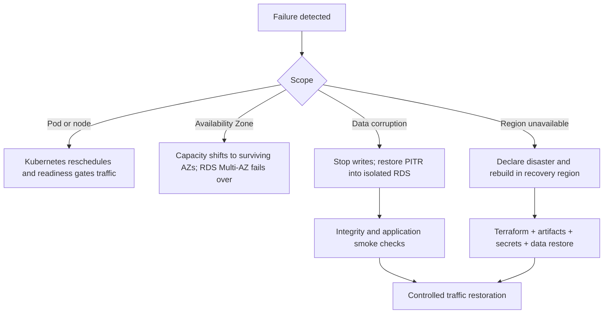

# Disaster Recovery Architecture

## Purpose

This document defines the proposed system-level recovery posture and points to the operational procedure in [operations/disaster-recovery](../operations/disaster-recovery.md). Values are objectives to validate, not guarantees.

## Initial Objectives

- **Production target RPO:** 5–15 minutes for PostgreSQL, bounded by RDS PITR configuration and verified restore evidence.
- **Production target RTO:** 30–60 minutes for a recoverable in-region failure; regional rebuild time must be measured separately before making a commitment.
- **Scope:** one AWS region across multiple Availability Zones. Multi-region active/active is not planned.

## Recovery Sources

| Capability | Authoritative recovery source |
| --- | --- |
| Business data | RDS automated backups, PITR, and controlled snapshots |
| Object data | S3 versioning/lifecycle and optional cross-region copy when risk justifies it |
| Infrastructure | Reviewed Terraform configuration plus recoverable encrypted remote state |
| Workload desired state | Git, Helm values, and Argo CD configuration |
| Application artifacts | Immutable image digests retained in ECR or a recovery registry policy |
| Secrets | Secrets Manager/KMS configuration and a documented rotation/recreation path |
| Events | PostgreSQL outbox plus SQS retention/DLQs; replay is controlled and idempotent |

## Failure Boundaries

An AZ failure should be absorbed by topology and managed failover. Data corruption is not fixed by high availability and requires a point-in-time restore. A regional disaster uses a documented rebuild, not an unproven active replica.

## Validation

At least quarterly once production exists: restore RDS to isolation, validate tenant and financial invariants, recover representative S3 objects, rebuild GitOps state, check image availability, and time the exercise. Run an annual regional tabletop before claiming any regional RTO. Record gaps in the [production-readiness checklist](../roadmap/production-readiness.md).

## Multi-Region Trigger

Revisit only for contractual availability beyond single-region risk, mandatory data residency, unacceptable user latency, or measured business impact exceeding the full cost and consistency burden. The new design requires an ADR, data conflict model, identity/DNS plan, and repeated failover evidence.
