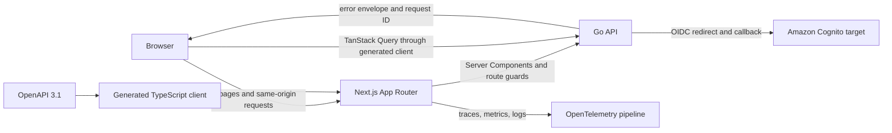

# Proposed Frontend Architecture

## Purpose And Status

This document proposes the frontend architecture for ClouDesk. The repository does
not yet contain a frontend implementation, so every file, boundary, dependency, and
runtime behavior below is a target rather than a statement of current capability.
The design favors a small local V1 that can evolve into the production target
without introducing a second application architecture.

The proposal uses Next.js App Router, React, strict TypeScript, Tailwind CSS, and
TanStack Query. React Hook Form and Zod are proposed for non-trivial forms;
Playwright is proposed for browser-level verification. OpenAPI 3.1 remains the
cross-stack contract and generates the TypeScript transport client. Related
contracts are defined in [API conventions](../api/conventions.md),
[API errors](../api/errors.md), and the [OpenAPI workflow](../api/openapi.md).

## Architectural Decisions

- Use TypeScript because the UI has permission-sensitive workflows, substantial
  form state, and a generated API contract. Strict static checks reduce contract
  drift and make refactoring across feature boundaries safer.
- Use App Router with Server Components by default. Client Components are explicit
  interaction islands, not the default rendering model.
- Keep one frontend deployable. Feature folders are ownership boundaries inside
  that deployable, not separately deployed micro-frontends.
- Use TanStack Query only for remote server state in interactive surfaces. URL
  state, form state, and short-lived view state retain separate owners.
- Generate transport types and endpoint functions from OpenAPI. Do not hand-copy
  request or response DTOs into feature modules.
- Treat authorization UI as guidance and defense in depth. The Go API is always
  authoritative for tenant membership and permissions; hidden controls are never
  a security boundary.
- Keep provider tokens out of browser JavaScript and browser storage. Production
  authentication targets Cognito-hosted OIDC; local development uses the same
  application-facing identity contract through a local adapter.

## Runtime Shape



CloudFront and the load-balancing layer should expose the web and API on one
origin. Browser calls use relative `/api/v1/...` URLs and secure cookies. This
avoids broad CORS policy and makes CSRF policy explicit. Tenant-owned API routes
carry tenant context as a required path parameter, for example
`/api/v1/organizations/{organizationId}/projects`; `X-Organization-ID` must not be
treated as authoritative context.

## Proposed Project Structure

```text
frontend/
├── src/
│   ├── app/
│   │   ├── (public)/
│   │   │   └── login/
│   │   ├── (onboarding)/
│   │   │   └── onboarding/
│   │   ├── (workspace)/
│   │   │   └── [organizationSlug]/
│   │   │       ├── layout.tsx
│   │   │       ├── dashboard/
│   │   │       ├── clients/
│   │   │       ├── projects/
│   │   │       ├── tasks/
│   │   │       ├── time/
│   │   │       ├── invoices/
│   │   │       ├── team/
│   │   │       ├── notifications/
│   │   │       ├── reports/
│   │   │       └── settings/
│   │   ├── error.tsx
│   │   ├── global-error.tsx
│   │   ├── not-found.tsx
│   │   └── layout.tsx
│   ├── features/
│   │   ├── auth/
│   │   ├── organizations/
│   │   ├── dashboard/
│   │   ├── clients/
│   │   ├── projects/
│   │   ├── tasks/
│   │   ├── time-tracking/
│   │   ├── invoices/
│   │   ├── team/
│   │   ├── notifications/
│   │   ├── reports/
│   │   └── settings/
│   ├── components/
│   │   ├── ui/
│   │   └── layout/
│   ├── lib/
│   │   ├── api/
│   │   │   ├── generated/
│   │   │   └── runtime/
│   │   ├── auth/
│   │   ├── observability/
│   │   └── validation/
│   ├── styles/
│   └── test/
├── e2e/
└── public/
```

Route groups separate public, onboarding, and authenticated shells without changing
URLs. The organization slug is a navigation identifier; the authenticated
organization context resolves it to an immutable `organizationId` before generated
tenant endpoints are called. The API verifies that ID against the active user and
membership on every request.

Each feature may contain `components`, `queries`, `mutations`, `forms`, `model`, and
`utils` only when needed. Avoid empty framework-shaped directories. Feature public
entrypoints expose the smallest stable surface; code must not import another
feature's private files.

### Dependency Direction

| Layer | Responsibility | May depend on |
| --- | --- | --- |
| `app` | Routing, layouts, metadata, server composition | Feature public APIs, shared layout, platform libraries |
| `features` | User workflows and feature-specific presentation | Generated API client, shared UI, narrow platform utilities |
| `components/ui` | Accessible primitives and visual tokens | React, styling utilities; no feature or API code |
| `lib/api/generated` | OpenAPI-generated DTOs and endpoint functions | Generated runtime only |
| `lib/api/runtime` | Fetch policy, credentials, tracing, normalized errors | Generated client contract and platform utilities |
| `lib/auth` | Session reads, organization context, capability helpers | Auth/API contracts; no feature UI |

Domain calculations that determine invoice totals, timer concurrency, or permissions
belong to the backend. The frontend may format values and predict a result for UX,
but it must render the server-confirmed value after mutation.

## Server And Client Component Boundaries

Server Components are the default for layouts, metadata, initial read-only content,
and session-aware composition. Client Components are reserved for stateful forms,
drag-and-drop, live timer controls, dialogs, editable tables, toasts, and other
browser-event-driven behavior.

- The root layout establishes HTML metadata, global styles, and the smallest set of
  client providers.
- The workspace layout reads the server-side session, resolves organization
  membership, renders navigation, and redirects unauthenticated users before
  protected content is streamed.
- A request-scoped QueryClient may prefetch the first interactive view on the
  server and dehydrate it into a client provider. Never reuse one QueryClient
  across server requests.
- Interactive islands receive serializable identifiers and initial data, not
  provider tokens or server-only service objects.
- Server-only modules use an explicit `server-only` boundary. Modules that access
  `window`, event handlers, or browser observability declare `"use client"` at the
  narrowest practical boundary.
- Route `loading.tsx` files provide meaningful skeletons for slow segments. They do
  not replace component-level pending feedback for mutations.

Server rendering is not an excuse for two data access systems. Both server-prefetch
and browser interaction use the generated client through environment-specific fetch
adapters with the same error model and organization path parameters.

## State Ownership

| State kind | Owner | Examples |
| --- | --- | --- |
| Navigable state | URL search params and route segments | Filters, cursor, sort, selected project tab |
| Remote server state | TanStack Query | Projects, tasks, notification count, invoice detail |
| Form draft and validation | React Hook Form + Zod | Client editor, time entry, invoice draft fields |
| Local interaction state | Component or focused context | Open dialog, row selection, temporary disclosure |
| Authenticated identity and organization | Server session plus hydrated read-only context | User ID, active membership, capability set |
| Durable business state | Go API and PostgreSQL | Permissions, invoice state, timer state, totals |

Do not mirror query data into a global store. Introduce a client state library only
after a demonstrated cross-feature need that cannot be represented by the URL,
query cache, form owner, or a focused React context.

## TanStack Query Policy

Query keys begin with immutable organization context for tenant-owned data, for
example `['organization', organizationId, 'projects', normalizedFilters]`. Keys must
never rely on the display slug alone. Switching organizations cancels in-flight
requests and removes organization-scoped cache entries before the new workspace is
rendered; caches must not persist across users.

- Feature query factories own keys, endpoint invocation, selection, and invalidation.
- Generated endpoint functions accept required `organizationId` path parameters;
  wrappers must not infer tenant context from a mutable header.
- Forward `AbortSignal` from TanStack Query to `fetch` so navigation and superseded
  requests stop consuming work.
- Set `staleTime`, polling, and retries per data class. Do not apply frequent global
  polling. Retry only transient, idempotent reads with a small bounded budget and
  jitter; never retry `401`, `403`, validation errors, or arbitrary mutations.
- Cursor pagination stores the opaque server cursor without decoding it. Filtering
  and sorting follow [pagination](../api/pagination.md).
- Mutations invalidate or update the narrowest affected keys. Broad cache resets are
  reserved for organization or identity transitions.
- Do not persist sensitive query data to local storage. A future offline mode needs
  a separate threat model and product decision.

### Optimistic Updates

Use optimistic updates only when the action is easily reversible and the UI can
retain a complete rollback snapshot. Suitable initial candidates are task status,
task assignment, and marking an in-app notification as read. Cancel related reads,
snapshot the cache, apply the predicted change, roll back on failure, and reconcile
with the server response on settlement.

Do not optimistically confirm invoice issue/void transitions, timer start/stop,
membership role changes, file completion, or destructive actions. Those operations
have concurrency, authorization, audit, or external side effects and remain pending
until the API confirms them. Missing preconditions (`428`) are a client defect;
stale ETags (`412`) refetch and show user reconciliation; a current-version domain or
idempotency conflict (`409`) presents its operation-specific resolution. Same-key,
same-request idempotency replay is treated as success and never repeats UI effects.

## Generated OpenAPI Client

OpenAPI 3.1 is the sole transport-contract source. CI should validate the
specification, regenerate `src/lib/api/generated`, fail on an uncommitted generation
diff, type-check all consumers, and run compatibility checks before merge. Generated
files carry a generated header and must never be edited manually.

`lib/api/runtime` is a thin adapter that:

- selects the server or browser base URL;
- sends same-origin credentials and the documented content type; the server adapter
  forwards only the allowlisted session and request context from the incoming request;
- forwards cancellation and W3C trace context where appropriate;
- reads the response request ID and stable error envelope;
- applies no hidden tenant, retry, or business logic; and
- returns typed success values or a normalized `ApiError` discriminated by status
  and API error code.

Feature modules may define view models derived from generated DTOs, but must not
redeclare transport DTOs. When a generated contract is awkward, change the OpenAPI
contract deliberately rather than masking it with a parallel handwritten interface.

## Authentication And Session Handling

The production target uses Cognito-hosted OIDC with Authorization Code and PKCE.
Local development uses an identity adapter or emulator with the same frontend-facing
redirect, callback, session, and logout behavior. The application authentication
boundary owns token exchange and refresh; the browser receives only a `Secure`,
`HttpOnly`, appropriately scoped `SameSite` session cookie. Access and refresh
tokens must not be stored in local storage, session storage, React context, query
cache, or readable cookies.

The proposed flow is:

1. An unauthenticated workspace request redirects to the application login endpoint.
2. The login endpoint creates OIDC state, nonce, and PKCE material and redirects to
   the configured provider.
3. The callback validates state, nonce, issuer, audience, and authorization code,
   then establishes or rotates the application session.
4. The workspace layout reads the session server-side and loads memberships and
   effective permissions.
5. Same-origin API calls send the session cookie. The API revalidates session,
   tenant membership, and permission for each operation.
6. Logout invalidates the server session, clears the cookie and query cache, and
   uses provider logout only when required by the provider contract.

Client behavior is deterministic: `401` clears client-visible identity state and
starts reauthentication while preserving only a safe same-origin return path;
`403` keeps the session and renders an access-denied state. Session refresh is
centralized to prevent refresh storms. CSRF protection, cookie scope, session
rotation, and revocation are security controls specified in
[security architecture](security.md).

## Authorization UX And Tenant Switching

Effective capabilities, not role names, drive UI decisions. A single typed
capability vocabulary should back navigation, action menus, route composition, and
form availability. Server layouts omit inaccessible navigation where possible; a
small client `Can` primitive or capability hook handles interactive controls after
hydration.

- Hide actions the user cannot discover or invoke; disable actions when the user can
  understand the feature but a current resource state prevents it, and explain why.
- Never assume a hidden button prevents a direct request. Always handle `403` from
  stale permissions, removed memberships, and concurrent role changes.
- Treat `404` according to the API's anti-enumeration policy; do not reveal whether a
  resource exists in another organization.
- Resolve an organization slug to an allowed organization ID before rendering its
  workspace. Organization switching cancels requests, clears the previous tenant's
  cache, resets feature-local state, and navigates to a verified membership.
- Destructive or externally visible actions require confirmation proportional to
  impact. Invoice voiding, member removal, project archival, and file deletion state
  consequences clearly and keep recovery/audit expectations visible.

The canonical isolation and permission rules live in
[multi-tenancy](multi-tenancy.md); frontend checks are an ergonomic projection of
those rules.

## Forms And Validation

Use native form semantics with React Hook Form for non-trivial client interaction
and Zod for UI-oriented runtime validation. Small forms that work naturally as
server actions or controlled inputs do not need a form library solely for
consistency.

- Generated OpenAPI DTOs remain the request shape. Zod schemas add UI constraints,
  coercion, conditional fields, and friendly messages; they must not fork server
  domain rules.
- Validate on blur or submit by default, with targeted immediate feedback after a
  field has been touched. Avoid noisy validation on every keystroke.
- Map API field violations to their controls and place non-field errors in an error
  summary. Focus the summary after a failed submit and link each error to its field.
- Preserve a user's safe draft after validation, authorization, rate-limit, or
  conflict failures. Never preserve secrets or sensitive authentication fields.
- Disable duplicate submission while a request is in flight and use idempotency keys
  for API operations identified by the [idempotency contract](../api/idempotency.md).
- Currency uses integer minor units or exact decimal strings from the API; dates and
  times are converted at the presentation boundary while the API remains UTC-based.
- Invoice totals, tax calculations, permission decisions, and timer invariants are
  always recomputed and confirmed by the server.

## Failure, Loading, Empty, And Success States

Every data-bearing screen defines its initial loading, background refresh, empty,
partial, error, forbidden, not-found, and success behavior.

| Condition | Proposed behavior |
| --- | --- |
| Initial route load | Shape-matched skeleton with a stable page heading; no full-page spinner |
| Background refresh | Preserve usable data and show a subtle freshness indicator only when useful |
| Empty collection | Explain the feature and show the permitted next action; distinguish no data from no filter matches |
| Expected API error | Inline or page-level recovery using the stable error code and visible request ID |
| Rendering defect | Nearest `error.tsx` boundary with retry; `global-error.tsx` is the last resort |
| Unauthorized | Reauthenticate safely and avoid redirect loops |
| Forbidden | Keep the shell, explain loss of access, and offer a valid destination |
| Not found | Use the API anti-enumeration behavior and avoid cross-tenant hints |
| Rate limited | Respect `Retry-After`, disable immediate retry, and explain when to try again |
| Offline/transient network | Preserve entered data and offer a bounded manual retry; do not claim success |
| Mutation success | Reconcile server data, announce important changes, and navigate only when the workflow requires it |

Expected API failures stay inside feature surfaces; programming and rendering
failures go to React error boundaries and observability. Toasts supplement visible
state but never serve as the only error or success feedback.

## Screen And Responsive Model

The authenticated desktop shell uses a persistent sidebar, page header, and content
region. Tablet layouts collapse secondary navigation. Mobile uses a compact top bar
and accessible navigation drawer; primary actions remain reachable without relying
on hover. The proposal starts mobile-aware but does not force dense desktop workflows
into identical mobile controls.

| Screen group | Primary responsive and state considerations |
| --- | --- |
| Login and onboarding | Single-column flow, explicit provider redirect state, recoverable invitation and expired-session errors |
| Dashboard | Reorderable only in future; V1 cards flow to one column and charts include textual summaries |
| Clients and projects lists | URL-backed filters; tables may become labeled card rows on narrow screens; bulk actions remain explicit |
| Client and project detail | Summary first, tabbed secondary content, deep links preserved, side panels become full-screen dialogs |
| Tasks and task detail | List/board choice is URL-backed; board columns scroll without trapping the page; keyboard alternative to drag-and-drop |
| Time tracking | Persistent, unambiguous active-timer status; start/stop awaits server confirmation; elapsed display tolerates refresh |
| Invoice list/editor/detail | Desktop table plus narrow-screen rows; editor sections stack; totals remain visible; lifecycle actions need confirmation |
| Team and settings | Permission explanations, unsaved-change protection, destructive actions isolated from routine settings |
| Notifications | Progressive list, accessible unread state, optimistic read marking with rollback |
| Reports | Filters precede visualization; charts have tables or summaries; long exports are asynchronous and status-driven |

Define breakpoints through shared design tokens rather than component-specific pixel
constants. Test narrow phone, tablet, standard laptop, and wide desktop layouts. Use
virtualization only after measured list-size or rendering evidence demonstrates a
need.

## Accessibility

Target WCAG 2.2 AA for the production UI. Accessibility is part of component and
workflow acceptance, not a final styling pass.

- Use semantic landmarks, headings, buttons, links, tables, labels, and fieldsets
  before ARIA.
- Provide full keyboard operation, visible focus, logical focus order, escape and
  return-focus behavior for dialogs, and a skip link.
- Announce asynchronous validation, mutation results, notification counts, and timer
  state changes through appropriately scoped live regions without excessive noise.
- Do not encode task status, invoice state, priority, or chart meaning through color
  alone. Meet text and control contrast requirements in every theme.
- Respect reduced motion and zoom/reflow. Touch targets must remain practical on
  small screens.
- Data grids need headers, captions or accessible names, row action labels, and a
  usable non-drag interaction. Charts need a textual or tabular equivalent.
- Automated accessibility checks support, but do not replace, keyboard and screen
  reader review of critical workflows.

## Observability

Use Next.js OpenTelemetry instrumentation for server-side requests and propagate W3C
trace context to the Go API. Browser instrumentation should be deliberately small:
Web Vitals, route/navigation performance, unhandled rendering failures, and selected
query or mutation failures. Preserve the API `requestId` in normalized errors and
display it in support-oriented error details.

Telemetry should include service, environment, route template, release identifier,
status, duration, trace ID, and organization ID only where policy permits. It must
exclude access tokens, session cookies, form contents, invoice details, file names,
email addresses, and other unnecessary personal data. High-cardinality resource IDs
must not become metric labels. Client error reporting needs sampling and source-map
access controls. The end-to-end policy is defined in
[observability](../operations/observability.md).

Initial frontend indicators should include Core Web Vitals by route group, page
render failures, API error rate observed by the browser, login redirect/callback
failures, and critical workflow completion failures. These are diagnostic signals,
not standalone availability guarantees.

## Testing Strategy

The detailed quality model is documented in
[frontend testing](../testing/frontend.md) and [E2E testing](../testing/e2e.md).
This architecture proposes:

- TypeScript strict checks and lint rules for the fastest structural feedback.
- Component tests for accessible primitives, form behavior, permission projections,
  error mapping, and optimistic rollback. Prefer user-observable assertions over
  component internals.
- Integration tests around each feature's generated-client adapter, query behavior,
  forms, and route composition. Mock at the HTTP boundary, not the generated client
  implementation.
- Contract checks that regenerate the OpenAPI client, compile representative
  consumers, and fail when the committed output drifts from the API specification.
- Playwright for the smallest set of cross-boundary journeys: login/onboarding,
  organization switching, clients/projects/tasks, timer concurrency, invoice
  creation and lifecycle, file upload authorization, permissions, and logout.

Playwright runs against an isolated application and database with deterministic seed
builders. Create storage state per role and organization rather than sharing one
administrator session. Include negative cross-tenant navigation and direct API
attempts, stale permission `403`, missing precondition `428`, stale-ETag `412`,
current-state/idempotency `409`, idempotent response replay, optimistic rollback, and
session expiry. Use role/name/label selectors; `data-testid` is a narrow fallback. Capture
trace, screenshot, console, and network artifacts on retry without recording secrets.

CI should shard the stable browser suite and use bounded retries only to gather
evidence; a test that passes only on retry remains a flake to fix. Critical journeys
run with keyboard-only assertions and automated accessibility scanning at desktop
and mobile viewports. A scheduled broader suite may cover browser variants and
longer report/export workflows.

## Performance And Delivery Constraints

- Stream route segments where it improves time to useful content, but avoid skeleton
  fragmentation that causes layout shift.
- Keep client providers and client component boundaries narrow to limit JavaScript
  shipped to the browser.
- Use framework image and font facilities for static assets. User files continue
  through authorized presigned S3 flows, not public asset optimization by default.
- Lazy-load genuinely heavy editors or charts after measuring bundle impact. Do not
  add memoization, virtualization, or a service worker speculatively.
- Establish route-level bundle budgets and Core Web Vitals baselines before calling
  the frontend production-ready.
- A release identifies frontend, generated contract, and backend compatibility so
  traces and failures can be correlated to an immutable artifact.

## Evolution By Stage

### Local V1

Build the public/authenticated shells, generated client, organization context,
permission projection, shared accessible controls, and the first vertical features.
Use the local identity adapter and direct application dependencies. Prefer simple
request/response updates over real-time infrastructure.

### Production Target

Enable Cognito OIDC, hardened cookie/session policy, server and browser OTel,
production CSP/security headers, deterministic OpenAPI generation, responsive and
accessibility gates, and Playwright critical journeys. Deploy one horizontally
scalable Next.js application with no process-local critical state.

### Future Evolution Triggers

Add real-time server updates only if polling creates measured freshness or load
problems. Add client cache persistence only after an approved offline requirement and
security review. Add virtualization when production-sized collections demonstrate a
rendering bottleneck. Split a frontend deployable only when independent ownership,
release cadence, or isolation pressure outweighs the contract and operational cost.

## Open Questions To Resolve Before Implementation

- Which concrete Next.js-compatible session library or application session
  implementation satisfies the final identity and revocation design?
- Which generated OpenAPI client tool best preserves required path parameters,
  `AbortSignal`, normalized errors, and both server/browser adapters?
- Which component-test runner and design-system primitives minimize dependencies
  while meeting accessibility requirements?
- Which browser telemetry backend and sampling policy align with the selected
  observability platform and data-retention rules?

These are implementation choices, not permission to diverge from the session,
tenant, API, accessibility, or observability invariants in this proposal.
