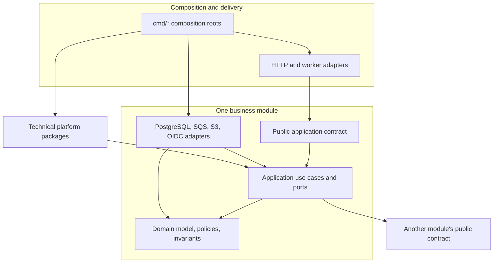
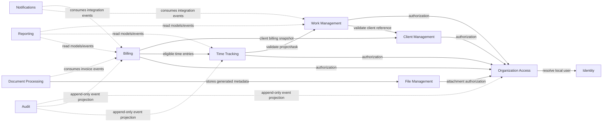

# ClouDesk Architecture Overview

## Purpose

This document proposes the software boundaries, bounded contexts, dependency rules,
and module architecture for ClouDesk. It is a design target, not a description of an
implemented system. The repository currently contains no product application or
infrastructure.

Related views:

- [System context](system-context.md)
- [Container architecture](containers.md)
- [Scalability and evolution](scalability.md)
- [Architecture decision register](../decisions/README.md)

## State And Scope

| Horizon | Proposed scope |
| --- | --- |
| Current repository | Documentation and planning only; there are no runtime components. |
| V1 local application | One repository, a Next.js web application, a modular Go API, PostgreSQL, and only the workers needed by delivered features. Docker Compose may provide local dependencies. |
| Production target | Single AWS Region across multiple Availability Zones, stateless web/API replicas on EKS, RDS PostgreSQL Multi-AZ, S3, SQS, and independently scalable workers. Redis is optional and non-authoritative. |
| Future evolution | Extract a module only after measured scaling, isolation, availability, deployment, or ownership pressure justifies the operational cost. Multi-region and a separate analytics store remain trigger-based decisions. |

The architecture favors modularity before microservices, explicit contracts, data
integrity, tenant isolation, bounded retries, and operational complexity proportional
to demonstrated need.

## System Boundary

ClouDesk owns the tenant-aware business workflows and records for organizations,
memberships, clients, projects, tasks, comments, time tracking, invoicing, files,
notifications, reporting, and audit. It does not own credential storage, email
delivery infrastructure, object-storage durability, or payment processing.

The initial identity boundary is a managed OIDC provider, proposed as Amazon Cognito
for the AWS production target. ClouDesk owns the local user reference, organization
membership, roles, and permissions; the provider owns authentication credentials and
authentication challenges. Payment processing and a customer portal are outside V1.

Every tenant-owned resource, command, query, object key, cache key, event, job, and
idempotency record must carry `organization_id`. PostgreSQL is the authoritative
store. Redis, if introduced, may accelerate rate limiting or cache derived data but
must not be required to reconstruct business state.

## Bounded Contexts

The bounded contexts below are logical ownership boundaries inside one deployable Go
codebase. A context may contain several cohesive Go packages; it is not a reason to
create an independently deployed service.

| Bounded context | Owns | Does not own | Principal collaborators |
| --- | --- | --- | --- |
| Identity | Local user identity reference, provider subject mapping, login-related security event intent | Passwords, OIDC credentials, tenant roles | Managed OIDC provider; Organization Access |
| Organization Access | Organizations, memberships, invitations, role-to-permission policy, tenant selection | Authentication credentials, domain resource lifecycle | All tenant contexts synchronously request authorization decisions |
| Client Management | Client identity, billing profile, contacts, archival state | Projects, invoices | Work Management; Billing |
| Work Management | Projects, project membership, tasks, assignments, labels, comments, activity rules | Time-entry ledger, invoice totals, file bytes | Organization Access; Client Management; Time Tracking; File Management |
| Time Tracking | Timers, manual time entries, billable status, rate-resolution inputs, corrections | Project lifecycle, invoice state | Work Management; Billing; Audit |
| Billing | Invoice aggregate, immutable billing snapshots, lines, totals, tax/discount rules, invoice state machine | Payment processing, source time-entry ownership, PDF bytes | Client Management; Time Tracking; Document Processing; Notifications |
| File Management | File metadata, upload lifecycle, object key, content policy, attachment authorization contract | Object bytes, project/task/invoice lifecycle | S3-compatible storage; Work Management; Billing |
| Document Processing | PDF/report generation jobs and generation status | Invoice business state, notification delivery | Billing; File Management |
| Notifications | In-app notification state, delivery preferences, email-delivery attempts | Source domain decisions, provider infrastructure | Integration events; email provider |
| Reporting | Query models and precomputed aggregates | Authoritative mutation of source aggregates | Work, Time, Billing, Client contexts |
| Audit | Append-only audit records and correlation metadata | Mutable source entities | Reliable integration events from every sensitive workflow |

`Document Processing` is separated conceptually because PDF/report generation has a
different resource profile, but it should initially remain an internal worker module.
Projects, tasks, and comments may remain distinct packages inside the Work Management
context so each package stays cohesive without creating artificial distributed
boundaries.

## Collaboration Rules

Interactions are selected by consistency need rather than by technology preference:

- A request remains synchronous when the caller needs an authorization decision,
  invariant check, or committed result before responding. Examples include checking
  membership, validating a client when creating a project, starting a timer, and
  issuing an invoice.
- Work becomes asynchronous when it is slow, externally dependent, retryable, or does
  not affect the command's immediate truth. Examples include PDF generation, email,
  deadline notifications, audit projection, and reporting precomputation.
- Cross-context synchronous calls use a small public application contract. Callers do
  not import another context's domain internals or repository implementation.
- Cross-context asynchronous calls use versioned integration events written to the
  transactional outbox in the same PostgreSQL transaction as the source change.
  Consumers assume at-least-once delivery and deduplicate by event ID.
- A cross-context workflow that genuinely needs one local ACID transaction may use an
  application-level process coordinator and transaction-scoped public ports. Each
  context still owns its writes; the coordinator must not issue SQL against private
  tables. This is a deliberate modular-monolith advantage, not a distributed
  transaction design.
- Reporting is the only planned cross-context read-model exception. Its queries are
  reviewed, read-only, tenant-scoped, and treated as consumers of source schemas;
  precomputed projections replace expensive joins as load grows.

## Module Architecture

The proposed backend structure uses vertical domain modules with lightweight internal
layers. Folder names are illustrative until implementation planning fixes the exact Go
package layout.

```text
backend/
├── cmd/
│   ├── api/                    # composition root for HTTP
│   ├── worker-outbox/          # outbox relay
│   ├── worker-notifications/   # in-app/email delivery
│   └── worker-documents/       # invoice PDFs and reports
├── internal/
│   ├── identity/
│   ├── organizations/
│   ├── memberships/
│   ├── clients/
│   ├── projects/
│   ├── tasks/
│   ├── comments/
│   ├── timetracking/
│   ├── invoices/
│   ├── files/
│   ├── notifications/
│   ├── reporting/
│   ├── audit/
│   └── platform/               # shared technical adapters, not business policy
├── api/                        # OpenAPI source and generated integration glue
├── migrations/
└── sql/
```

Each business module should expose only its `public` application contract and keep
domain types, use cases, persistence details, and transport mappings private wherever
Go package rules permit. Generic `utils`, `helpers`, or `common` packages are not
allowed as dependency shortcuts.

### Layers And Dependency Direction



Allowed dependencies point inward toward policy:

1. Domain code depends on the Go standard library and module-local domain code only.
2. Application code depends on its own domain and declared ports. It may depend on
   another module's public application contract when synchronous consistency requires
   it.
3. Transport and infrastructure adapters depend on application contracts; application
   and domain code do not depend on `pgx`, SQS, S3, HTTP routers, or OIDC SDKs.
4. `cmd/*` composition roots are the only packages expected to know concrete adapters
   across multiple modules.
5. Cyclic module dependencies are prohibited. A cycle is resolved by moving the
   orchestration to an application process coordinator, publishing an integration
   event, or correcting misplaced ownership.

### Context Dependency Map



Solid arrows denote synchronous public-contract dependencies. Dashed arrows denote
asynchronous integration-event consumption. The map shows representative dependencies,
not permission to omit tenant scoping from unshown interactions.

## Data Ownership And Transactions

One PostgreSQL cluster and database are proposed initially. Physical co-location does
not make tables shared: each table has one owning module, one migration owner, and one
write path. Foreign keys, tenant-aware unique constraints, and transaction boundaries
protect data integrity. Direct writes to another module's tables are prohibited.

Transactions should wrap invariant-bearing local workflows such as starting/stopping a
timer, issuing or voiding an invoice, reserving source time entries, and committing a
business change with its outbox event. External network calls never occur inside an
open database transaction. Long-running work starts after commit.

## Hard-To-Reverse Decisions

The principal architecture ADR register should record these decisions before product
implementation:

| Decision | Proposed direction | Reversal concern |
| --- | --- | --- |
| System decomposition | Modular Go monolith plus independent workers | Premature service boundaries create distributed transactions and operational load. |
| Source of truth | PostgreSQL | Data ownership and transaction semantics shape every module. |
| Tenant model | Organization as tenant; mandatory `organization_id` defense in depth | Retrofitting tenant scope is high-risk. |
| Cross-stack contract | OpenAPI 3.1 under `/api/v1` | Generated clients and compatibility policy depend on it. |
| Reliable async delivery | SQS with transactional outbox and consumer inbox/deduplication | Broker and event semantics affect failure behavior. |
| Authentication | Managed OIDC, initially Cognito for the AWS target | Provider migration affects subject mapping and session flows. |
| Deployment topology | One regional product deployment; EKS is staged, not a local V1 prerequisite | Platform cost and operational ownership are substantial. |

Local package names, router choice, and individual worker process grouping are more
reversible implementation details and should remain adjustable.

## Boundary Verification

Future implementation should enforce the proposal with:

- Go internal-package boundaries and import-cycle checks;
- architecture tests that reject forbidden cross-module imports;
- migration ownership review and searches for unscoped tenant queries;
- OpenAPI compatibility checks in CI;
- integration tests proving outbox atomicity and inbox deduplication;
- trace and metric dimensions that reveal cross-context latency and failure rates;
- periodic review of extraction signals in [scalability and evolution](scalability.md).
