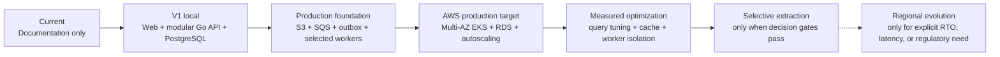
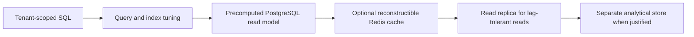
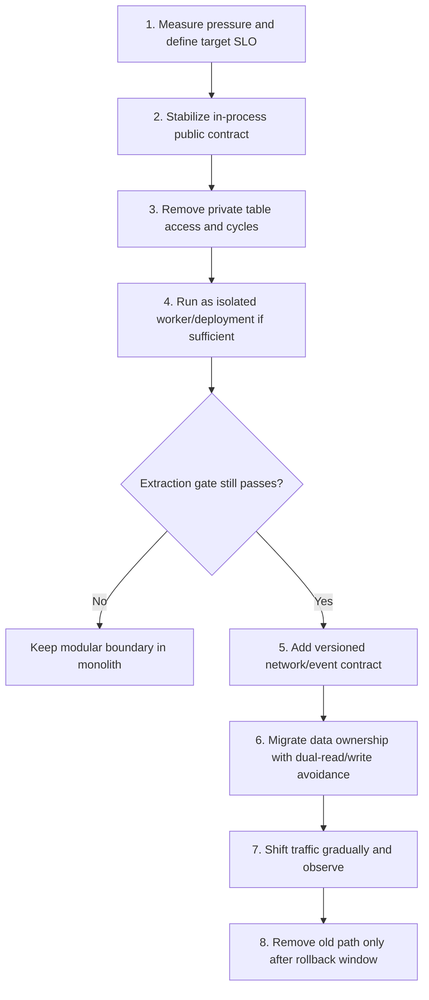

# ClouDesk Scalability And Evolution

## Purpose

This document proposes how ClouDesk should scale from a local modular application to
a production target without adopting distributed complexity prematurely. It defines
measurable triggers for infrastructure changes and future service extraction. It does
not claim current capacity or production readiness.

Related documents:

- [Architecture overview](overview.md)
- [System context](system-context.md)
- [Container architecture](containers.md)
- [Architecture decision register](../decisions/README.md)

## Scaling Principles

- Make the API and web stateless; keep authoritative state in PostgreSQL.
- Scale a measured bottleneck, not a technology category.
- Prefer query, index, payload, batching, and concurrency corrections before adding
  infrastructure.
- Protect PostgreSQL with connection budgets, bounded work, and admission control as
  application replicas increase.
- Scale worker classes independently using queue age and processing rate, not CPU
  alone.
- Preserve tenant fairness so one large organization cannot consume all request,
  connection, or worker capacity.
- Partition deployment or data ownership only after simpler isolation techniques have
  failed or an ownership boundary is stable.

## Evolution Stages

Each transition is optional and evidence-driven. For example, SQS is introduced when
the product first needs durable asynchronous side effects, while Redis waits until a
specific cache, rate-limit, or coordination problem exists.

## Scaling By Container

| Component | Initial posture | Primary signals | First responses | Later responses |
| --- | --- | --- | --- | --- |
| Next.js web | At least two production replicas when availability requires it; no critical local state | Request rate, p95/p99 latency, error rate, event-loop saturation, memory | Cache safe static assets at CloudFront, remove client/server waterfalls, right-size pods | Horizontal scaling, isolate expensive rendering routes |
| Go API | Multiple stateless production replicas behind ALB | RED metrics, saturation, goroutines, DB wait time, downstream latency | Optimize handlers/queries, bound concurrency, tune requests/limits | HPA on CPU plus request/latency signals; isolate heavy endpoints into async jobs |
| Outbox publisher | One or a small coordinated replica set | Oldest unpublished event age, batch throughput, publish errors, DB lock time | Tune batch/claim duration, backoff, SQS batching | Coordinated horizontal publishers; partition only if ordering and throughput demand it |
| Notification workers | Small bounded worker pool | Oldest message age, delivery rate, provider throttling, DLQ rate | Tune concurrency below provider limits, batch when supported | HPA/KEDA-style queue scaling; isolate channels/providers |
| Document workers | Dedicated concurrency budget | Queue age, CPU, memory, generation duration, pod eviction | Bound document size and concurrency, right-size resources | Separate node pool or service extraction for workload isolation |
| Reporting projections | Asynchronous where possible | Projection lag, query duration, rows scanned, database CPU/I/O | Add targeted indexes, precompute aggregates, schedule heavy work | Read replica or separate analytical read store after consistency requirements are defined |
| PostgreSQL | One Multi-AZ primary for production target | Connections, lock waits, transaction time, CPU, IOPS, buffer hit ratio, slow queries | Fix N+1/unbounded queries, add evidence-backed indexes, shorten transactions, cap pools | Instance/storage scaling, connection proxy/pooler, read replicas for eligible reads, partition only proven large tables |
| Optional Redis | Absent until justified | Cacheable read volume, hit ratio, rate-limit coordination need | Introduce only for named workloads with fallback | Cluster/replication only when the workload and failure budget justify it |

HPA decisions should use workload-representative signals. CPU can be useful for API and
document generation, but queue backlog age is a better indicator for workers. Memory
autoscaling is treated cautiously because scaling after memory exhaustion is too late.

## Probable First Bottleneck

The first shared production bottleneck is likely PostgreSQL connection and query
capacity, not Go compute. Tenant-scoped project/task lists, dashboard aggregates, time
reports, and invoice views can create expensive joins or too many queries as API
replicas and organizations grow. Unbounded API connection pools can exhaust RDS before
pods show high CPU.

This is a hypothesis to validate with traces, query metrics, `EXPLAIN (ANALYZE,
BUFFERS)` in non-production test data, and load tests. The response order is:

1. eliminate N+1 and unbounded result sets;
2. enforce cursor pagination, statement deadlines, and query limits;
3. add tenant-leading indexes supported by observed plans;
4. shorten transactions and remove external I/O from them;
5. allocate a global connection budget across API and worker replicas;
6. precompute expensive operational aggregates;
7. scale the RDS instance/storage or add pooling;
8. add read replicas only for reads that tolerate replica lag;
9. consider a separate reporting store only after operational queries cannot meet both
   product and database reliability goals.

For document generation or email bursts, the first bottleneck may instead be worker
throughput or provider throttling. Queue age makes that localized bottleneck visible
without requiring API scaling.

## Connection And Concurrency Budget

Horizontal scaling multiplies database clients. Before choosing replica counts, the
team should reserve PostgreSQL connections for administration, migrations, incident
response, and failover recovery, then divide the remaining budget among APIs, workers,
and background jobs. Each process uses a bounded pool; HPA maximum replicas must be
compatible with the aggregate pool maximum.

Request and job admission also remains bounded:

- API handlers apply deadlines and endpoint-specific concurrency/rate controls.
- Report exports and document generation become jobs instead of holding HTTP
  connections and database transactions open.
- Worker pools cap in-flight messages by database, CPU, memory, and downstream
  capacity.
- SQS visibility timeout exceeds normal processing duration and is extended only while
  a worker demonstrates progress.
- Retry budgets prevent a failing dependency from multiplying load.
- Per-organization quotas or fair scheduling are introduced if tenant concentration
  appears in queue or request metrics.

## Read And Cache Evolution

PostgreSQL remains authoritative. The progression for read-heavy behavior is:

Cache keys include `organization_id`, resource identity, relevant version, and query
shape. Cache invalidation is explicit; stale authorization data is not accepted as an
authorization decision. On Redis failure, the system falls back to bounded
PostgreSQL-backed reads or deliberately degrades nonessential endpoints. Cache loss
never loses business data.

Read replicas are not suitable for read-after-write commands, permission changes,
timer concurrency checks, or invoice state transitions. Reporting and historical
lists may use them only after the UI and API define acceptable replica lag.

## Service Extraction Decision Gate

“It may scale” is not an extraction reason. A module becomes a service candidate only
when evidence shows a durable boundary and the benefits exceed the cost of network
failure, eventual consistency, independent delivery, on-call ownership, security, and
data migration.

An extraction proposal should satisfy all mandatory readiness conditions and at least
one strong pressure condition.

### Mandatory readiness conditions

- The bounded context has a stable name, owner, public API/event contract, and no
  cyclic dependencies.
- Its authoritative data and write paths can be separated without cross-service ACID
  transactions or direct table access.
- Idempotency, event versioning, retries, DLQ behavior, trace propagation, and SLOs are
  defined and tested.
- A team owns build, deployment, incidents, security patches, migrations, and cost.
- Load and failure tests show the proposed boundary improves the measured problem.
- A reversible migration and rollback plan exists.

### Strong pressure conditions

| Pressure | Evidence that can justify extraction | Evidence that does not |
| --- | --- | --- |
| Independent scale | Sustained workload is materially overprovisioning the rest of the monolith and cannot be isolated adequately with a separate worker deployment | General expectation of growth |
| Availability | Context needs a demonstrably different SLO or failure containment boundary | Desire to label components “high availability” |
| Resource isolation | CPU, memory, I/O, runtime, or dependency profile repeatedly harms core request latency | A one-off slow job that can be queued |
| Deployment independence | Frequent safe releases are blocked by coordinated monolith releases and the boundary has compatibility discipline | Preference for smaller repositories |
| Team ownership | A stable team can own the context end to end and coordination cost is measurably high | Creating a service before a team exists |
| Security/compliance | Separate credentials, network controls, data residency, or blast radius are mandated and cannot be met in-process | Security by physical separation without a threat model |
| Performance profile | A distinct storage or compute model is proven necessary and incompatible with the core runtime | Choosing a different database for novelty |

## Extraction Candidates And Triggers

| Candidate | Why it may separate later | Trigger | Why it remains internal initially |
| --- | --- | --- | --- |
| Document Processing | CPU/memory-heavy rendering, specialized libraries, S3-focused IAM | Generation backlog violates its proposed SLO or resource spikes harm API/other workers despite separate deployments and limits | It already runs as an independent worker, which supplies isolation without distributed data ownership |
| Notifications | Provider throttling, channel-specific delivery, independent release cadence | Multiple channels/providers and delivery volume require a dedicated owner or availability policy | Queue and worker isolation solve initial latency and failure concerns |
| Reporting/Analytics | Read-heavy aggregates and different freshness requirements | Operational reporting materially harms primary database SLOs after query tuning and projections | PostgreSQL aggregates avoid warehouse operations and duplicate data governance |
| File scanning | Untrusted-content processing and specialized runtime | Malware scanning becomes mandatory or processing requires stronger sandbox/blast-radius isolation | V1 can restrict types/sizes and use a managed scanner integration when needed |
| Audit | Compliance retention, immutability, access separation | Regulation requires independently controlled storage/availability or export volume overwhelms the core database | An append-only module plus least-privilege access is simpler initially |
| Billing | Distinct ownership or integration complexity | A dedicated billing team, high transaction volume, or external accounting/payment integrations create a stable independent lifecycle | Billing participates in client/time workflows where local transactions and explicit public ports reduce inconsistency |

Identity authentication is already delegated to a managed OIDC system; local identity
mapping, membership, and authorization should not be extracted merely to create an
“identity service.” Projects, tasks, comments, and time tracking should remain together
until real ownership and consistency pressures prove otherwise.

## Safe Extraction Sequence

Prefer extracting an asynchronous worker before moving authoritative data. A network
facade around shared tables is not a completed service extraction: it retains shared
data coupling while adding remote failure.

## Scaling Signals And Decision Cadence

Dashboards and load tests should correlate these signals by route, worker class, and
organization without exposing tenant content:

- API request rate, error ratio, p50/p95/p99 duration, saturation, and deadline
  cancellations;
- PostgreSQL connections, pool wait time, query latency, lock wait time, deadlocks,
  transaction age, IOPS, and replica lag if replicas exist;
- queue depth, oldest-message age, processing rate, retry count, DLQ arrivals, and
  outbox oldest-pending age;
- worker CPU, memory, in-flight count, processing duration, and provider throttle rate;
- cache hit/miss ratio, latency, eviction rate, and degraded-mode activations;
- domain load such as active timers, invoice creation rate, file volume, report jobs,
  and tenant concentration.

Capacity reviews should use normal, burst, sustained, and failure-injection tests.
Scaling policy changes require before/after evidence and a cost estimate. SLOs are
proposed objectives, not guarantees, and should be calibrated after representative
traffic exists.

## Availability-Zone And Regional Evolution

The production target uses one AWS Region with multiple Availability Zones. Stateless
replicas and workers spread across nodes/AZs; RDS uses Multi-AZ failover. A pod, node,
or single-AZ loss should reduce capacity rather than lose committed data, provided the
remaining capacity and disruption budgets are tested.

Multi-region is deferred. It becomes a design candidate only if one or more of these
requirements are explicit and funded:

- an RTO that cannot be met by tested single-region restore/failover procedures;
- regulatory data residency requiring regional separation;
- user latency that edge caching and regional optimization cannot meet;
- a business continuity requirement that accepts the consistency, replication,
  routing, security, and operating cost of multiple regions.

Before multi-region, ClouDesk should prove backup restore, point-in-time recovery,
infrastructure recreation, image availability, GitOps recovery, and regional runbooks.
Multi-region without tested recovery would add failure modes without proving
resilience.

## Decisions Deliberately Deferred

- Aurora PostgreSQL versus RDS PostgreSQL after workload and cost evidence;
- Redis topology until a named use case exists;
- Karpenter and custom autoscaling signals until EKS workload behavior is measured;
- read replicas, partitioning, or an analytics store until query and data growth demand
  them;
- canary tooling until rolling deployment and telemetry are reliable;
- service mesh, Kafka, and multi-region until a requirement exceeds the simpler
  architecture;
- service extraction until the decision gate above is supported by operational and
  ownership evidence.

