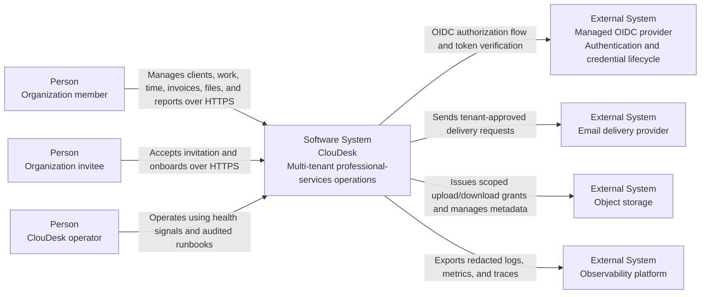
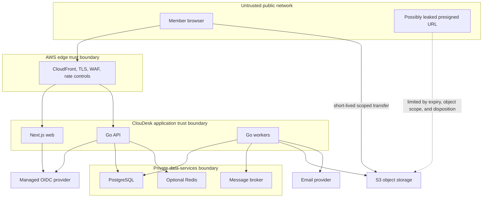

# ClouDesk System Context

## Purpose

This C4-style system context defines people, external systems, trust boundaries, and
high-level information flows for the proposed ClouDesk platform. It does not claim
that any integration is currently implemented.

See the [architecture overview](overview.md) for bounded contexts and the
[container view](containers.md) for deployable responsibilities.

## Actors And External Systems

| Element | Relationship to ClouDesk |
| --- | --- |
| Organization member | Uses ClouDesk as an owner, administrator, manager, member, or viewer. Effective permissions come from an active organization membership. |
| Organization invitee | Accepts an invitation and establishes or connects an external identity before becoming an active member. |
| ClouDesk operator | Operates the platform and responds to incidents. This identity has no implicit tenant-data access; audited break-glass access requires a separate future policy. |
| Managed OIDC provider | Authenticates users and owns credentials, password reset, and future MFA challenges. Amazon Cognito is the proposed initial AWS choice. |
| Email delivery provider | Delivers invitation, assignment, mention, deadline, and invoice messages. ClouDesk owns delivery intent and status, not provider transport. |
| Object storage | Stores attachments, generated invoice PDFs, reports, and exports. Amazon S3 is the production target; ClouDesk owns tenant-scoped metadata and authorization. |
| Observability platform | Receives redacted telemetry for operations. Telemetry must not become an uncontrolled copy of tenant content or credentials. |

Payment gateways, public client accounts, a data warehouse, and external accounting
systems are outside V1. They require explicit contracts and threat review before being
added to the system boundary.

## C4-Style Context Diagram

## Trust Boundaries

Crossing a boundary always requires authentication where applicable, authorization,
input validation, tenant scoping, a deadline, and safe telemetry. Workloads use
workload identity and least-privilege IAM rather than static AWS credentials.

## Principal Information Flows

### Interactive commands and queries

1. A browser reaches the edge over HTTPS.
2. The managed OIDC provider authenticates the user; ClouDesk maps the validated
   provider subject to a local user.
3. Every tenant API request selects an organization and proves an active membership.
4. The Go API authorizes the permission, validates input, and performs a
   tenant-scoped PostgreSQL command or query.
5. The response carries a request ID; server telemetry avoids tokens, secrets, and
   unnecessary personal data.

The user ID alone never grants tenant access. Resource lookup must combine resource
identity and `organization_id`, preventing IDOR and tenant enumeration.

### Direct file transfer

1. The browser asks the API for permission to upload or download a specific file.
2. The API validates membership, resource association, content constraints, and tenant
   ownership, then creates a short-lived, operation-specific presigned URL.
3. The browser transfers bytes directly to object storage.
4. The API maintains the authoritative metadata and upload lifecycle in PostgreSQL;
   unconfirmed or rejected uploads do not become usable attachments.

An object key includes a non-guessable identifier and tenant scope. S3 buckets remain
private. A URL is a temporary capability, not proof of ongoing authorization.

### Asynchronous side effects

1. A synchronous command commits its business record and integration event to the
   PostgreSQL outbox in one transaction.
2. The outbox publisher delivers to the proposed SQS broker with bounded retries.
3. Workers process messages at least once and deduplicate by event ID.
4. Provider calls, PDF generation, in-app notification updates, audit projection, and
   reporting projection occur outside the initiating transaction.
5. Exhausted messages reach a DLQ for alerting, diagnosis, and controlled replay.

Broker unavailability delays side effects but does not lose the committed intent.
Worker death causes visibility-timeout redelivery. Neither condition may mutate the
already committed business outcome silently.

## Boundary Invariants

- ClouDesk makes authorization decisions; the OIDC provider supplies authenticated
  identity claims but not organization membership truth.
- PostgreSQL is the source of truth for tenant business state, idempotency, outbox,
  and consumer deduplication records.
- Object storage is never exposed as a public tenant-data origin.
- Email is asynchronous and must not determine whether a core command commits.
- Redis outage may reduce cache or rate-limiting capability but may not make critical
  records unavailable or incorrect.
- Operators observe the system without receiving blanket application-level tenant
  access.
- External dependencies have explicit deadlines, retry classification, and redacted
  telemetry.

## Evolution Of The Context

Future external systems must enter through an owned ClouDesk contract rather than
coupling directly to database tables. Candidate additions include payment processing,
accounting export, customer-facing invoice access, malware scanning, and a warehouse.
Each addition requires a data-classification review, tenant-aware authorization model,
failure semantics, audit coverage, and an ADR in the
[decision register](../decisions/README.md).

