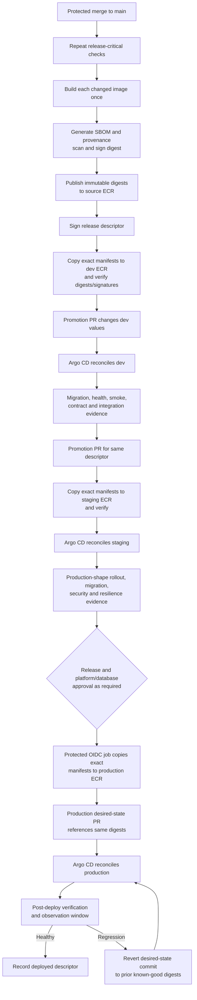

# Proposed Continuous Delivery Architecture

## Purpose And Status

This document defines how a merged ClouDesk change becomes one immutable release set
and is promoted through dev, staging, and production. It does not describe an existing
pipeline. GitHub Actions owns validation, build, signing, ECR publication, and
promotion proposals; [Argo CD](../decisions/ADR-017-argo-cd-controller.md) owns cluster
reconciliation. CI does not run Helm or `kubectl` against a cluster.

The deployment default is a [Kubernetes rolling update](../decisions/ADR-019-rolling-deployments.md).
Database sequencing follows [expand and contract](database-migrations.md), and all
Kubernetes intent follows the [GitOps model](gitops.md).

## Release Unit

ClouDesk begins as one product release train even though `web`, `api`, the outbox
publisher, worker classes, and the migration runner have separate images and scaling
lifecycles. A signed release descriptor is the promotion unit. It binds one source
commit to:

- the immutable OCI digest for every deployable component;
- the Helm chart version and rendered-values schema version;
- the OpenAPI bundle hash and compatibility result;
- the ordered migration-set hash and schema compatibility range;
- SBOM, provenance, signature, and vulnerability policy evidence; and
- release version, creation workflow/run, and promotion eligibility.

A component that did not change may retain its previous digest, but the new descriptor
records that fact explicitly. Environments select only a complete descriptor; they do
not assemble unreviewed combinations of independent tags.

Frontend environment differences must be runtime configuration or same-origin
server-side configuration. Public build-time `NEXT_PUBLIC_*` values that differ by
environment would violate build-once and require a documented redesign. Secrets never
enter the browser image or descriptor.

## End-To-End Delivery Flow

The exact ordering of target-ECR copy and promotion PR can vary operationally, but the
PR cannot merge until every referenced digest exists in that account and passes
verification. The release is never rebuilt after the signed descriptor is created.

## Build And Publication

On protected `main`, the release workflow:

1. checks out the exact merge commit and repeats release-critical contract, test, and
   policy gates;
2. creates reproducible, minimal multi-stage OCI images with pinned base digests and
   a non-root runtime;
3. produces an SPDX or CycloneDX SBOM and SLSA-compatible provenance/GitHub artifact
   attestation for each digest;
4. performs source, dependency, filesystem, and registry scan policy checks;
5. signs each digest through the protected workflow identity and publishes to an ECR
   repository with immutable tags; and
6. emits and signs the complete release descriptor.

The full Git SHA and semantic release version are discoverability tags only. Helm
values use the OCI digest. `latest`, a branch name, or a mutable environment tag is
never a deployment reference.

The initial account model uses a shared-tooling/source ECR and environment/account
ECR repositories. A narrowly scoped GitHub OIDC promotion role copies or replicates
the exact manifest and attached evidence, verifies the destination digest, and cannot
build, administer the cluster, retrieve application secrets, or mutate unrelated
repositories. ECR lifecycle policy retains deployed and previous known-good digests
for the rollback and disaster-recovery window.

## Environment Promotion Policy

| Environment | Promotion trigger and review | Reconciliation | Required evidence before next environment |
| --- | --- | --- | --- |
| Dev | Automation opens a PR for an eligible descriptor; low-risk changes may auto-merge after required checks | Automatic Argo CD sync after merge | Migration succeeded, workloads healthy, API/UI smoke and integration/contract tests, no critical supply-chain finding |
| Staging | Explicit promotion PR for the exact dev-proven descriptor; application/platform review | Automatic sync in the staging window | Production-shape Helm render, migration/backfill evidence, critical E2E, tenant/security tests, representative load, rolling rollback, alerts and dashboards |
| Production | Dedicated promotion PR plus release owner and CODEOWNERS; protected GitHub Environment gates any AWS copy role; database/security/platform approval by scope | Automatic reconciliation of the approved commit during an allowed window | Post-deploy health, smoke, SLO/error/latency observation, audit link, release record |

Promotion is monotonic: dev precedes staging, staging precedes production, and evidence
is bound to the same release descriptor. A newer dev release does not invalidate a
previously proven staging candidate, but production promotion must name exactly which
candidate and evidence it uses. Environment configuration, capacity, endpoints, and
secret references vary independently as described in
[environment boundaries](../infrastructure/environments.md); application behavior and
contracts do not.

Infrastructure promotion is a separate Terraform authority and plan/apply chain. A
release that needs new cloud capability sequences it additively: provision and verify
the capability, deploy a compatible consumer, observe, and remove the old capability
in a later change. A product release cannot hide a Terraform apply inside Argo CD.

## Deployment And Migration Ordering

For a normal compatible release, Argo CD executes the reviewed intent in this order:

1. validate the release descriptor, target ECR presence, signatures/provenance,
   values schema, and current environment preconditions;
2. run at most one controlled, digest-pinned migration Job for the release's additive
   schema step, using the migration-specific database identity;
3. stop the sync if migration preflight or execution fails;
4. roll `api`, `web`, publisher, and worker Deployments with readiness, graceful
   termination, `maxUnavailable: 0`/bounded surge where required, and compatibility
   with the expanded schema and old event/API versions;
5. run post-sync smoke and release verification; and
6. record health and observation evidence before the release is promotable.

Long backfills are not held inside a rollout hook. They run as separately observable,
resumable, throttled Jobs with watermarks and explicit completion gates. A code switch
that depends on the backfill is a later release. Destructive contraction occurs only
after the rollback and queue/DLQ replay windows, in a separately approved release.

Application pods never run migrations on startup. A migration failure cannot be
worked around by making readiness wait indefinitely or by starting new pods against
an unknown schema.

## Rolling Deployment Policy

The initial production strategy uses ordinary Kubernetes Deployments, not Argo
Rollouts. Web and API begin with multiple replicas, a readiness gate, nonzero
`minReadySeconds`, bounded surge, zero unavailable replicas where capacity allows,
PodDisruptionBudgets, topology spread, and a termination grace period longer than
observed ingress drain time. Workers stop intake and acknowledge only committed work.

Old and new versions overlap during a rollout. Therefore:

- HTTP, OpenAPI, event, and database changes are backward compatible for the complete
  overlap and replay windows;
- outbox/consumer event versions tolerate rolling producer and consumer order;
- database expansion precedes code and contraction is delayed;
- readiness proves the pod can safely accept its workload, while liveness excludes
  ordinary dependency outages; and
- HPA and node scaling maximums respect the RDS connection and downstream quotas.

A rollout that never becomes healthy remains stopped. Argo CD health is necessary but
not sufficient: post-deploy checks also evaluate HTTP errors, latency, pod restarts,
database pool pressure, outbox/queue age, worker failures, and critical domain smoke
results.

## Rollback And Roll-Forward

The normal rollback is a reviewed revert of the environment's desired-state commit to
the previous signed release descriptor/digests. Argo CD then reconciles the rollback;
CI does not issue an imperative deployment. The expanded database schema remains in
place so the previous application still works. Before production, staging must prove
this path with mixed old/new pods and the exact migration sequence.

Rollback is unsafe when a release has already performed a destructive contraction,
emitted incompatible events, or made an irreversible external effect. Such changes
are never combined with the first consumer release and require an explicit
roll-forward/restore plan before approval. A failed additive migration stops before
the application rollout; operators repair forward or run a separately reviewed safe
down migration only when its reversibility was proven. Database restore is a disaster
recovery action with an RPO/data-loss implication, not an ordinary deployment
rollback.

If a regression is configuration-only, revert the desired-state commit. If it is
artifact-specific, select the previous descriptor. If the prior artifact has a newly
discovered critical vulnerability, release ownership decides between a bounded
configuration mitigation, a forward hotfix, and rollback using security and business
impact evidence.

## Progressive Delivery Evaluation

Argo Rollouts is deliberately not part of V1. Ordinary rolling updates are cheaper,
easier to operate, and consistent with the current absence of traffic and measured
SLIs. [Release strategy](release-strategy.md#future-progressive-delivery) defines the
entry criteria and evaluation of ALB traffic shifting, analysis templates, pause/
abort behavior, and metric-based rollback. Until those criteria are met, an operator
must not describe a standard rolling health check as a canary.

## Credentials And Authority Boundaries

- GitHub OIDC roles are split into source publication, target artifact promotion,
  Terraform plan/apply, and read-only drift capabilities. Only the job that needs a
  role receives `id-token: write`.
- Production artifact copy requires a protected GitHub Environment. Production
  desired-state approval is a CODEOWNERS-governed PR; neither approval grants a
  general AWS or Kubernetes administrator.
- Argo CD runs inside the cluster, reads only approved repository paths, and writes
  only destinations allowed by its Project. Application CI has no kubeconfig.
- Migration Jobs receive only a migration database identity and necessary secret
  reference, not a broad application/cloud role.
- A fine-grained GitHub App or equivalently scoped automation identity may open
  promotion PRs. It cannot approve or merge its own production change.

## Release Failure And Recovery Matrix

| Failure point | Containment | Recovery |
| --- | --- | --- |
| Test, scan, signature, or descriptor failure | Nothing is promotion-eligible | Fix source/build policy and create a new descriptor; do not relabel partial output |
| Target ECR copy/digest verification failure | GitOps PR cannot merge | Retry only the idempotent exact-manifest copy after diagnosing IAM/registry failure |
| Migration preflight/Job failure | Argo sync stops before new pods | Preserve logs/schema state; repair forward or use a proven safe reversal |
| Readiness/rollout failure | Old replicas remain where rollout budgets allow; no further promotion | Revert desired state or release a fix; investigate capacity, probes, schema, and config |
| Post-deploy SLO/smoke regression | Promotion freezes; production incident policy may start | Revert to previous compatible descriptor or roll forward based on evidence |
| Argo CD unavailable | Existing workloads continue; promotions and drift repair pause | Rebuild pinned Argo bootstrap, restore repository access/RBAC, and reconcile Git |
| Git hosting unavailable | Runtime continues but desired-state change is unavailable | Freeze changes; use break-glass only for an active incident and reconcile afterward |

## Delivery Evidence And Ownership

Each environment records source commit, signed descriptor, component digests,
migration version/result, GitOps commit, Argo operation/health, smoke results,
approvers, timestamps, and rollback target. Evidence links must not embed secret data.
Release/platform owners track a promotion until the observation window closes;
database owners own migration risk; service owners own runtime health; security owns
supply-chain policy and exceptions. Detailed review and release roles are in
[release strategy](release-strategy.md#ownership-and-approval).

ClouDesk CD is production-ready only after staging proves build-once promotion,
signature verification, protected OIDC denial paths, migration ordering, mixed-version
compatibility, rolling rollback, Argo outage recovery, and the break-glass/reconciliation
procedure with current evidence.
