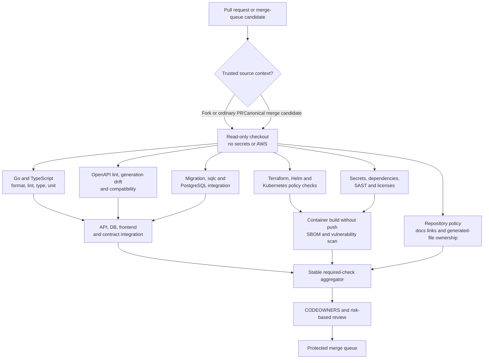

# Proposed Continuous Integration Architecture

## Purpose And Status

This document defines the planned GitHub Actions quality and supply-chain gates for
ClouDesk. It is a design: the repository currently has no Git history, application
source, workflow, runner, registry, or deployable artifact. M0 introduces the first
executable pipeline; M14 completes artifact promotion and GitOps delivery.

The pipeline enforces the [OpenAPI contract](../api/openapi.md),
[Terraform operating model](../infrastructure/terraform.md), and the decisions to use
[GitOps](../decisions/ADR-016-gitops-delivery-model.md),
[rolling deployments](../decisions/ADR-019-rolling-deployments.md), and
[expand-and-contract migrations](../decisions/ADR-020-expand-contract-migrations.md).

## CI Principles

- A pull request proves a candidate is reviewable; it never grants deployment
  authority or publishes a production artifact.
- Untrusted code, including fork pull requests, receives no repository secrets,
  GitHub OIDC token, AWS role, writable package token, or self-hosted production
  runner.
- Tools, actions, generators, base images, and dependencies are version-pinned.
  Third-party actions use full commit SHAs and are updated through reviewed pull
  requests.
- Generated OpenAPI clients, `sqlc` output, lock files, Helm renders, and other
  derived contracts must be deterministic. CI regenerates and rejects drift.
- Fast, deterministic checks run before expensive integration and image jobs.
  Required status checks remain stable even when path-aware jobs are skipped.
- Security scanner output is triaged by an owner and severity policy. A scanner
  warning is neither silently ignored nor treated as proof that an artifact is safe.
- CI logs and artifacts contain no credentials, Terraform state, production data,
  presigned URLs, or unredacted sensitive plans.

## Trigger And Trust Model

| Trigger | Trust and authority | Intended work |
| --- | --- | --- |
| `pull_request` from the canonical repository | Read-only source token; no AWS role | All deterministic and local integration checks; container build without push |
| `pull_request` from a fork | Same read-only path on GitHub-hosted ephemeral runners | Checks that require no secrets or privileged cache; never execute fork code in a privileged `pull_request_target` job |
| Merge queue candidate | Read-only plus normal test artifacts | Re-run required checks against the exact prospective merge result |
| Push to protected `main` | Artifact-publication workflow only after all branch gates | Re-run release-critical checks, build once, attest, sign, and publish immutable artifacts |
| Manual workflow dispatch | Narrow, separately reviewed maintenance operation | Explicitly allowlisted tasks such as a scanner re-run; never a generic production shell |
| Scheduled workflow | Read-only dependency, drift, and expiry checks | Vulnerability refresh, Terraform drift plan, stale exception detection |

`pull_request_target` must not check out and execute pull-request code. A workflow that
needs to label or comment on an untrusted pull request uses metadata only and a
minimal token. GitHub-hosted ephemeral runners are the initial choice. A self-hosted
runner is introduced only with isolated ephemeral instances, no ambient cloud
credentials, controlled egress, image reset, and a threat review.

Repository workflow changes are high-impact changes. `CODEOWNERS` protects
`.github/workflows/`, action wrappers, release tooling, container build definitions,
Helm, GitOps environment values, Terraform, and dependency-update configuration.

## Pull Request Pipeline

Path detection may avoid irrelevant expensive jobs, but it cannot create a bypass.
A stable aggregator fails unless every required job for the detected scope passed or
was explicitly and validly marked not applicable. Changes to shared tooling,
dependency locks, generators, base images, OpenAPI, migrations, Dockerfiles, Helm,
Terraform, or workflows fan out to all affected consumers.

## Required Gates By Change Surface

### Repository Baseline

Every pull request checks Markdown links, exact `ClouDesk` naming, formatting,
forbidden generated edits, license policy, lock-file consistency, and that the
documented build/test entrypoints still exist. Repository policy rejects accidental
secrets, large binaries, production `.env` files, Terraform state/plans, kubeconfigs,
and mutable deployment tags.

### Go Backend And Workers

- `gofmt`/`goimports` drift, `go vet`, one selected pinned static linter, and module
  integrity;
- unit tests, table/property tests for domain invariants, race detection on packages
  with concurrency, and focused fuzz corpus where parsing or money rules justify it;
- HTTP and repository integration tests using the supported PostgreSQL major version;
- tenant-isolation negatives, authorization failures, transaction rollback,
  idempotency, outbox/inbox, graceful shutdown, and worker crash-window tests;
- dependency vulnerability analysis with a documented exception expiry and owner.

### Next.js And TypeScript

- formatter, ESLint, strict TypeScript typecheck, dependency/lock integrity, unit and
  component tests;
- generated client compilation and fixtures for success/error, money, dates, cursor,
  `ETag`, cancellation, and idempotency behavior;
- accessibility checks and a bounded Playwright critical-path suite at the appropriate
  integration stage;
- a production-mode build proving that environment-specific secrets and URLs are not
  baked into the browser bundle. Runtime configuration is validated separately.

### OpenAPI And Cross-Stack Compatibility

The exact sequence in [the OpenAPI workflow](../api/openapi.md#ci-contract-pipeline)
is required: OpenAPI 3.1 lint/reference/example checks, ClouDesk policy rules,
deterministic Go and TypeScript generation, consumer compilation/fixtures, and a
semantic diff against the target branch. A breaking change is blocked unless it uses
a new API major with an ADR and consumer migration/retirement plan.

### PostgreSQL And Migrations

CI verifies migration checksums and ordering, rejects edits to an already shared
migration, migrates an empty database, upgrades from the previous release schema,
regenerates `sqlc`, and runs tenant/constraint/invariant probes. Unsafe DDL, lock and
rewrite risk, backfill behavior, and any down migration receive explicit review. The
full release ordering is defined in [database migrations](database-migrations.md).

### Terraform, Helm, And Kubernetes

- Terraform format/validate, provider lock verification, TFLint, one selected IaC
  security/policy scanner, module tests, and affected-root speculative plans as
  defined in [Terraform CI](../infrastructure/terraform.md#verification-and-security-gates);
- Helm lint, values-schema validation, deterministic rendering for every environment,
  Kubernetes API/schema validation, and policy checks for digest pinning, probes,
  resources, non-root security, service-account identity, namespace scope, and
  forbidden privileged resources;
- server-side dry-run and cloud-backed plans run only for a trusted same-repository
  context with a read-only environment plan role. Forks get local/static checks and
  never an AWS token;
- policy fixtures include negative cases so a policy engine cannot appear green while
  rejecting nothing material.

### Security And Supply Chain

Every pull request performs secret scanning, dependency review, SAST, license policy,
and IaC/manifest scanning. The image candidate is built without push, scanned by
package and OS vulnerability, and inspected for a non-root runtime, minimal contents,
no embedded secrets, and fixed base-image digest. Critical or known-exploited findings
block; high findings follow an explicit SLA and exception process approved by the
security owner. An exception records component, exposure, compensating controls,
owner, expiry, and removal evidence.

The merged release workflow adds registry scanning, an SBOM, provenance, and a
signature as described below. Scheduled rescans can block further promotion or start
an incident; they do not silently mutate a deployed digest.

## Build-Once Supply-Chain Contract

Each deployable (`web`, `api`, and independently operated worker or migration image)
is built exactly once from the protected merged source revision. A signed release
descriptor binds:

- source commit and repository;
- component name and OCI manifest digest;
- immutable convenience tag derived from the full Git SHA;
- build definition and pinned base-image digests;
- OpenAPI bundle hash, migration-set hash, and Helm chart/package version;
- SPDX or CycloneDX SBOM digest;
- vulnerability scan policy/result reference;
- SLSA-compatible provenance or GitHub artifact attestation identifying the workflow
  and builder.

Images are pushed to ECR with tag immutability and never deployed by tag. A keyless
Cosign-compatible signature using GitHub OIDC is the initial signing design: identity
and issuer constraints are verified against the protected release workflow, and the
signature subject is the image digest. If an AWS KMS-backed key is later required by
policy, key use is isolated to a signing role and does not alter build-once promotion.

Promotion copies or replicates the exact OCI manifest into the target account's ECR,
then independently verifies its digest, signature/provenance, SBOM association, scan
policy, and release descriptor before a GitOps pull request can reference it. It must
not rebuild, retag a mutable image, or regenerate frontend assets per environment.
ECR lifecycle rules preserve all current and rollback digests for the documented
recovery window.

## GitHub OIDC And Least Privilege

Workflow-level permissions default to `contents: read`. `id-token: write` appears only
on a job that must federate to AWS or create a keyless attestation; it is not granted
to test jobs. Package, pull-request, security-event, and attestation permissions are
added per job at the narrowest level.

AWS trust requires `sts.amazonaws.com` audience and exact GitHub organization,
repository, workflow/ref or reusable-workflow identity, and protected GitHub
Environment subject. Roles are separated by capability and environment:

| Role | Allowed authority | Explicit denial/boundary |
| --- | --- | --- |
| Non-production Terraform plan | Read exact state/root resources and manage only its lock file | No target mutation, state write, production account, or trust-policy change |
| Environment Terraform apply | Apply one approved root and write its exact state prefix | No self-escalation, organization/state protection change, or unrelated root |
| Shared artifact publisher | Push named release repositories, obtain scan metadata, and attach attestations | No cluster, RDS, secret, IAM, or production state access |
| Target artifact promoter | Read the approved source digest and write named target ECR repositories | No rebuild, cluster access, application secrets, or arbitrary ECR administration |
| Drift observer | Read configuration/state necessary for plans and reports | No apply or reconciliation authority |

Production roles additionally require a protected GitHub Environment and authorized
human approval. Session names include workflow, run ID, and commit for CloudTrail.
Durations are short and bounded to the operation. Fork workflows, pull-request test
jobs, and reusable workflows not explicitly trusted cannot assume a role. CI has no
routine Kubernetes credential: Argo CD reconciles from inside each cluster.

## Branch Protection, Reviews, And Ownership

`main` requires the stable CI aggregator, resolved review conversations, current
CODEOWNERS approval, merge-queue success, and no force push. Review depth is based on
risk: ordinary changes require a non-author approval; OpenAPI, migrations, IAM,
workflows, security controls, Terraform, Helm, or production values require their
designated owner, with an independent security/platform/database reviewer as
appropriate. [Release strategy](release-strategy.md) defines branches, Conventional
Commits, production approval, and release ownership.

CI platform owners maintain runner images, action pins, caches, scanner policy, OIDC
trust coordination, and build provenance. Domain owners maintain their tests and
cannot waive a platform or security gate unilaterally. Bypasses are time-limited,
reasoned, auditable, and followed by a corrective issue; no permanent administrator
bypass is part of normal delivery.

## Failure Handling And Evidence

- Concurrency keys cancel superseded pull-request runs but never interrupt an active
  publish, Terraform apply, migration, or promotion operation.
- A flaky test is quarantined only with reproduction evidence, owner, expiry, and a
  replacement blocking signal. Automatic retries may gather diagnostics, not turn a
  failing first attempt green.
- Caches are content-addressed and treated as untrusted acceleration. Release output
  is rebuilt from declared inputs and verified before publication.
- Logs, JUnit/test reports, scan reports, plans, SBOMs, provenance, and descriptors
  have retention appropriate to audit and incident needs. Sensitive binary Terraform
  plans remain restricted and short-lived.
- Failed or partially published releases are marked ineligible for promotion. Cleanup
  may remove an unreferenced convenience tag, but immutable evidence and any digest
  already referenced by an environment follow retention policy.

The pipeline is operational only when negative trust tests prove that a fork, changed
workflow, wrong branch/environment, or wrong repository cannot obtain AWS credentials;
when action pins and generated outputs are reproducible; and when a release descriptor
can be verified independently from source commit through deployed digest.
