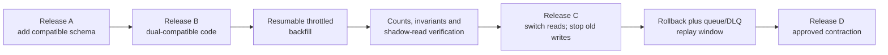

# Proposed Database Migration Strategy

## Purpose And Status

This document defines zero-downtime PostgreSQL change delivery for ClouDesk. It is a
future implementation contract: no schema, migration runner, RDS instance, or release
Job currently exists. It applies [ADR-020](../decisions/ADR-020-expand-contract-migrations.md)
to rolling deployments and the data rules in the
[PostgreSQL model](../architecture/data-model.md#migration-strategy).

## Core Contract

- Ordered, immutable SQL files are the schema source. Use one pinned
  `golang-migrate` runner; application pods never migrate on startup.
- Every shared environment records applied version and checksum. An applied file is
  never edited; a correction is a new forward migration.
- Each table has one module/migration owner. Cross-module constraints and financial,
  tenant, identity, audit, or outbox changes require the affected owners.
- One digest-pinned migration image is built, scanned, signed, and promoted with the
  release descriptor. It is not rebuilt per environment.
- Exactly one migration Job may execute for an environment. Database locking and the
  migration table enforce this even if Kubernetes/Argo retries the Job.
- Runtime roles cannot run DDL. The short-lived migration identity has only required
  schema authority, cannot bypass tenant/audit safeguards for application traffic,
  and is unavailable to ordinary CI tests.
- Production rollback normally rolls application code back while leaving an additive
  schema in place. Destructive down migrations are not automatic.

## Migration Metadata And CI Gates

Each change records owner, purpose, version, checksum, affected tables, compatibility
range, reversibility, expected lock/runtime, transaction mode, backfill plan,
verification queries, and rollback/roll-forward action. CI then:

1. rejects duplicate/out-of-order versions and edits to applied history;
2. lints risky SQL and requires review for rewrites, table scans, destructive DDL,
   privilege changes, unbounded updates, or long exclusive locks;
3. migrates a fresh PostgreSQL database and upgrades a representative previous-release
   database;
4. regenerates `sqlc` and rejects drift;
5. runs constraints, two-tenant isolation, transaction, and application compatibility
   tests against old and new application versions where relevant;
6. exercises any claimed down migration only when it is genuinely data-preserving;
7. tests backfill resume, cancellation, retry, throttling, and verification; and
8. produces the migration-set hash bound into the signed release descriptor.

Parallel migration pull requests rebase through the merge queue and receive a new
version if ordering collides. A green empty-database migration alone is insufficient;
the previous production schema path is the release-critical test.

## Expand-And-Contract Sequence

1. **Expand:** add a nullable column, table, compatible index, or `NOT VALID`
   constraint. Avoid rewrite-heavy defaults and blocking type changes.
2. **Compatible code:** deploy code that tolerates old/new states and dual-writes only
   when the transition requires it. Dual-write logic is observable and time-bounded.
3. **Backfill:** update bounded primary-key ranges with a durable watermark, rate and
   lock limits, cancellation, idempotent retry, and pause/resume control.
4. **Verify and switch:** compare counts/invariants and, where safe, shadow reads.
   Change reads, then stop old writes in a later release.
5. **Observe:** retain the old schema through the maximum application rollback,
   outbox, queue, DLQ, restore, and supported-version window.
6. **Contract:** remove the old column/index/path only in a separate destructive
   release with explicit approval and a roll-forward/restore decision.

Adding `NOT NULL` to a large table uses compatible writes/backfill first, then a
validated check and bounded final metadata change where PostgreSQL permits. Large
indexes use `CREATE INDEX CONCURRENTLY` in a non-transactional migration and check for
invalid remnants before retry. Foreign keys may be added `NOT VALID` and validated
separately. Exact techniques require staging measurements for the selected PostgreSQL
version and data shape.

## GitOps And Environment Ordering

For each environment, the promotion PR references the release descriptor, migration
image digest/set, expected current schema, and target schema. Argo CD runs a controlled
PreSync/sync-wave Job before new pods:

1. verify target account/database, current version, checksum history, compatible
   application range, free space/connection reserve, and absence of another runner;
2. for production, confirm approval, PITR health and a protected snapshot for a
   measured high-risk migration—not mechanically for every release;
3. acquire the migration lock and apply only the declared additive step with finite
   `lock_timeout` and `statement_timeout`;
4. run post-migration version, invalid-index, constraint, row-count, and domain
   invariant checks;
5. stop Argo reconciliation on failure; otherwise roll compatible workloads; and
6. record schema version, checksum, release/digest, timings, approver, and result.

Dev proves basic execution; staging uses the production PostgreSQL major/parameters
and production-shaped data to measure locks/runtime, backfill, rollout, and rollback;
production consumes the same artifact only after that evidence. Long backfills run as
separate observable Jobs and gate a later switch release; they do not block an Argo
sync for hours. Environment states are never copied.

## Operational Safety

- Reserve RDS connections for migration and operations; the Job has a tiny dedicated
  pool and one active process.
- Use short lock waits, explicit per-statement/overall deadlines, low-impact batches,
  jittered pauses, and a configurable stop threshold for replica lag, DB load, lock
  waits, error rate, or SLO burn.
- Avoid one transaction for a large backfill, DDL plus slow data rewrite, peak-hour
  validation, and unbounded `UPDATE`/`DELETE`.
- Observe migration phase, version, elapsed time, rows/batches, lock wait, deadlocks,
  DB CPU/IO/connections, replication/failover events, invalid indexes, and application
  compatibility. Labels never contain SQL, customer data, or high-cardinality IDs.
- DDL logs and failure evidence are retained with the release, with sensitive
  connection details redacted.

## Failure And Recovery

| Failure | Required response |
| --- | --- |
| Preflight mismatch or dirty schema | Stop before DDL; freeze promotion and investigate history/environment identity |
| Lock timeout | Release locks, leave new pods undeployed, reschedule or redesign; never loop aggressively |
| Transactional migration fails | Rollback occurs; verify state and repair with a new forward migration |
| Non-transactional index fails | Detect/drop the invalid artifact concurrently when safe, then apply a reviewed repair |
| Backfill stops | Persist watermark, release capacity, resume idempotently after diagnosis |
| RDS failover/ambiguous connection | Reconnect only after verifying migration-table and schema state; never blindly replay unknown DDL |
| New application fails | Revert GitOps to the previous digest; expanded schema remains compatible |
| Contraction causes regression/data loss | Prefer an emergency forward repair; PITR restore is a declared DR incident with an RPO/data-loss decision |

Do not run `force` on dirty migration state without inspecting actual schema and
recording a reviewed reconciliation. A backup is not a rollback plan: restoration
takes time, may lose post-restore-point writes, and must also reconcile S3/events.

## Approval And Completion Evidence

Additive, measured low-lock changes require database-owner review. Backfills require
the database and owning domain; permission/RLS changes also require security.
Contractions, rewrites, large validations, or retention/deletion changes require
database, platform, domain/security as applicable, production release approval, and
current restore evidence.

A migration is complete only when schema/checksum state, generated code, application
compatibility, invariant queries, backfill status, telemetry, and rollback/forward
target are recorded. Contraction cleanup remains tracked work; temporary dual paths
must not become permanent undocumented schema.
