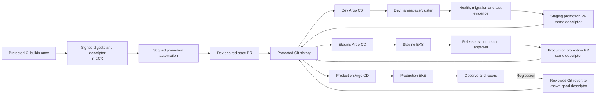

# Proposed GitOps Operating Model

## Purpose And Status

This document defines the future Git-as-desired-state contract for ClouDesk on EKS.
It implements [ADR-016](../decisions/ADR-016-gitops-delivery-model.md) and
[ADR-017](../decisions/ADR-017-argo-cd-controller.md). There is currently no Git
repository, Helm chart, cluster, or Argo CD installation; local V1 does not require
GitOps. M14 introduces this model after the application, AWS, and EKS foundations are
proven.

GitOps covers Kubernetes desired state. It does not make PostgreSQL, Terraform state,
container tags, runtime secrets, or the live cluster the source of truth.

## Initial Repository Decision

Start with one protected monorepo containing product source, Terraform, the Helm chart,
and environment desired state. This keeps one review graph while the team and release
rate are small, lets a contract change update source and deployment compatibility in
one pull request, and avoids cross-repository automation before a real permissions
boundary exists.

```text
clouddesk/
├── backend/
├── frontend/
├── infrastructure/
│   └── terraform/
└── deploy/
    ├── charts/
    │   └── clouddesk/                 # one versioned application chart
    ├── environments/
    │   ├── dev/                       # digest references and non-secret values
    │   ├── staging/
    │   └── production/
    ├── platform/                      # approved add-ons owned by GitOps
    └── policy/                        # values/schema and rendered-state policy
```

This is logical proposed layout, not a scaffold mandate. A promotion automation opens
a pull request that changes only the target environment's release descriptor/digest
references. It does not commit directly to `main`, approve its own pull request, or
write into another environment.

A separate `clouddesk-gitops` repository becomes justified when one or more of these
conditions are measured:

- production desired state needs a stricter reader/writer population than product
  source and branch protection cannot express it safely;
- a platform/release team owns promotion independently from application teams;
- repository scale, audit retention, or promotion cadence makes source and desired
  state history unmanageable together;
- multiple application repositories or clusters consume the same platform contract;
  or
- policy requires production reconciliation to read a repository that application
  build credentials cannot modify.

The extraction keeps commit/digest provenance and environment history, introduces a
fine-grained promotion identity, and changes Argo source allowlists in a staged ADR.
It must not rebuild artifacts or combine Terraform and GitOps ownership.

## Sources Of Truth And Ownership

| Asset | Authoritative owner/source | Explicit non-owner |
| --- | --- | --- |
| AWS accounts, network, EKS, ECR, RDS, S3, SQS, IAM/workload identity substrate, minimal Argo bootstrap | Reviewed Terraform roots and state | Argo CD and application Helm chart |
| Kubernetes namespaces, service accounts, approved add-ons, application workloads, Services, Ingress, policies, autoscaling, controlled release Jobs | Git desired state reconciled by Argo CD | Terraform and CI-driven Helm |
| ALB and target groups generated from Ingress | AWS Load Balancer Controller | Terraform/Argo direct AWS resource management |
| Application images and release descriptor | Protected build workflow plus immutable ECR digest/signature/provenance | Helm templates and environment rebuilds |
| Runtime secret values | AWS Secrets Manager and approved rotation owner | Git, Helm values, image, Terraform ordinary variables, CI logs |
| PostgreSQL schema history | Immutable ordered migrations and migration metadata table | Startup code, Helm, or manual DDL |
| Business data | PostgreSQL; S3 for authorized object bytes | Git, Kubernetes objects, Terraform state, Redis |

No resource is intentionally co-owned. Terraform bootstraps a minimal pinned Argo CD
installation and the cloud identity it needs; a documented adoption removes that
bootstrap object from Terraform only after GitOps owns the exact live definition.
Argo CD never applies Terraform. CI validates both sides of workload-identity binding
but cannot mutate the cluster to repair it.

## Argo CD Topology And Least Privilege

- Use one Argo CD installation per cluster/security boundary. Production's dedicated
  cluster has its own controller and credentials; non-production may share a cluster
  only with environment-isolated namespaces and Projects.
- Define one Argo CD Project per environment. A Project allowlists the exact repository
  and path, destination cluster/namespace, permitted namespaced kinds, and approved
  platform namespaces. It denies arbitrary cluster-scoped resources, privileged
  workloads, cross-environment destinations, and unapproved repositories.
- Model each environment with a small application boundary: platform prerequisites,
  migrations/release coordination, and the ClouDesk chart. Add an ApplicationSet or
  app-of-apps layer only when several clusters/applications make manual definitions a
  demonstrated source of drift; do not add it for three static environments alone.
- Argo repository credentials are read-only, short-lived where the integration
  permits, and scoped to the selected repository. SSO/RBAC separates view, sync,
  rollback/revert coordination, and administrator capability. No shared local admin
  account is used routinely.
- The controller service accounts are namespace and verb scoped. Project policy and
  admission policy prevent an application chart from creating cluster roles,
  namespaces, CRDs, or other platform-wide resources.
- Argo notifications report sync/health/drift but hold no application secret. Audit
  logs correlate actor, Git commit, Application, target, and operation.

The production EKS API remains private. Argo reconciles from inside the cluster, so
routine GitHub Actions needs no network path or credential to Kubernetes.

## Desired-State And Helm Contract

Use one versioned ClouDesk chart whose workload differences remain visible. Shared
helpers may normalize labels and security context, but a generic template must not
erase separate API, web, publisher, worker, IAM, resource, probe, or scaling policies.

Environment values contain only non-secret configuration, resource/capacity choices,
feature-flag policy, secret **references**, and the complete release descriptor with
digest-pinned images. The chart has a JSON values schema. CI renders every environment
and checks Kubernetes schemas, admission/security policy, namespace/RBAC scope,
probes, requests/limits, topology, disruption, secret references, and immutable image
digests. `latest`, tag-only image references, embedded credentials, and unbounded
privilege fail the pull request.

Release values must identify:

- semantic release version and source commit;
- signed release-descriptor digest;
- per-component `repository@sha256:...` reference;
- compatible migration image/set and expected schema range;
- chart version and configuration-schema version; and
- previous known-good descriptor for operator visibility, not automatic mutation.

Helm rendering is deterministic. Argo CD renders and applies the reviewed chart;
GitHub Actions does not run `helm upgrade` against a cluster.

## Reconciliation And Promotion Flow



Argo polls or receives a validated webhook and reconciles only a protected merged
commit. Dev, staging, and production use automatic sync after the corresponding
promotion PR is merged; the approval boundary is Git review, not an undocumented
manual click in Argo. Production sync windows prevent routine promotion outside the
approved operating window while still allowing an explicit incident override.

Self-heal corrects unauthorized live mutation. Pruning is enabled for allowlisted,
namespaced application resources after diff/policy checks and foreground/finalizer
behavior is tested. Deletion of a namespace, persistent/data resource, CRD,
controller, or shared platform component requires a separate protected change and is
not made safe merely by Argo pruning. Critical cloud/data resources are outside Argo.

Promotion always selects the same signed release descriptor proven in the previous
environment. Artifact copy to a target ECR is separately verified before merge.
Environment values change configuration/capacity, not application bits. The detailed
gate/evidence chain is in [continuous delivery](cd.md#environment-promotion-policy).

## Sync Ordering And Database Safety

Argo sync waves and health checks encode dependencies without treating Kubernetes
apply order as a database transaction:

1. validate prerequisites and secret references;
2. run the single migration Job for a compatible additive schema change;
3. stop the sync on migration failure;
4. roll compatible application Deployments and Services;
5. run bounded post-sync smoke verification; and
6. report health/evidence.

The migration Job has an immutable image digest, release/schema-specific identity,
database lock, conservative lock/statement timeouts, and a migration-only credential.
Its durable migration table, not hook success alone, prevents duplicate application.
Long backfills are separate desired Jobs with resumable watermarks and explicit
promotion gates; Argo does not hold an application rollout open for hours. See
[database migrations](database-migrations.md#gitops-and-environment-ordering).

## Drift Policy

Argo continuously compares protected Git intent with live Kubernetes state.

| Drift class | Response |
| --- | --- |
| Safe namespaced application field changed manually | Alert and self-heal to Git; preserve audit evidence |
| Unknown/unmanaged namespaced object | Report as orphan; owner chooses import into Git or controlled removal |
| Admission/controller default or known server-generated field | Normalize through an exact documented ignore; never use broad wildcard ignores |
| Mutating controller owns a field | Declare the field owner and ignore only that path; test upgrades for changed ownership |
| Critical/security drift or reconciliation denial | Page the platform/security owner, freeze promotion, investigate Git, actor, admission, and controller evidence |
| Desired state is wrong | Revert or correct Git; do not repeatedly patch live state against the controller |

Ignore rules have owner, rationale, exact JSON path, external controller, test, and
removal trigger. Disabling auto-sync, self-heal, policy, or notifications permanently
to silence drift is prohibited.

## Break-Glass And Reconciliation

Break-glass is for an active incident where the normal reviewed Git path cannot meet
the recovery need. It is not a faster deployment path.

1. Declare the incident, name the commander/operator, record reason, target, expected
   change, expiry, and rollback condition.
2. Freeze promotion for the affected Application. If Argo would immediately undo the
   necessary patch, suspend auto-sync only for that narrow Application and for a
   bounded period; do not disable repository-wide reconciliation.
3. Assume a short-lived MFA/federated break-glass role through the approved private
   EKS access path. CI credentials, shared kubeconfigs, and static tokens are not used.
4. Capture the live diff and audit events, then apply the smallest reversible change.
   Never use break-glass to run unreviewed destructive database DDL, expose the API,
   or bypass tenant/security policy.
5. Validate service and security signals. If the change fails, reverse it immediately.
6. Before incident closure, either encode the verified change in a reviewed Git PR or
   remove it so live state again matches Git. Re-enable sync/self-heal and prove a
   clean diff.
7. Revoke/expire access, attach audit evidence to the incident, and create follow-up
   tests/runbook/policy work.

If Git is unavailable and a live patch is essential, the incident record holds the
intended patch until Git returns. Runtime may continue while reconciliation is paused,
but a successful patch does not become a second source of truth.

## Controller Failure And Recovery

Argo CD failure does not stop existing application pods; it pauses promotion,
self-healing, and drift visibility. Alert on controller/repository/authentication/
application errors and freeze desired-state changes until reconciliation is healthy.

Recovery uses the minimal pinned Terraform bootstrap, protected Git desired state,
environment Projects/RBAC, and external secret references. Reinstall into the cluster,
restore repository/SSO integration, diff without pruning, validate ownership/ignored
fields, then enable normal sync. Argo's internal database/cache is not the only copy of
desired state. A cluster rebuild follows the same process after Terraform recreates
the platform and managed data services are restored according to disaster recovery.

Compromise of Argo or its repository credential is a security incident: revoke the
credential, freeze sync, inspect Git/audit/admission evidence and live workloads,
rotate affected trust, rebuild from verified inputs, and reconcile only after supply-
chain integrity is established.

## Governance And Verification

Application owners may propose their component digests and non-production values.
Platform owns charts, Projects, controller upgrades, sync policy, namespaces, and
break-glass. Database owns migration ordering. Security owns repository credentials,
RBAC/policy, signature verification policy, and privileged exceptions. Release owners
approve promotion evidence; automation cannot approve its own production PR.

Before production, verify:

- Argo cannot read an unapproved repository or write another environment/namespace;
- an application chart cannot create cluster-wide privilege or use a mutable tag;
- unsigned, unattested, wrong-account, or missing digests cannot be promoted;
- migration failure blocks the workload sync and a previous application digest works
  with the expanded schema;
- live drift self-heals, exact ignores remain bounded, and unauthorized resources are
  visible;
- Argo outage leaves workloads running and a clean rebuild resumes reconciliation;
  and
- a timed break-glass exercise ends with Git/live parity and expired access.

Only executable and observed evidence can change this document's status from proposed
to operational.
