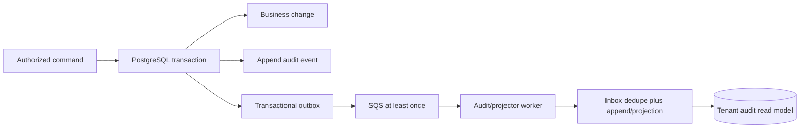

# Audit Domain

## Purpose And Status

Audit provides a tenant-scoped, append-only account of security-sensitive and
business-significant actions. It supports investigation and accountability; it is
not a substitute for operational logs, metrics, traces, financial ledgers, or an
external compliance archive. This is a proposed design.

## Event Model

An audit event contains:

```text
id
organization_id (nullable only for approved pre-tenant identity/security events)
actor_type (USER, SYSTEM, SUPPORT)
actor_user_id / actor_membership_id / workload identity as applicable
action
outcome
resource_type / resource_id
occurred_at
reason_code / approved free-text reason where required
metadata (schema-versioned, allowlisted, redacted)
request_id / trace_id / correlation_id / causation_id
source service and event schema version
```

The server chooses organization, actor, action, resource, timestamp, and correlation
fields. Callers may supply a reason only on operations that define one, under length
and content limits. Events use stable action names such as
`membership.role_changed`, `invoice.issued`, and `time_entry.corrected`; display text
is derived, not stored as the contract.

The normal runtime audit role can insert and authorized readers can select, but
application roles cannot update or delete events. Tenant RLS applies to reads and
inserts. Migration/retention and break-glass roles are separate and externally
audited. Append-only means immutable through the application contract; it does not
claim that a database/cloud administrator is cryptographically unable to alter data.

## Required Events

Initial coverage includes:

- identity/session: successful login/session creation at approved granularity,
  logout/revocation, disabled-user attempt, refresh/session-reuse anomaly, and
  privileged MFA/recovery signals made available safely by the provider;
- access: invitation create/revoke/accept, membership role/status change, owner grant
  or removal attempt, last-owner conflict, organization create/update/suspend, and
  support/break-glass access;
- business: sensitive client billing change, project archive, task moderation,
  time-entry correction/deletion, invoice create/issue/send/void and payment-state
  reconciliation, report/export request/download, and file quarantine/delete;
- asynchronous/security: controlled DLQ replay, repeated poison event, provider
  callback rejection, malware finding, secret/key rotation metadata, and audit
  ingestion/retention failure.

Routine reads and high-volume ordinary task edits are not all audit events. They use
operational telemetry unless access to particularly sensitive resources or policy
requires an audit trail. Audit reads/exports and changes to audit policy are themselves
audited.

## Write Paths And Delivery

When an API command changes PostgreSQL state, its audit row is inserted in the same
transaction as the business effect, idempotency result, and outbox event where
practical. A failed transaction leaves neither a false audit success nor an unaudited
business change. The append uses server-derived actor and tenant context.

For provider/workload events that cannot join the source transaction, a reliable
versioned event is written/received through the outbox/inbox path. The Audit projector
deduplicates by `(organization_id, source_event_id, action)` and records lag/failure.
An audit outage must not silently discard a required event. Security-critical
commands whose synchronous audit insert fails fail closed; async audit projection
surfaces durable backlog and alerts rather than claiming immediate audit completion.



Identity events without an organization use a separately permissioned security stream
or nullable tenant only for an approved action schema. They are never returned from a
tenant audit endpoint merely because an email/subject later joins that tenant.

## Metadata And Privacy

Each action owns a versioned metadata schema containing the minimum investigation
detail. Prefer stable IDs, categorical reason/outcome, and allowlisted before/after
fields. Do not record passwords, tokens, cookies, invitation values, CSRF values,
presigned URLs, secret material, full request/response bodies, file content, raw SQL,
provider payloads, stack traces, or unnecessary personal/billing data.

Sensitive before/after values are omitted, masked, or represented as `changed: true`.
IP and user agent, when needed for security investigation, are normalized, protected,
retained for a defined shorter window, and not used as unbounded metric labels. User
privacy deletion may pseudonymize display attributes while retaining stable actor
references required for legitimate audit/financial records.

## Read API And Authorization

Audit is API read-only:

```text
GET /api/v1/organizations/{organizationId}/audit-events
GET /api/v1/organizations/{organizationId}/audit-events/{auditEventId}
```

Both require an active membership and `audit:read`. Lists require bounded cursor
pagination; broad tenants also require a bounded time range. Actor, action, resource
type/ID, outcome, and time filters are allowlisted, tenant-leading, and indexed.
Metadata receives field-level redaction before serialization. A cross-tenant ID is
the same not-found result as a missing event. Export is an explicit rate-limited,
audited async workflow with retention and file authorization, not an unbounded list
response.

## Retention, Integrity, And Operations

Retention is defined with legal/privacy/product owners before production and may
differ by event class and environment. PostgreSQL backup/PITR protects the
authoritative V1 record. Partitioning or archival is introduced only from measured
volume and retention needs; cleanup uses bounded policy-aware jobs and privileged
roles, never generic application deletion.

Monitor append errors, oldest projection lag, dedupe conflicts, rejected schemas,
retention backlog, read/export anomalies, and telemetry ingestion gaps. Alerts link
to runbooks without embedding event payloads. Access to the audit store, backups,
exports, and dashboards is least privileged and recorded outside the store when the
actor could modify it.

Cryptographic hash chaining or an object-lock/WORM export is not a V1 claim. It is
considered when regulation, customer assurance, privileged-insider risk, or forensic
requirements demand tamper evidence independent of PostgreSQL administrators. Such
an export requires key custody, verification/recovery tooling, deletion/legal-hold
policy, and tested completeness semantics.

## Failure Behavior And Verification

- Required synchronous append failure rolls back the protected command.
- Duplicate HTTP idempotency replay does not create a second business audit event;
  an optional access/replay observation is a separate bounded security signal.
- Duplicate SQS delivery creates one audit effect through inbox deduplication.
- Unsupported/malformed event schemas are quarantined/DLQ'd and alerted; they are not
  partially recorded under a guessed tenant.
- Redis or telemetry outage cannot change the audit record or authorization result.
- Audit API/log errors never expose protected metadata to an unauthorized caller.

Tests prove transactional atomicity, application immutability, runtime-role/RLS
enforcement, cross-tenant denial, metadata redaction, idempotency and event
deduplication, order/cursor stability, concurrent append, retention permissions,
projector crash/retry, backlog alerting, and restricted audit export. Restore
exercises verify that audit events remain aligned with restored business/outbox state
at the selected recovery point.
