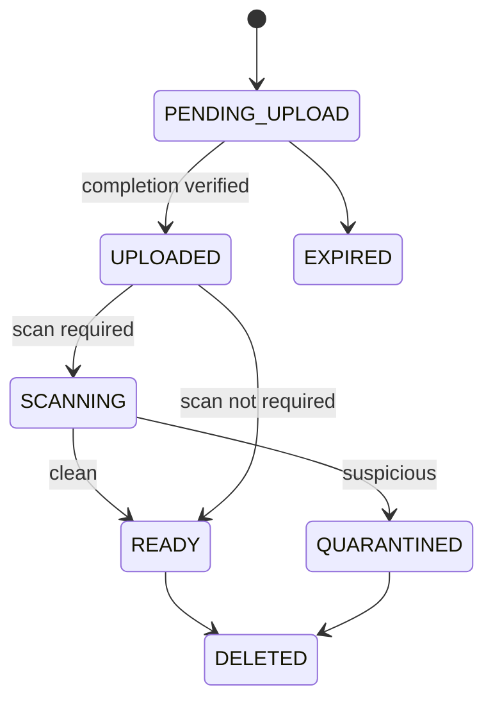
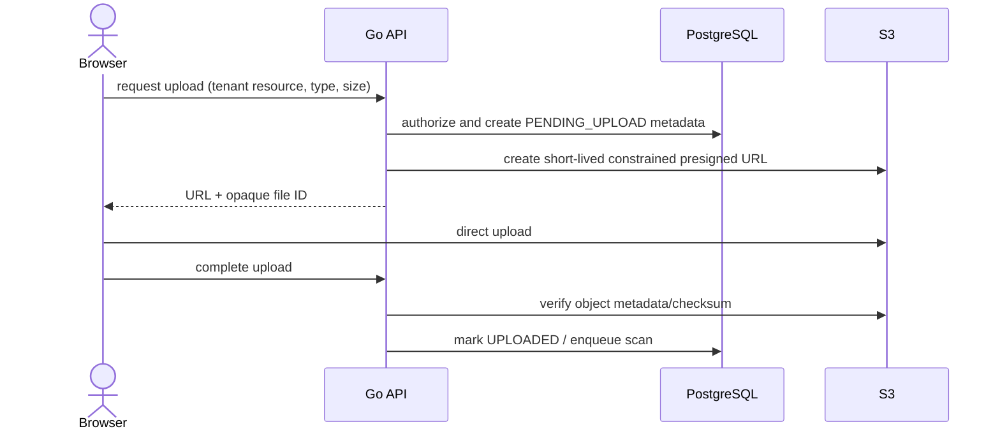

# Files Domain

## Purpose

The Files module owns metadata and authorization for tenant objects stored in Amazon S3 or a local S3-compatible development service.

## Model And Lifecycle

A file record includes organization, uploader, related resource, opaque storage key, original filename, media type, expected/actual size, checksum, status, scan status, timestamps, and retention/deletion metadata. PostgreSQL owns the lifecycle; S3 owns bytes only.

## Upload Flow

## Security And Failure Rules

- Object keys are opaque and tenant-prefixed; bucket listing is never granted to browsers.
- URLs are short lived and operation-specific; possession is treated as temporary bearer access.
- Type, extension, size, checksum, and resource permission are validated; dangerous inline content is downloaded with safe disposition.
- Bucket access is private, encrypted, versioned where required, and restricted by workload identity.
- A failed or abandoned upload expires and is reconciled; an S3 delete occurs after durable deletion intent and is retryable.
- Malware scanning is a production-target asynchronous step for risky content. Quarantined objects cannot receive download URLs.

Lifecycle and recovery policies are defined in [backups](../operations/backups.md).
