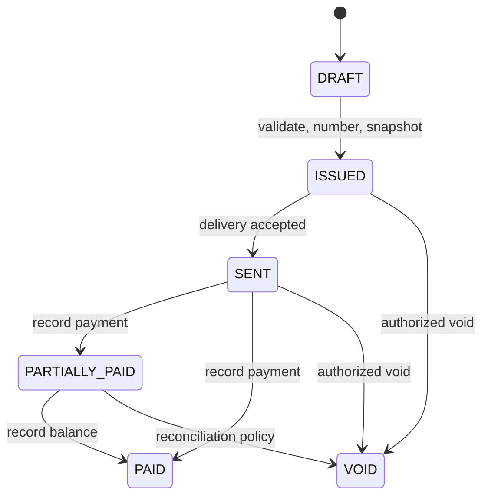

# Invoicing Domain

## Purpose

Invoicing turns approved billable work and manual charges into durable commercial records with explicit calculation and lifecycle rules.

## Aggregate

An invoice owns organization/client snapshot data, unique tenant invoice number, issue/due dates, currency, state, line snapshots, tax/discount rules, integer minor-unit totals, payment summary, version, PDF file reference, sent timestamp, and audit timestamps. Decimal quantities and rates use explicit precision; floating point is forbidden for money.

## State Machine



`OVERDUE` is a computed read status, never a persisted financial state: it is true when `due_date` has passed and the persisted state has an unpaid balance (`ISSUED`, `SENT`, or `PARTIALLY_PAID`). Paying or voiding an overdue invoice follows the ordinary persisted transitions above; scheduled evaluation materializes only deduplicated notification intent. Issued financial snapshots are immutable. Corrections use void/replacement or future credit-note behavior rather than editing history.

## Creation And Issuance

- Drafts accept eligible, uninvoiced time entries and manual lines from the same organization/client/currency.
- One transaction validates version, calculates totals, allocates a tenant-unique number on issue, links time entries, inserts the audit record, and writes outbox events.
- Create and issue support idempotency: the same key and request replay the original `201` create or `200` issue response. Missing required `If-Match` on issue returns `428`; a stale value returns `412 VERSION_MISMATCH`; a current-version request incompatible with persisted state returns `409`. Concurrent same-intent attempts therefore produce one effect plus replay, not a second invoice or number.
- The document consumer accepts `InvoiceIssued` by committing its inbox row plus a uniquely keyed PDF-generation intent. A bounded dispatcher then renders and writes the deterministic tenant-prefixed S3 object outside a database transaction, records the outcome idempotently, and emits a completion event.
- Email sending begins only after the PDF is ready; failure never rolls back the issued invoice and is visible/retryable.

## Invoice Creation Flow

```mermaid
sequenceDiagram
    actor User
    participant API as Go API
    participant DB as PostgreSQL
    participant Publisher as Outbox Publisher
    participant Queue as Amazon SQS
    participant PDF as Document Consumer
    participant Dispatcher as PDF Dispatcher
    participant S3
    User->>API: Issue invoice + Idempotency-Key
    API->>DB: BEGIN; validate and lock draft
    API->>DB: snapshot lines, issue, audit, outbox event + deliveries
    DB-->>API: COMMIT
    API-->>User: 200 ISSUED
    Publisher->>DB: claim destination delivery; read immutable event
    Publisher->>Queue: InvoiceIssued
    Queue->>PDF: at-least-once delivery
    PDF->>DB: inbox + durable generation intent; COMMIT
    PDF->>Queue: delete accepted message
    Dispatcher->>DB: claim pending generation intent
    Dispatcher->>S3: write deterministic PDF object
    Dispatcher->>DB: mark file READY / retryable failure
```

Payment-provider integration and credit notes are future evolution. See [async processing](../architecture/async-processing.md).
