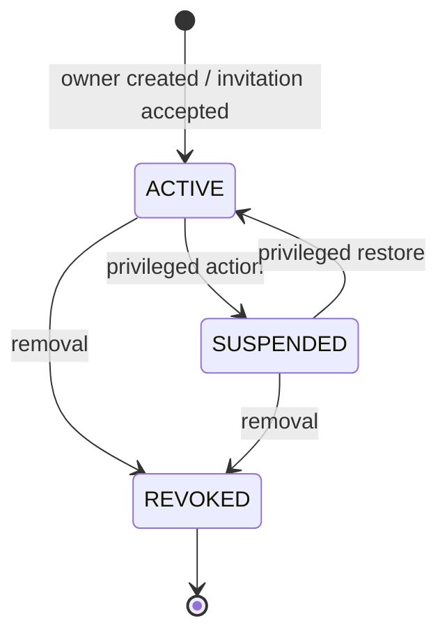

# Memberships, RBAC, And Invitations Domain

## Purpose And Status

A membership is the only relationship that grants a ClouDesk user authority inside
an organization. This document defines the proposed V1 role bundles, named
permissions, invitation lifecycle, resource predicates, and privileged invariants.
Authentication alone grants no tenant access.

## Model And Lifecycle

A membership contains `id`, `organization_id`, `user_id`, `role`, `status`,
`invited_by` when applicable, `joined_at`, suspension/revocation metadata, `version`,
and audit timestamps. `(organization_id, user_id)` is unique for the active/history
policy. Tenant-aware foreign keys prevent membership IDs from being attached to
another organization.

Membership states are `ACTIVE`, `SUSPENDED`, and `REVOKED`. A pending invitation is a
separate record because an email address is not yet a stable user identity. An
invitation contains organization, intended normalized verified email, proposed role,
inviter, hashed single-use token, expiry, status, and timestamps. Its statuses are
`PENDING`, `ACCEPTED`, `EXPIRED`, and `REVOKED`.

Invitation acceptance is authenticated, tenant-bound, short-lived, idempotent, and
transactional. The token is sent in a JSON body, stored only as a hash, compared
safely, and consumed once. The verified provider email must match the intended invite
or the inviter must issue a new invitation; a request-supplied email never binds the
identity. Acceptance creates/reactivates exactly one membership and its audit/outbox
records atomically.

## Authorization Policy

V1 uses five fixed role bundles: `OWNER`, `ADMIN`, `MANAGER`, `MEMBER`, and `VIEWER`.
Application code checks named permissions and resource conditions; it does not branch
on role except for owner-hierarchy invariants. The role-to-permission map is one
versioned backend policy mirrored in docs/tests and exposed as effective capabilities
to the UI. It is not dynamically editable in PostgreSQL, and V1 has no per-membership
allow/deny overrides. Unknown roles/permissions fail closed.

Permission vocabulary:

| Area | Named permissions |
| --- | --- |
| Organization/access | `organization:read`, `organization:update`, `memberships:read`, `memberships:invite`, `memberships:update-role`, `memberships:suspend`, `memberships:remove` |
| Clients | `clients:read`, `clients:read-sensitive`, `clients:create`, `clients:update`, `clients:archive` |
| Projects/tasks | `projects:read`, `projects:create`, `projects:update`, `projects:archive`, `projects:manage-members`, `tasks:read`, `tasks:create`, `tasks:update`, `tasks:assign`, `tasks:comment`, `tasks:moderate` |
| Time | `time:read-own`, `time:read-all`, `time:track-own`, `time:correct-own`, `time:manage-all` |
| Billing | `invoices:read`, `invoices:create`, `invoices:update-draft`, `invoices:issue`, `invoices:send`, `invoices:void` |
| Files/reporting/audit | `files:read`, `files:upload`, `files:delete`, `reports:view`, `reports:export`, `audit:read` |

### V1 Role Bundles

`Y` means the role receives the named permission. Resource visibility and domain
invariants still apply. A blank cell is denied.

| Permission group | OWNER | ADMIN | MANAGER | MEMBER | VIEWER |
| --- | :---: | :---: | :---: | :---: | :---: |
| `organization:read` | Y | Y | Y | Y | Y |
| `organization:update` | Y | Y |  |  |  |
| `memberships:read` | Y | Y | Y |  |  |
| `memberships:invite` | Y | Y | Y |  |  |
| `memberships:update-role` / `suspend` / `remove` | Y | Y |  |  |  |
| `clients:read` | Y | Y | Y | Y | Y |
| `clients:read-sensitive` | Y | Y | Y |  |  |
| `clients:create` / `update` / `archive` | Y | Y | Y |  |  |
| `projects:read` / `tasks:read` | Y | Y | Y | Y | Y |
| `projects:create` / `update` | Y | Y | Y |  |  |
| `projects:archive` / `manage-members` | Y | Y | Y |  |  |
| `tasks:create` / `update` / `assign` | Y | Y | Y | Y |  |
| `tasks:comment` | Y | Y | Y | Y |  |
| `tasks:moderate` | Y | Y | Y |  |  |
| `time:read-own` / `track-own` / `correct-own` | Y | Y | Y | Y |  |
| `time:read-all` / `manage-all` | Y | Y | Y |  |  |
| `invoices:read` | Y | Y | Y |  | Y |
| `invoices:create` / `update-draft` | Y | Y | Y |  |  |
| `invoices:issue` / `send` | Y | Y |  |  |  |
| `invoices:void` | Y |  |  |  |  |
| `files:read` | Y | Y | Y | Y | Y |
| `files:upload` | Y | Y | Y | Y |  |
| `files:delete` | Y | Y | Y | own only |  |
| `reports:view` | Y | Y | Y |  | Y |
| `reports:export` | Y | Y | Y |  |  |
| `audit:read` | Y | Y |  |  |  |

The table intentionally keeps invoice issue/send with administrators and invoice void
with owners in V1. Product evidence may later justify a billing-specific role or
permission reassignment; that is a policy version with migration/review, not an ad
hoc hidden exception.

## Resource-Level Conditions

Permission checks are combined with conditions:

- Restricted projects require project participation or an organization role allowed
  to administer all projects. Project membership never grants an organization
  permission the user lacks.
- `time:*own` compares the authenticated `user_id`/membership to the time-entry actor;
  `time:manage-all` remains tenant-scoped.
- `files:delete` for a member requires uploader ownership, owner-resource access, an
  eligible lifecycle state, and retention policy. Role text alone does not authorize
  deletion.
- Viewer access is read-only and still respects restricted projects and sensitive
  field policy.
- Membership actions cannot target another organization. Admins cannot grant/remove
  `OWNER`, change their own authority upward, or bypass the last-owner invariant.
  Only an owner may grant or revoke owner status.
- A user cannot approve their own elevation through invitation or stale client data.
  Current PostgreSQL membership/version is checked inside the mutation transaction.

## Membership Operations And Failure Behavior

List/read, invite, revoke invitation, accept invitation, change role, suspend,
reactivate, and revoke are explicit operations. Role/status changes use `If-Match` or
an equivalent version precondition and audit before/after role/status. Removing the
last active owner fails with a domain conflict even under concurrent requests.

Authorization is rechecked before returning a stored idempotency response. A revoked
member cannot replay an earlier privileged response. Cached capabilities may hide or
show UI controls but never authorize a command. A status change becomes authoritative
at PostgreSQL commit; short-lived UI/session data is invalidated or naturally fails
on the next server check.

An unauthenticated invitation acceptance returns `401`; invalid/expired/used tokens
return one generic safe error; an existing equivalent membership produces an
idempotent success or documented conflict without disclosing other identities.
Invitation creation and acceptance are throttled and audited without logging token or
full email values.

## Verification And Evolution

Tests generate a role/permission matrix with positive and negative cases, plus every
resource condition. They cover self-escalation, owner grant/revoke hierarchy,
concurrent last-owner removal, suspension during a request, stale role versions,
cross-tenant membership IDs, restricted projects, own/all time and file conditions,
invitation theft/replay/expiry/email mismatch, idempotency after revocation, and UI
capability staleness.

Custom roles, project-specific roles, temporary access, service accounts, SCIM, and
support impersonation are deferred. Their trigger is a demonstrated customer or
operations need; introducing any of them requires policy storage/versioning,
deny-by-default fallback, migration/rollback, administrative separation, expanded
audit, and a renewed escalation/confused-deputy threat model.
