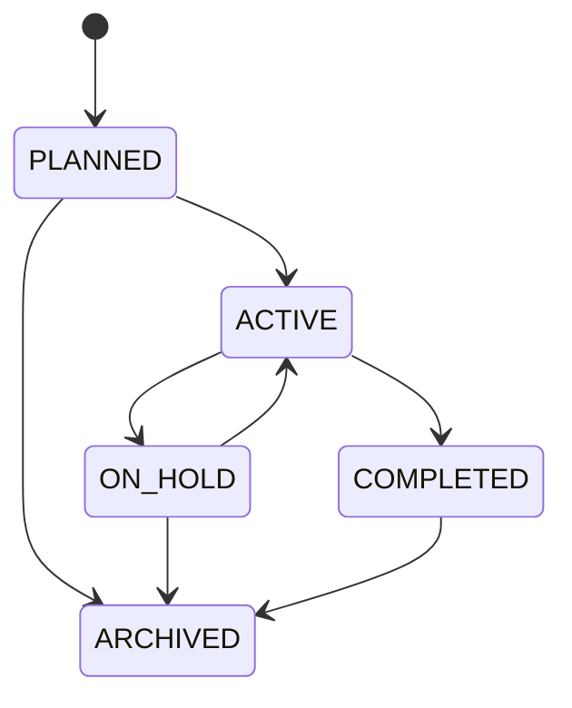

# Projects Domain

## Purpose

Projects organize client delivery, access, budgets, tasks, tracked time, files, and future invoice candidates.

## Model

A project belongs to one organization and client and has an owner membership, name, description, lifecycle status, dates, billing model, budget, default hourly rate, tags, timestamps, version, and optional archive timestamp. A `project_members` relation grants project participation without replacing organization permissions.

## Lifecycle

- Client, project, owner, and members must share one organization.
- Completed or archived projects reject new timers and tasks unless explicitly reopened by a permitted actor.
- Billing model is `HOURLY`, `FIXED`, or `NON_BILLABLE`; changes never rewrite invoiced history.
- Optimistic locking protects project settings and budget changes.
- Archive retains tasks, files, time, invoice links, and audit history.

## Authorization And Events

Organization permissions gate create/archive; project participation further limits work visibility when an organization enables restricted projects. Important events include `ProjectCreated`, `ProjectStatusChanged`, and `ProjectArchived`; notifications are derived asynchronously only when needed.
