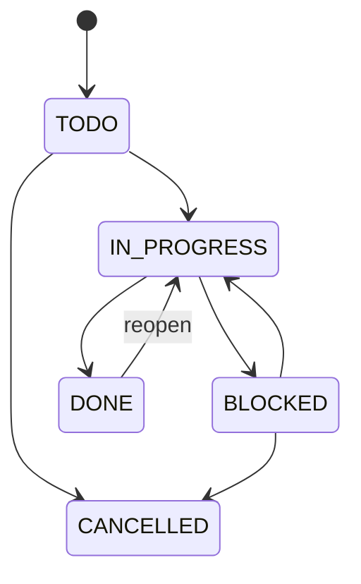

# Tasks Domain

## Purpose

Tasks represent executable project work with assignments, collaboration, time, attachments, and an auditable lifecycle.

## Model And Lifecycle

A task carries organization and project keys, title, description, status, priority, due date, estimate, creator, version, timestamps, and optional completion/archive timestamps. Assignees and labels are separate relations scoped through the same organization/project.

- Parent project and assignee memberships must be active in the same organization.
- A task cannot accept new tracked time when cancelled or when its project is archived.
- Status transitions are explicit domain operations, not arbitrary field patches.
- `actual_tracked_seconds` is derived from valid time entries rather than maintained as competing truth.
- Concurrent edits use a version precondition where overwriting would lose meaningful changes.

## User Experience And Events

Assignment, mention, approaching deadline, overdue state, and completion may emit events; notification policy suppresses duplicates. Optimistic UI is suitable for reversible label/assignment actions, but conflicts and authorization failures must restore server state.
