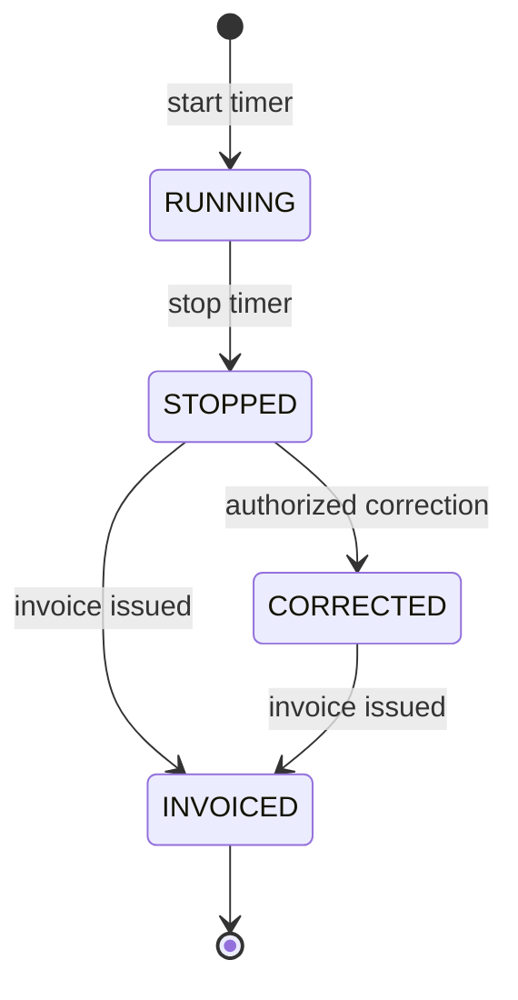

# Time Tracking Domain

## Purpose

Time tracking is a central ClouDesk workflow connecting member effort, project delivery, reporting, and invoicing.

## Model

A time entry includes organization, member, project, optional task, start/end instants, duration, description, billable flag, currency/rate snapshot where applicable, source (`TIMER` or `MANUAL`), invoice linkage, version, and audit timestamps. Store instants in UTC; retain a user's IANA time zone only for display and date-boundary interpretation.

## Timer Invariants

- At most one active timer exists per global `user_id`, enforced by a partial unique index where `ended_at IS NULL`; simultaneous billing across organizations would be misleading.
- Start and stop are transactional, accept an idempotency key, and lock/select the active row to serialize concurrent requests.
- Stop computes duration from server timestamps, rejects negative or implausible ranges, and returns the prior result on safe retry.
- A task, project, and membership must belong to the same organization.
- Completed/archived projects and cancelled tasks reject new timers.
- `GET /api/v1/me/active-timer` is the deliberate user-scoped exception to organization-prefixed resource routes; it returns only the authenticated user's timer after confirming the referenced membership remains active.

## Corrections And Billing

Manual entry and correction validate overlaps according to organization policy. Corrections to invoiced entries require invoice-domain remediation rather than silent mutation. Hourly rate resolution is explicit: project override, then organization default; the resolved currency/rate is snapshotted before billing. Every correction records before/after metadata in the audit trail.

## Reporting

Operational reports aggregate bounded date ranges by organization, member, client, project, task, and billability. Long exports run asynchronously. See [idempotency](../api/idempotency.md) and [data model](../architecture/data-model.md).
