# ClouDesk AWS Target Architecture

## Purpose And Status

This document defines the proposed AWS deployment, account boundaries, managed
services, availability model, and recovery posture for ClouDesk. It is a target
architecture; no AWS resources currently exist.

The design implements the decisions in
[ADR-003](../decisions/ADR-003-postgresql-system-of-record.md),
[ADR-007](../decisions/ADR-007-amazon-sqs-messaging.md),
[ADR-011](../decisions/ADR-011-amazon-cognito-oidc.md),
[ADR-012](../decisions/ADR-012-bounded-redis-usage.md),
[ADR-013](../decisions/ADR-013-aws-single-region-multi-az.md),
[ADR-014](../decisions/ADR-014-eks-production-platform.md),
[ADR-015](../decisions/ADR-015-terraform-iac.md), and
[ADR-018](../decisions/ADR-018-opentelemetry-observability.md). See
[networking](networking.md), [environments](environments.md), and
[cost management](cost-management.md) for the detailed operating boundaries.

## Decision Summary

- Run production in one selected AWS Region across three Availability Zones. This is
  an AZ-resilient design, not a multi-region design.
- Use Route 53, CloudFront, and AWS WAF at the edge, with one internet-facing ALB as
  the CloudFront origin. The ALB routes UI traffic to Next.js and `/api/v1` to the Go
  API on EKS. Workers have no inbound internet route.
- Place EKS nodes and pods in private application subnets. Place RDS and optional
  ElastiCache in isolated data subnets. Only the ALB and NAT gateways use public
  subnets.
- Use an RDS for PostgreSQL Multi-AZ DB instance as the initial production system of
  record. Aurora PostgreSQL, RDS Proxy, and read replicas are deferred until measured
  load or recovery evidence justifies their cost and complexity.
- Use SQS standard queues with DLQs, private S3 buckets, immutable ECR repositories,
  Cognito through OIDC, Secrets Manager, ACM, and workload-scoped IAM roles.
- Keep Redis optional and non-authoritative. If it is introduced in production, use
  an ElastiCache replication group with Multi-AZ automatic failover.
- Provision everything through Terraform and deliver Kubernetes desired state through
  GitOps. Console changes are break-glass actions that must be reconciled back to code.

## AWS Organization And Account Boundaries

AWS Organizations should establish the following logical accounts. AWS accounts have
no hourly charge, so these boundaries buy meaningful blast-radius reduction without
requiring production-sized resources in every account.

| Account | Responsibility | Explicit exclusions |
| --- | --- | --- |
| Organization management | Consolidated billing, account creation, SCP attachment, and root controls | No workloads, CI roles, or routine administrator sessions |
| Security and log archive | Organization CloudTrail destination, security findings, immutable audit retention, and delegated security administration | No application workloads or developer write access |
| Shared tooling | GitHub OIDC trust, artifact promotion support, and optional shared observability administration | No production business data; not a transitive administrator of production |
| Non-production | Isolated dev and staging VPCs, test data services, and non-production EKS resources | No production data or production credentials |
| Production | Production VPC, EKS, RDS, S3, SQS, optional ElastiCache, Cognito, and production ECR | No interactive development or preview environments |

For a portfolio bootstrap, security/log archive and shared tooling may initially be
combined, provided production and non-production remain separate and the management
account remains workload-free. The target split should be restored before onboarding
real customer data. Dev and staging can share the non-production account, but must use
separate VPCs, KMS keys, state roots, databases, buckets, queues, secrets, identities,
and quotas. Staging may move to a dedicated account when compliance, team ownership,
or blast-radius evidence requires it.

Guardrails should include root MFA, alternate contacts, centralized CloudTrail,
AWS Config/security findings when proportionate, and SCPs that prevent disabling
audit controls, leaving the organization, using unapproved Regions, or making S3
public. Human access uses federation through IAM Identity Center and short-lived role
sessions; IAM users and long-lived access keys are not part of the design.

## Production Deployment View

The diagram is the production target. The ALB is created and reconciled by the AWS
Load Balancer Controller from Kubernetes ingress configuration. It uses IP targets,
so traffic reaches pod endpoints without exposing NodePorts publicly.

```mermaid
flowchart TB
    USER["ClouDesk user"]

    subgraph GLOBAL["AWS global edge services"]
        R53["Route 53 alias"]
        CF["CloudFront distribution<br/>static caching; dynamic pass-through"]
        WAF["AWS WAF<br/>managed, reputation, and rate rules"]
        VIEWCERT["ACM viewer certificate<br/>us-east-1 global-service requirement"]
    end

    subgraph REGION["Selected AWS Region - production"]
        ORIGCERT["Regional ACM certificate"]
        ALB["Internet-facing ALB<br/>CloudFront-only origin ingress"]

        subgraph VPC["ClouDesk VPC"]
            subgraph AZA["Availability Zone A"]
                PUBA["Public subnet<br/>ALB + NAT A"]
                APPA["Private app subnet<br/>EKS nodes and pods"]
                DATAA["Isolated data subnet"]
                WEBA["Next.js pod"]
                APIA["Go API pod"]
                WORKERA["Outbox/domain worker pod"]
            end
            subgraph AZB["Availability Zone B"]
                PUBB["Public subnet<br/>ALB + NAT B"]
                APPB["Private app subnet<br/>EKS nodes and pods"]
                DATAB["Isolated data subnet"]
                WEBB["Next.js pod"]
                APIB["Go API pod"]
                WORKERB["Outbox/domain worker pod"]
            end
            subgraph AZC["Availability Zone C"]
                PUBC["Public subnet<br/>ALB + NAT C"]
                APPC["Private app subnet<br/>EKS nodes and pods"]
                DATAC["Isolated data subnet"]
                WORKERC["Outbox/domain worker pod"]
            end

            WEB_SVC["Kubernetes Web Service"]
            API_SVC["Kubernetes API Service"]
            RDS[("RDS PostgreSQL Multi-AZ<br/>DB subnet group spans 3 AZs")]
            REDIS[("Optional ElastiCache<br/>Multi-AZ replication group")]
        end

        SQS["SQS queues + DLQs"]
        S3[("Private S3 buckets")]
        ECR["Immutable ECR repositories"]
        COGNITO["Amazon Cognito OIDC"]
        SECRETS["Secrets Manager + KMS"]
        TELEMETRY["OTel collectors and<br/>selected observability backends"]
    end

    USER -->|HTTPS| R53 --> CF
    WAF --- CF
    VIEWCERT --- CF
    CF -->|HTTPS origin| ALB
    ORIGCERT --- ALB
    ALB -->|default and UI routes| WEB_SVC
    ALB -->|/api/v1| API_SVC
    WEB_SVC --> WEBA
    WEB_SVC --> WEBB
    API_SVC --> APIA
    API_SVC --> APIB
    APIA --> RDS
    APIB --> RDS
    WORKERA --> RDS
    WORKERB --> RDS
    WORKERC --> RDS
    APIA -.-> REDIS
    APIB -.-> REDIS
    WORKERA <-->|publish and poll| SQS
    WORKERB <-->|publish and poll| SQS
    WORKERC <-->|publish and poll| SQS
    APIA --> S3
    USER -->|short-lived presigned transfer| S3
    WORKERA --> S3
    WORKERB --> S3
    WORKERC --> S3
    APPA -.-> ECR
    APPB -.-> ECR
    APPC -.-> ECR
    APIA --> COGNITO
    APIB --> COGNITO
    APIA --> SECRETS
    WORKERA --> SECRETS
    WORKERB --> SECRETS
    WORKERC --> SECRETS
    WEBA -.-> TELEMETRY
    APIA -.-> TELEMETRY
    WORKERA -.-> TELEMETRY
    WORKERB -.-> TELEMETRY
    WORKERC -.-> TELEMETRY
```

CloudFront has one ALB origin. Behaviors may cache fingerprinted Next.js static assets
and other explicitly public immutable content; authenticated HTML and `/api/v1/*`
disable shared caching and forward only the required headers, cookies, and query
parameters. The browser's presigned S3 transfer bypasses CloudFront, so S3 policy,
short expiry, exact CORS, checksum/size constraints, metadata reconciliation, and
content scanning remain mandatory controls.

Route 53 aliases the application hostname to CloudFront. CloudFront's viewer
certificate must be in `us-east-1`; that is a global-service control-plane constraint,
not a second application Region. A separate certificate in the selected workload
Region protects CloudFront-to-ALB TLS. HTTP redirects to HTTPS, and TLS policy versions
are reviewed rather than left at provider defaults indefinitely.

The ALB security group accepts TCP 443 only from the AWS-managed CloudFront
origin-facing prefix list. WAF is associated with CloudFront and starts with managed
core and known-bad-input rules, reputation controls, request-size limits, and scoped
rate rules in count mode before blocking. A secret origin header may be validated as
an additional control, but is not a substitute for the prefix-list restriction.

## EKS Runtime Boundary

The regional EKS control plane is managed across AWS availability zones. Production
nodes and pod IPs use the three private application subnets. Critical Web and API
Deployments have multiple replicas, topology spread constraints, disruption budgets,
and readiness gates; worker Deployments scale separately from queue age/depth. These
workload details are owned by the Kubernetes design, while the AWS contract is:

- AWS Load Balancer Controller owns the public ALB and IP target groups.
- One Kubernetes Ingress routes the same public origin to the Web Service and API
  Service. Internal Services use ClusterIP. Workers expose no Ingress.
- The EKS API endpoint is private in production. Access uses EKS access entries,
  federated roles, and an audited private administration path; there is no bastion
  with a permanent public address.
- Nodes have only bootstrap, networking, logging, and image-pull permissions. Business
  AWS permissions never accumulate on the node role.
- Each AWS-integrated controller and workload has its own Kubernetes service account
  and EKS Pod Identity association to a least-privilege IAM role. IRSA is a documented
  fallback only where Pod Identity support or topology is insufficient.
- Workloads are stateless. Business data, queues, and object bytes do not reside on
  node disks, so node replacement does not require data recovery.

## Managed Data And Integration Services

### PostgreSQL Decision

Use an RDS for PostgreSQL Multi-AZ **DB instance deployment** for the initial
production target. It matches ClouDesk's single-writer transaction model, extensions,
and PostgreSQL operational practices with lower complexity and usually lower baseline
cost than Aurora. The synchronous standby is for availability, not read scaling.
The application reconnect design follows AWS's documented [Multi-AZ DB instance failover behavior](https://docs.aws.amazon.com/AmazonRDS/latest/UserGuide/Concepts.MultiAZ.Failover.html):
failover changes DNS to the standby and existing connections must be re-established;
duration depends on database activity and recovery rather than a fixed guarantee.

Production configuration should include private placement, a three-subnet DB subnet
group, storage encryption, deletion protection, automated backups and PITR, enhanced
monitoring appropriate to the budget, `pg_stat_statements`, maintenance windows, and
a protected final-snapshot policy. Connect directly to the RDS writer endpoint at
first. RDS Proxy is introduced only if replica count or connection churn exhausts a
measured connection budget; read replicas follow only after query/index and aggregate
optimization.

Aurora PostgreSQL is reconsidered only when representative tests show at least one of:

- RDS failover time cannot meet an approved recovery objective and Aurora's measured
  behavior materially closes the gap;
- read scaling needs several replicas or storage growth/IO behavior makes Aurora
  economically favorable at ClouDesk's actual traffic;
- RDS instance/storage limits remain the bottleneck after pool, query, index, and
  workload fixes; or
- a future approved regional architecture requires capabilities that justify Aurora's
  migration and compatibility cost.

The evaluation must compare a full monthly cost model, extension/version compatibility,
backup/restore behavior, connection semantics, and a load/failover test. Aurora is not
adopted for a nominal scalability claim.

### Optional ElastiCache

Do not provision ElastiCache until a measured distributed cache, rate-limit, or
short-lived coordination need exists. If production adopts Redis-compatible
ElastiCache, use a replication group across AZs, automatic failover, encryption in
transit and at rest, authentication, private data-subnet placement, and an application
security group scoped to exact callers. Cache keys always include `organization_id`
and TTL.

Redis failure never loses business truth. Read caching falls back to bounded database
queries, and sensitive abuse controls reject conservatively or use a documented local
fallback when centralized enforcement is unavailable. Readiness does not depend on
Redis, and timeout/circuit behavior prevents a cache outage from consuming all API
connections.

### SQS

Use SQS standard queues per workload class, with workload-specific visibility
timeouts, long polling, bounded redrive counts, and a DLQ for each queue. Queue and
KMS policies admit only the owning outbox publisher or consumer workload role. SQS is
at-least-once and loosely ordered: PostgreSQL outbox records prevent lost publish
intent, while consumer inbox records prevent duplicate durable effects. Alarm on
oldest-message age, receive count, send/processing errors, and DLQ depth.

### S3

Use environment-specific private buckets for attachments, invoice PDFs, generated
reports, and exports. Consolidating those classes into one application bucket with
separate prefixes is acceptable initially; quarantine or compliance boundaries may
justify a separate bucket later. Required controls are public-access block,
bucket-owner-enforced object ownership, TLS-only bucket policy, default encryption,
server-generated opaque tenant-prefixed keys, versioning in production, and exact
CORS for the ClouDesk origin.

Lifecycle rules abort incomplete multipart uploads, expire temporary exports, and
transition or expire noncurrent versions according to the approved retention policy.
Presigned uploads bind an expected key, short expiry, maximum size, checksum where
supported, and allowlisted media type. PostgreSQL remains authoritative for ownership
and lifecycle; no URL is issued for pending, quarantined, or deleted metadata.

### ECR

Maintain environment/account-scoped ECR repositories with immutable tags, scan on
push, encryption, and lifecycle policies that retain every deployed or rollback
digest. CI builds once; promotion copies or replicates that exact manifest and verifies
the digest before GitOps references it. Production never deploys `latest` or resolves
a mutable tag at rollout time.

### Cognito

Use a separate Cognito user pool and client per environment through standard
OIDC/OAuth flows. Cognito authenticates users; the ClouDesk database owns user mapping,
memberships, organization roles, and authorization. Callback/logout URLs are exact,
test and production pools never share users, and MFA/risk policy evolves by approved
risk requirements.

## IAM, Secrets, Certificates, And Encryption

Human, CI, and workload identities are separate trust paths:

| Identity | Mechanism | Boundary |
| --- | --- | --- |
| Human operator | IAM Identity Center federation into named read-only, operator, and tightly controlled admin roles | MFA, short session, no IAM user keys, production write access exceptional and audited |
| GitHub Actions | GitHub OIDC to environment-specific roles | Trust restricted by organization, repository, workflow/ref, and environment; plan and apply/promotion roles are distinct |
| EKS workload | EKS Pod Identity per service account | Exact cluster/namespace/service-account association; least-privilege S3, SQS, Secrets Manager, or controller API actions only |
| AWS service | Service-linked role or explicit service principal | Resource conditions and KMS grants limited to the service/resource |

At minimum, separate workload roles exist for the AWS Load Balancer Controller, API,
outbox publisher, notification worker, document worker, and telemetry components.
The API role may sign only the object operations and prefixes required by the file
contract; the outbox publisher may send only to its queues; consumers may receive and
delete only from their owned queues/DLQs; the document worker alone receives its S3
write permissions. Cross-tenant authorization remains an application rule even when
an IAM policy is resource-scoped.

Secrets Manager stores database credentials and third-party provider secrets. Pods
retrieve only their own secret through Pod Identity, either at startup or through an approved
CSI/external-secret integration; secrets are never Terraform values, container image
content, Kubernetes manifests, or static environment files in Git. Rotation must be
tested against connection pools and dual-credential overlap. Application logs and
telemetry redact secret values and presigned URLs.

Use KMS encryption for RDS, production S3, SQS where sensitive payloads require it,
Secrets Manager, ECR, and Terraform state according to the key-management design.
Customer-managed keys are appropriate for production separation and auditable grants;
non-production may use AWS-managed keys where the lower administrative and per-key
cost is justified. Key deletion windows and break-glass recovery require explicit
controls because deleting a key can make backups unrecoverable.

## Availability And Failure Behavior

| Failure | Target behavior | Important limitation |
| --- | --- | --- |
| Pod crash | Kubernetes replaces the pod; readiness removes it before traffic | A single-replica workload still has an interruption |
| Node loss | Replicas on other nodes/AZs continue while capacity is replaced | Requests in flight can fail; workers rely on SQS redelivery |
| One AZ loss | ALB and critical replicas use surviving AZs; same-AZ NAT routing avoids a failed NAT; RDS can fail over | Capacity must reserve enough headroom in two AZs; zonal loss is tested, not assumed |
| RDS primary failure | RDS promotes the standby and the writer DNS endpoint changes; pools discard stale connections and reconnect with jitter | In-flight transactions abort; commit outcome can be ambiguous |
| Redis failure | Cache miss/fallback or conservative rate-limit behavior; core records remain available | Database load rises and selected abuse-sensitive actions may be rejected |
| SQS delay/outage | Commands already committed remain in PostgreSQL outbox; workers catch up later | Notifications, PDFs, audit projections, and reports become stale |
| Worker crash | Visibility timeout makes unacknowledged work redeliver; inbox deduplication avoids repeated durable effect | External providers still require stable idempotency/reconciliation |
| NAT failure | Production application subnet in that AZ uses its own NAT; endpoints keep selected AWS traffic private | External-provider calls from the affected AZ fail until route/capacity recovers |
| CloudFront/ALB path failure | Health alarms and origin/target health identify the boundary; healthy targets continue | There is no second regional origin in this design |

RDS failover must be treated as transient connection loss, not transparent success.
Read-only operations may retry within their request deadline. Mutations retry only
when the whole operation is idempotent; after an ambiguous commit, the API reconnects
and resolves the tenant-scoped idempotency record or resource state before responding.
Readiness should remove an API pod while it cannot safely acquire a database
connection, but liveness must not create a restart storm during a managed failover.

## Backup And Disaster Recovery

The initial proposed production objectives are an RPO of 5–15 minutes and an RTO of
30–60 minutes for recoverable in-region failures. They are objectives to validate,
not guarantees. Regional recovery time remains uncommitted until an exercise proves
it. The system-level contract is in
[disaster recovery](../architecture/disaster-recovery.md).

- Configure RDS automated backups and PITR, proposed at 35 days for production, plus
  a protected manual snapshot before high-risk migrations. Multi-AZ is availability,
  not a backup.
- Enable S3 versioning in production and retain noncurrent versions long enough to
  recover operator or application deletion. Lifecycle expiration must agree with
  tenant deletion, legal, financial, and audit retention.
- Preserve immutable deployed image digests in ECR for the recovery/rollback window.
- Version and protect Terraform remote state; Git and GitOps desired state remain the
  reproducible infrastructure/workload sources.
- Preserve the deletion ledger outside purged tenant data. A restored older database
  must reapply completed deletion obligations before it can serve traffic.
- Restore RDS into an isolated VPC, validate schema/tenant/financial invariants,
  recover representative S3 objects, deploy the immutable release, and run application
  smoke checks before controlled traffic restoration.

Quarterly production restore exercises should measure actual RPO/RTO and capture
evidence. An annual regional-loss tabletop is required before making a regional RTO
claim. No warm standby, active/active deployment, cross-region database, or automatic
regional DNS failover is included initially. Cross-region backup copies are a separate
risk decision because they add residency, key, retention, and deletion obligations.

## Multi-Region Reconsideration Triggers

Create a new ADR rather than extending this topology implicitly when contractual
availability exceeds accepted single-region risk, data residency requires independent
regional placement, user latency remains unacceptable after edge optimization, or
measured regional-loss business impact exceeds the cost and consistency burden. The
new decision must define tenant placement, write ownership/conflicts, identity, keys,
backup deletion, queues, observability, DNS failover, and repeatedly tested recovery.

## Evidence Required Before Production

This proposal becomes an operational claim only after Terraform plans, policy tests,
network reachability tests, Kubernetes ingress/workload-identity tests, RDS and Redis failover
exercises, SQS/DLQ replay tests, S3 authorization tests, restore evidence, cost budgets,
and runbooks exist. Until then, every component and objective in this document remains
planned.
