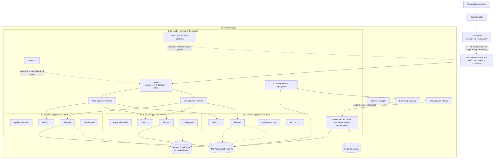

# Proposed Kubernetes And EKS Architecture

## Purpose And Status

This document defines the staged Amazon EKS target for ClouDesk workloads. It is a
design, not an implemented cluster or a set of manifests. Local V1 remains Docker
Compose based; EKS is introduced only after the application, asynchronous-processing,
security, and observability foundations are ready.

The governing decisions are [one AWS Region across three Availability Zones](../decisions/ADR-013-aws-single-region-multi-az.md),
[staged EKS](../decisions/ADR-014-eks-production-platform.md),
[GitOps desired state](../decisions/ADR-016-gitops-delivery-model.md),
[Argo CD](../decisions/ADR-017-argo-cd-controller.md), and
[rolling deployments](../decisions/ADR-019-rolling-deployments.md). See
[scaling operations](../operations/scaling.md) for signals, formulas, and operator
actions and [AWS infrastructure](aws.md) for the surrounding network and managed
services.

## Deployment Horizons

| Horizon | Platform posture |
| --- | --- |
| Current repository | Documentation only. There is no application, cluster, chart, or Kubernetes manifest. |
| V1 local | Docker Compose runs the web, API, PostgreSQL, and only feature-required workers. Kubernetes is not a developer prerequisite. |
| Dev | Prefer the lowest-cost runtime that still exercises relevant contracts. A shared non-production EKS cluster is acceptable only with hard namespace, IAM, quota, and access isolation; it is not required. |
| Staging | EKS validates the same Helm templates, image digests, controllers, probes, rollouts, and policies intended for production at reduced capacity. |
| Production target | One private-endpoint EKS cluster in one AWS Region, with application nodes and pods across three private application subnets/AZs. Managed AWS services remain outside the cluster. |
| Future evolution | Add Karpenter, progressive delivery, specialized nodes, or another Region only when measured triggers justify them. |

EKS is an execution platform, not a service-boundary decision. The Go API remains a
modular monolith and worker processes are separated only for lifecycle, resource,
queue, or IAM isolation.

## Production Deployment View

The diagram shows desired three-AZ placement, not a guarantee that every workload
always has one pod in each AZ. Replica count, node capacity, topology constraints,
and disruption policy must all make that state schedulable.

## Workload Inventory And Exposure

| Workload | Controller | Production starting posture | Network exposure | Principal dependencies |
| --- | --- | --- | --- | --- |
| `web` | Deployment | 3 replicas | ClusterIP behind the shared ALB; default/UI routes | API and OIDC; no PostgreSQL access |
| `api` | Deployment | 3 replicas | ClusterIP behind the shared ALB at `/api/v1` | RDS, optional Redis, OIDC/JWK, S3 presigning |
| `outbox-publisher` | Deployment | 2 coordinated replicas | No Service or ingress | RDS and SQS |
| `notification-worker` | Deployment | 2 replicas | No Service or ingress; kubelet probes address the pod directly | SQS, RDS, email secret/provider |
| `document-worker` | Deployment | 2 replicas with bounded concurrency | No Service or ingress | SQS, RDS, S3; CPU/memory-heavy work isolated |
| `audit-reporting-worker` | Deployment, separable when profiles diverge | 2 replicas | No Service or ingress | SQS and owned RDS tables |
| `database-migration` | One controlled Job per compatible release step | Exactly one active execution | No Service or ingress | RDS with a migration-specific database role |

Starting replica counts are capacity hypotheses, not SLO guarantees. Staging may use
smaller counts but must periodically exercise three-AZ placement and production
disruption behavior. A shared worker binary is acceptable initially only if each queue
retains separate concurrency, retry, telemetry, IAM, and scaling budgets; one broad
Deployment must not silently erase those isolation boundaries.

## Ingress, Services, And Network Boundaries

- Route 53 aliases CloudFront. CloudFront applies the edge WAF and forwards origin
  HTTPS to one internet-facing ALB in the three public subnets.
- AWS Load Balancer Controller creates and reconciles the ALB and IP target groups
  from a GitOps-managed `Ingress` using an explicit `IngressClass`. Terraform owns
  the VPC, subnet discovery tags, EKS/OIDC/IAM substrate, and security-group boundary;
  neither Terraform nor a second controller may co-own the Ingress or ALB lifecycle.
- The ALB security group accepts port 443 only from the AWS-managed CloudFront
  origin-facing prefix list. It reaches only the selected web/API pod target ports.
  Direct public access to nodes, pods, worker ports, or the EKS API is prohibited.
- The ALB uses `target-type: ip`, registering VPC CNI pod IPs. The default/UI rule
  targets the `web` ClusterIP Service and `/api/v1` targets the `api` ClusterIP
  Service. Worker Deployments have neither Ingress nor user-facing Service.
- ALB health checks use the relevant readiness path. Deregistration delay and pod
  termination must be longer than the observed propagation/drain interval so a
  terminating pod stops receiving new traffic before exit.
- Production nodes and pods use three private application subnets. RDS and optional
  ElastiCache use isolated data subnets and restrictive security groups. VPC endpoints
  for ECR, S3, SQS, STS, CloudWatch, and Secrets Manager are evaluated against NAT
  cost and availability in the AWS design.
- Namespace default-deny ingress and egress is the target. Explicit policy permits
  ALB-to-web/API, DNS, required same-namespace calls, RDS/Redis endpoints, and named
  AWS/provider destinations. Network policy is defense in depth and never replaces
  application authorization, tenant scoping, IAM, or security groups.

## Namespaces And Tenancy

Use a small number of purpose-owned namespaces rather than one namespace per bounded
context or customer:

| Namespace | Ownership and contents |
| --- | --- |
| `argocd` | Argo CD controllers, tightly scoped Projects/RBAC, and no application workloads |
| `platform-system` | AWS Load Balancer Controller and other explicitly approved cluster add-ons |
| `observability` | Collectors/agents and approved telemetry components |
| `clouddesk-<environment>` | Web, API, workers, Services, Ingress, policies, quotas, and release Jobs for one environment |

Production should use a dedicated account and cluster. If non-production environments
share a cluster, each receives a namespace, IAM roles, Argo CD Project, ResourceQuota,
LimitRange, network policy, secrets, and database/account boundary of its own.
Kubernetes namespaces are not the ClouDesk tenant boundary: organizations share the
application runtime and remain isolated by server-side authorization, tenant-aware
PostgreSQL access, scoped events/caches/objects, and defense-in-depth RLS.

## Service Accounts, EKS Pod Identity, And Secrets

Every workload has a dedicated Kubernetes service account mapped through an EKS Pod
Identity association to one IAM role. AWS currently recommends Pod Identity whenever
possible because the association is managed through EKS and the role is reusable
across clusters. IRSA remains an explicit fallback for an unsupported workload,
Fargate constraint, or cross-account pattern that Pod Identity cannot satisfy. Static
AWS keys, the node instance role, the default service account, and a shared catch-all
workload role are forbidden. Automount the Kubernetes API token only where needed.

| Service account | Minimum AWS capability |
| --- | --- |
| AWS Load Balancer Controller | Controller actions restricted by supported resource tags and cluster ownership |
| `web` | Normally no AWS API permission; OIDC/API access uses application protocols |
| `api` | Scoped S3 presign/object metadata operations and only named runtime secrets; optional Redis discovery only if needed |
| `outbox-publisher` | Send to named SQS queues and read its named secret material; no consumer or S3 rights |
| `notification-worker` | Receive/delete/change visibility on notification queues and read only its provider secret |
| `document-worker` | Receive/delete/change visibility on document queues and access only approved S3 prefixes/operations |
| `audit-reporting-worker` | Receive/delete/change visibility on its queues; no unrelated S3/provider permissions |
| migration Job | No broad AWS permissions; database credential access is isolated from steady-state pods |
| Argo CD | Kubernetes reconciliation within approved Projects; AWS access only where a documented integration needs it |

Terraform creates the Pod Identity Agent add-on, IAM roles/policies, and exact
cluster/namespace/service-account associations; GitOps creates the matching service
accounts. CI verifies both sides of that binding. Runtime secret values remain in Secrets Manager and are delivered
through one reviewed CSI/external-secret mechanism; Helm values and Git contain only
references. Rotation, pod refresh behavior, and fail-closed startup must be tested
before production.

See the official [EKS workload identity comparison](https://docs.aws.amazon.com/eks/latest/userguide/service-accounts.html)
and [Pod Identity considerations](https://docs.aws.amazon.com/eks/latest/userguide/pod-identities.html).

## Resource Policy And Scheduling

Requests drive scheduling and HPA utilization; limits protect nodes from one faulty
process. The following are load-test starting points, not production guarantees:

| Workload | CPU request / limit | Memory request / limit | Initial concurrency note |
| --- | ---: | ---: | --- |
| Web | `100m / 500m` | `256Mi / 512Mi` | Bound SSR and upstream request concurrency |
| API | `250m / 1000m` | `256Mi / 512Mi` | Bound DB acquisition and expensive route concurrency |
| Outbox publisher | `100m / 500m` | `128Mi / 256Mi` | Small claim batches; no network I/O while DB locks are held |
| Notification worker | `100m / 500m` | `128Mi / 256Mi` | Provider and DB semaphores below downstream quotas |
| Document worker | `500m / 2000m` | `512Mi / 2Gi` | Begin with one document per pod; tune with real file limits |
| Audit/reporting worker | `100m / 500m` | `256Mi / 512Mi` | Separate reporting when it harms audit freshness or DB capacity |

Set Go memory controls relative to the container memory limit and observe throttling,
OOM kills, GC time, and working-set headroom. A pod that repeatedly reaches a limit is
investigated and right-sized; blindly adding replicas can amplify database or provider
pressure. ResourceQuota and LimitRange reject workloads without reviewed budgets.

Critical web/API replicas use `topologySpreadConstraints` across
`topology.kubernetes.io/zone` and `kubernetes.io/hostname`, with `maxSkew: 1` and zone
placement unschedulable when the declared production availability shape cannot be met.
Preferred hostname pod anti-affinity further avoids colocating same-workload replicas
without permanently blocking recovery. Worker classes spread across zones/nodes;
document pods may later use a dedicated tainted node pool. Do not use hard anti-affinity
that prevents restoring minimum service in a surviving AZ.

## Probes And Graceful Lifecycle

| Probe | Meaning | Dependency policy | Failure action |
| --- | --- | --- | --- |
| Startup | Configuration and local initialization completed within a bounded startup window | It may verify required configuration; it does not wait indefinitely for optional Redis, telemetry, or providers | Prevent liveness/readiness evaluation until startup succeeds; permanent configuration failure remains visible |
| Liveness `/health/live` | The process event loop/supervisor is making progress | No remote dependency checks | Restart only a stuck or irrecoverably broken process; never restart-loop because RDS/SQS/Redis/email is down |
| Readiness `/health/ready` | The pod can safely accept new requests or messages | API/DB-dependent workers may become unready when safe DB work is impossible; optional Redis/telemetry/provider failure is excluded | Remove HTTP targets or stop worker intake without killing the process |

Workers expose probe endpoints on a pod-only management port and have no Service.
Readiness for a worker means it is willing to poll; an SQS or provider outage should
normally pause/back off intake and alert rather than cause a liveness restart.

On `SIGTERM`, web/API mark unready, stop new intake, drain in-flight requests, flush
bounded telemetry, close pools, and exit. Workers stop polling/claiming, finish within
the attempt budget or release work for redelivery, and acknowledge only committed
effects. Initial application drain budgets are 30 seconds for HTTP and 60 seconds for
workers/publisher; Kubernetes termination grace adds measured ALB/readiness propagation
margin. Long document work must checkpoint or tolerate SQS redelivery rather than
extending termination indefinitely.

## Disruption And Rollout Policy

- Web and API begin with three replicas, `maxUnavailable: 0`, `maxSurge: 1`, a
  readiness gate, and a nonzero `minReadySeconds`. Their PDB starts at
  `minAvailable: 2`, preserving service during one voluntary disruption.
- Two-replica publisher/worker classes use a PDB such as `minAvailable: 1` only when
  short unavailability violates the workload's queue-age objective. Durable SQS and
  outbox backlogs may make a PDB unnecessary for lower-priority workers.
- PDBs protect only voluntary eviction. They do not cover crashes, Spot interruption,
  node loss, or AZ loss, and they create no replacement capacity. Review them before
  node-group or cluster upgrades; never set a single-replica `minAvailable: 1` that
  makes safe drain impossible.
- Rolling updates use immutable image digests and backward-compatible API, event, and
  schema contracts. Database expansion precedes mixed-version pods; contraction waits
  beyond the rollback and queue/DLQ replay windows. Application pods never migrate on
  startup.
- A rollout stops on failed readiness or SLO/error/latency degradation. Rollback pins
  the previous known-good digest while expanded schema remains compatible. Canary and
  Argo Rollouts remain future options only after trustworthy traffic volume and
  automated analysis signals exist.

## Pod And Node Autoscaling

Autoscaling is bounded by downstream capacity, not treated as unlimited availability.
Web/API use HPA v2 with CPU utilization as an initial saturation proxy plus observed
request concurrency/latency for decisions; workers use queue backlog per ready replica,
oldest-message age, processing time, and provider/database headroom. Detailed policy
and stabilization behavior live in [scaling operations](../operations/scaling.md).

The first EKS stage uses one small, on-demand EKS managed node group spanning three
AZs for system and baseline application capacity, with conservative minimum capacity
that survives one planned node disruption. Cluster Autoscaler may scale that managed
group within reviewed bounds. Critical controllers are never dependent on burst
capacity they are responsible for creating.

Karpenter is a planned evaluation, not an initial requirement. Adopt it when measured
pending-pod time, heterogeneous document workloads, bin-packing waste, or managed
node-group scaling latency/cost justifies another controller. Keep a stable managed
group for CoreDNS, CNI, Argo CD, AWS Load Balancer Controller, telemetry, and Karpenter
itself; use separate NodePools for general on-demand and explicitly interruptible
async work. Critical API/web capacity and stateful platform controllers must not rely
exclusively on Spot. Cluster Autoscaler and Karpenter must not co-own the same capacity.

## Helm, GitOps, And Ownership

Plan one versioned ClouDesk application chart with templates for each Deployment,
Service, Ingress, service account, policy, HPA, PDB, and controlled Job. Environment
values contain sizing and references, never secret values or mutable image tags. A
JSON values schema, `helm lint`, rendering, policy/schema validation, and staging
server-side dry-run guard every change. Reuse template helpers without hiding workload
differences behind excessive chart abstraction.

CI builds and scans once, publishes to ECR, and records the immutable digest. A
reviewed promotion changes the environment values in Git; Argo CD reconciles that
commit. Argo CD applications and Projects separate environment/workload ownership and
prevent cluster-wide resources from being introduced by the application chart.
Terraform performs only the minimal pinned Argo CD bootstrap plus cloud primitives;
after bootstrap, GitOps owns Kubernetes add-ons and application objects. No resource
is intentionally co-owned by Terraform, Helm run from CI, and Argo CD.

## Cluster Operational Model

- Keep the production Kubernetes API private. Human and automation access uses
  audited, time-bound AWS identity from an approved network path; no shared admin
  kubeconfig. Map least-privilege operator roles separately from break-glass access.
- Pin an EKS version supported by AWS and maintain a tested upgrade cadence. Upgrade
  staging first, then control plane, managed add-ons/controllers, nodes, and workloads;
  validate deprecated APIs, PDBs, webhook availability, CNI capacity, and rollback
  limits before each step.
- Pin and scan EKS add-on, controller, Helm chart, and image versions. CoreDNS, VPC CNI,
  kube-proxy, CSI, ALB controller, Argo CD, and telemetry compatibility is part of the
  platform release matrix.
- Enforce Pod Security Standards at least at `restricted` for application namespaces:
  non-root, read-only root filesystem where possible, no privilege escalation, dropped
  capabilities, seccomp runtime default, and explicit writable volumes.
- Monitor API-server/audit events, controller reconciliation errors, node/pod health,
  pending pods, IP exhaustion, DNS, certificate/Ingress health, HPA metrics freshness,
  evictions, restarts, and Argo drift. Probe success alone is not system health.
- Desired state, Terraform, image digests, and external data backups rebuild the
  cluster. Do not treat in-cluster controller state or etcd as the only recovery copy.
  Periodically test rebuild into an isolated environment.

## Failure Behavior

| Failure | Intended behavior | Guardrail and evidence |
| --- | --- | --- |
| Pod/process crash | ReplicaSet replaces it; Service routes only to ready pods. Uncommitted requests fail; SQS work is redelivered and inbox deduplication contains duplicates. | Multiple replicas, readiness, idempotency, queue visibility, crash-point tests |
| One node dies | Other-node replicas continue and pending pods reschedule. Capacity is reduced until baseline/node autoscaling replaces it. | Zone/node spread, PDB for planned drains, N+1 capacity test, bounded connection reopening |
| One AZ fails | ALB uses healthy targets in surviving AZs; queues absorb worker loss; RDS may fail over. Service may run degraded but must preserve correctness. | Three-AZ placement, survivor headroom, RDS reconnect jitter, partial-AZ exercise |
| PostgreSQL unavailable/failover | API and DB-dependent workers become unready or shed work without failing liveness. Pools reconnect with jitter; ambiguous mutations resolve through idempotency. | Pool deadlines, connection budget, no blind retries, failover test |
| SQS unavailable | API continues committing business state plus outbox; publisher backs off and lag grows. Workers do not restart-loop. | Durable outbox, oldest-event alerts, bounded retries |
| Optional Redis unavailable | Bounded reads fall back to PostgreSQL or nonessential work degrades; no business state is lost. | Cache is non-authoritative and DB budget/load shedding protects RDS |
| ALB controller unavailable | Existing ALB/targets continue; desired ingress changes pause. Avoid deleting/recreating ingress during the incident. | Controller alert, pinned version, multiple controller replicas where supported |
| Argo CD unavailable | Existing workloads continue; reconciliation and promotions pause. Recovery rebuilds the controller from pinned bootstrap and Git. | Git is desired-state source; no emergency drift left unreconciled |
| HPA/custom metrics unavailable | Existing replica count remains; alerts fire and operators use reviewed manual bounds. It must not trigger scale-to-zero. | Baseline replicas, metrics freshness alert, capacity runbook |
| Node autoscaler unavailable | Existing nodes continue; pods may remain pending and optional work is shed. Critical baseline does not depend on elastic nodes. | Stable managed node group, pending-pod alert, provider quota checks |
| Regional failure | This single-region target is unavailable; recovery follows the regional restore/rebuild plan. | Tested RPO/RTO, backups and infrastructure/GitOps reconstruction; no false multi-region claim |

## Production Readiness Evidence

Before production, prove rather than assume:

- rendered Helm output passes schema, policy, security, and Kubernetes API validation;
- all workloads run without static AWS keys or unintended node-role permissions;
- requests/limits, replica bounds, worker concurrency, and PostgreSQL connection sums
  hold under normal, burst, backlog-recovery, and dependency-failure load;
- kill-pod, drain-node, lost-AZ, RDS failover, SQS denial, controller outage, and
  termination tests match the failure table;
- topology constraints remain schedulable with real node/subnet/IP capacity and PDBs
  do not block upgrades;
- a rolling deployment and digest rollback work with mixed API/event/schema versions;
- EKS, Argo CD, add-ons, and the application can be reconstructed from Terraform,
  GitOps, ECR, Secrets Manager references, and managed-service backups.
