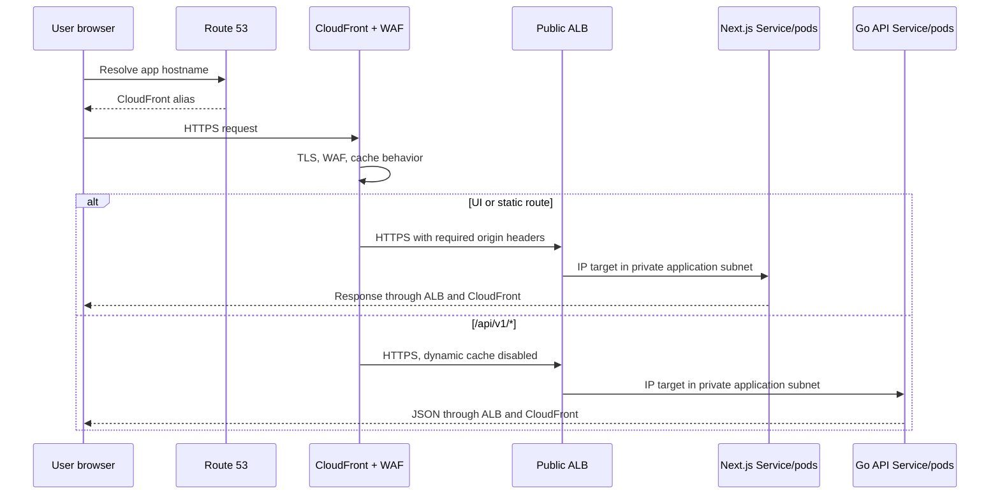

# ClouDesk AWS Networking

## Purpose And Status

This document defines the proposed VPC, subnet, routing, ingress, egress, DNS, and
network-security model for the [AWS target architecture](aws.md). It is a design, not
an existing network.

## Network Principles

- One VPC per cloud environment; no shared production/non-production VPC.
- Three Availability Zones in every staging/production VPC so subnet and placement
  contracts remain stable. Dev may run less capacity but reserves the same subnet
  shape when an AWS VPC exists.
- Public subnets contain only internet-facing ALB nodes and NAT gateways. EKS nodes and
  pods have no public addresses. RDS and optional ElastiCache have no internet route.
- Security groups are the primary stateful control. Kubernetes NetworkPolicy limits
  pod-to-pod flows. NACLs remain simple unless a concrete stateless boundary requires
  a stricter rule set.
- Ingress and egress are explicit, observable, and least-privilege. A private subnet
  is not treated as an authorization boundary by itself.

## Address Plan And Subnets

Use configurable, non-overlapping RFC1918 CIDRs after checking corporate/VPN and
future connectivity ranges. An illustrative allocation is production `10.20.0.0/16`,
staging `10.30.0.0/16`, and dev `10.40.0.0/16`. The production subdivision below shows
the intended relative sizes; it is not a value to copy without IP-capacity analysis.

| AZ | Public subnet | Private application subnet | Isolated data subnet |
| --- | --- | --- | --- |
| A | `10.20.0.0/24` | `10.20.32.0/20` | `10.20.16.0/24` |
| B | `10.20.1.0/24` | `10.20.48.0/20` | `10.20.17.0/24` |
| C | `10.20.2.0/24` | `10.20.64.0/20` | `10.20.18.0/24` |

Application subnets are deliberately larger because the EKS VPC CNI allocates VPC
addresses to pods and rolling updates temporarily increase demand. Capacity planning
must include maximum nodes, pods per node, surge replicas, load-balancer targets,
interface endpoints, and a growth reserve. Prefix delegation or secondary CIDRs are
evaluated before exhaustion; subnet resizing after deployment is not a viable plan.

The RDS DB subnet group and ElastiCache subnet group include all three isolated data
subnets even when a managed service actively occupies only two AZs. Nodes and pods
span the three application subnets. The ALB attaches to all three public subnets.

## Route Tables

| Subnet class | Routes | Purpose |
| --- | --- | --- |
| Public | VPC local routes; `0.0.0.0/0` to the Internet Gateway | Public ALB interfaces and NAT gateways only |
| Private application, production | VPC local routes; `0.0.0.0/0` to the NAT gateway in the same AZ; gateway/interface endpoint routes where applicable | EKS node/pod outbound access without public addresses; same-AZ NAT avoids a cross-AZ dependency and charge |
| Private application, cost-reduced non-production | VPC local routes; default to one shared NAT while accepted, or no default route for an endpoint-only workload | Reduces fixed NAT cost at the explicit expense of zonal egress resilience |
| Isolated data | VPC local routes and only service routes required by managed control planes | No Internet Gateway or NAT default route; RDS and ElastiCache cannot initiate internet traffic |

Production uses one NAT gateway and Elastic IP per AZ. An application subnet never
routes through another AZ's NAT in steady state. Staging may use one NAT by default to
control cost, but must temporarily exercise the three-NAT production pattern for AZ
resilience testing. Dev should avoid a permanent NAT when an endpoint-only or local
workflow is adequate. NAT instances are not proposed: their patching, scaling, failover,
and throughput ownership are disproportionate unless a later measured cost model
proves otherwise.

IPv6 could reduce IPv4/NAT pressure, but dual-stack application, ingress, DNS, provider,
and security validation is deferred. No component should assume that public IPv4
assignment is a scaling strategy.

## Ingress Request Path

Route 53 exposes no direct record for pods or Services. CloudFront is the public
application endpoint; the public ALB is an origin, not an alternate user endpoint.
Its security group accepts 443 only from the CloudFront origin-facing managed prefix
list. The AWS Load Balancer Controller creates ALB listeners and IP target groups from
the reviewed Ingress contract. The default route reaches the Next.js Service and
`/api/v1` reaches the Go API Service. Workers and internal operational endpoints do
not have Ingress rules.

ALB target health uses workload readiness endpoints, not liveness endpoints. Health
paths reveal no dependency details. CloudFront does not cache authenticated or API
responses unless a future endpoint has an explicit public cache contract. Host-header
and path rules have a deny/default action for unexpected hosts or paths.

## Security Group Contract

Security groups should reference other security groups rather than changing CIDR lists
where AWS supports it. Exact ports are finalized with the application and Kubernetes
contracts.

| Security group | Inbound | Outbound |
| --- | --- | --- |
| ALB | TCP 443 from CloudFront origin-facing managed prefix list; no world-open application listener | Web/API target ports to the workload/pod security boundary |
| EKS node baseline | Control-plane and node-to-node traffic required by EKS/CNI; no internet ingress | DNS, endpoints, same-cluster required flows, NAT for allowlisted external dependencies |
| Web workload | Target port from ALB; required internal calls to API only | API Service, DNS, telemetry, and explicitly required OIDC/asset endpoints |
| API workload | Target port from ALB and explicitly approved internal callers | PostgreSQL 5432, optional Redis 6379, HTTPS to VPC endpoints/Cognito/email as required, DNS, telemetry |
| Worker workload classes | No ALB or internet inbound; only cluster health/metrics where required | PostgreSQL, owned SQS endpoints, scoped S3, Secrets Manager, email provider, DNS, telemetry according to role |
| RDS | TCP 5432 only from API and approved worker security groups | Response traffic only; no default internet route |
| ElastiCache | TCP 6379 only from approved API/worker security groups | Response/replication traffic only; no default internet route |
| Interface endpoints | TCP 443 from approved application/node/workload groups | Service-managed responses |

If Security Groups for Pods are adopted, assign groups by workload class without
exhausting ENI/IP capacity. Otherwise, the node security-group boundary is combined
with default-deny Kubernetes NetworkPolicies to distinguish Web, API, worker, and
controller traffic. The platform must test the chosen VPC CNI mode; documentation
must not claim pod-level SG enforcement unless it is actually enabled.

RDS, Redis, S3, and SQS controls complement rather than replace tenant authorization.
A workload that can reach a data service still requires the correct database role,
IAM role, event organization, object prefix, and application permission.

## VPC Endpoints

Endpoints are selected using both security value and total cost. Each interface
endpoint incurs an hourly cost per AZ plus processing, so creating every possible
endpoint can cost more than the NAT traffic it avoids.

| Endpoint | Initial posture | Reason and trigger |
| --- | --- | --- |
| S3 gateway | Use in every AWS VPC | No interface-endpoint hourly charge; keeps ECR layer and application S3 traffic off NAT. Bucket policies must not block authorized browser presigned transfers. |
| ECR API and ECR Docker interface | Production; staging when continuously active | Private image metadata/layer path with S3 gateway; compare endpoint fixed cost with NAT image-pull traffic in dev |
| SQS interface | Production when queue traffic/security posture justifies it | Workers avoid NAT for message traffic; hourly-per-AZ cost may exceed a quiet dev queue |
| Secrets Manager interface | Production when startup/rotation traffic and private-path policy justify it | Removes NAT dependency for secret retrieval; workloads remain Pod-Identity-scoped |
| EKS Auth interface | Production when Pod Identity must work without NAT/internet egress | `com.amazonaws.<region>.eks-auth` keeps Pod Identity Agent credential acquisition private |
| STS interface | Only for documented IRSA exceptions that require a private path | Keeps `AssumeRoleWithWebIdentity` private; affected SDKs must use the regional endpoint |
| CloudWatch Logs/monitoring or managed OTel endpoints | Add for the selected observability backend | Telemetry volume can dominate NAT; endpoint set depends on the chosen backend |
| EC2, EKS, Elastic Load Balancing, SSM | Add only when private bootstrap/controller/administration paths require them | Required set depends on managed node bootstrap and private administration design; validate with a no-NAT test before claiming endpoint-only operation |

Endpoint policies restrict accounts, actions, repositories, queues, buckets, and
secrets where supported. Endpoint DNS is enabled and tested from pods. A service's
interface endpoint does not make the service resource private unless its own resource
policy and identity policy also enforce the intended callers.

## DNS, Certificates, And EKS API Access

Enable VPC DNS support and hostnames. Route 53 owns public application records; a
private hosted zone is added only for a demonstrated internal name contract. Kubernetes
Services use cluster DNS. Application code uses managed service DNS names, never cached
IP addresses for RDS, Redis, SQS, or endpoints.

CloudFront viewer TLS uses an ACM certificate in `us-east-1`, and the ALB origin uses a
certificate in the workload Region. DNS validation records are managed through
Terraform. Certificate issuance/renewal alarms are retained even though ACM performs
managed renewal.

Production enables only the EKS private API endpoint. GitOps reconciliation runs
inside the cluster; routine CI does not need direct Kubernetes API exposure. Human
break-glass access enters through an audited private path using federated roles and
Systems Manager or an approved private access service, with EKS access entries and
short-lived sessions. No permanent public bastion or unrestricted public EKS endpoint
is proposed. If non-production temporarily enables a public endpoint, allowed CIDRs
and access entries are narrow and the difference is recorded.

## Egress Control And Observability

Security groups cannot restrict traffic by internet hostname. Start with the smallest
documented outbound flows, default-deny Kubernetes NetworkPolicies, private AWS service
endpoints, regional SDK endpoints, and separate worker classes so a document worker
does not inherit notification-provider access. A centralized egress proxy or Network
Firewall is deferred until compliance or threat evidence justifies its cost and
operational ownership.

Use VPC Flow Logs with an approved sampling/destination/retention policy, ALB access
logs in a protected bucket when needed, WAF logs with field redaction, NAT metrics,
endpoint metrics, and DNS/query telemetry where justified. Logs must not capture
authorization headers, tokens, presigned URL query strings, or unnecessary personal
data. Alerts focus on rejected flows, NAT errors/port exhaustion, target health,
unusual egress, endpoint failures, and IP exhaustion.

## Failure And Cost Trade-Offs

- Three production NAT gateways preserve zonal egress but add fixed and data-processing
  cost. One staging/dev NAT is an explicit resilience reduction, not production parity.
- Interface endpoints reduce NAT bytes and public-path dependency but multiply fixed
  charges across three AZs. Deploy them from a break-even and threat analysis.
- Cross-AZ calls cost money and consume failure budget. Spread replicas for resilience,
  prefer same-zone routing where supported, and measure rather than compromise
  correctness to eliminate all cross-zone traffic.
- ALB, CloudFront, and WAF form one intentional public path. A second ALB per Web/API
  workload would add cost without an isolation requirement.
- Large application subnets reserve addresses at no direct subnet cost and avoid a
  high-risk renumbering event. Monitor available IPs and ENI allocation before scaling.

## Verification Required During Implementation

Before production, automated and exercise evidence must prove route tables, no-public-IP
node placement, data-subnet isolation, CloudFront-only ALB access, TLS policies, target
health, security-group reachability, default-deny NetworkPolicies, endpoint policies,
Pod Identity through EKS Auth (and regional STS for any IRSA exception), DNS resolution during RDS failover, same-AZ NAT routing,
VPC flow-log delivery, and sufficient IP capacity during a rolling surge and one-AZ
loss. Until that evidence exists, this document is only the proposed network contract.
