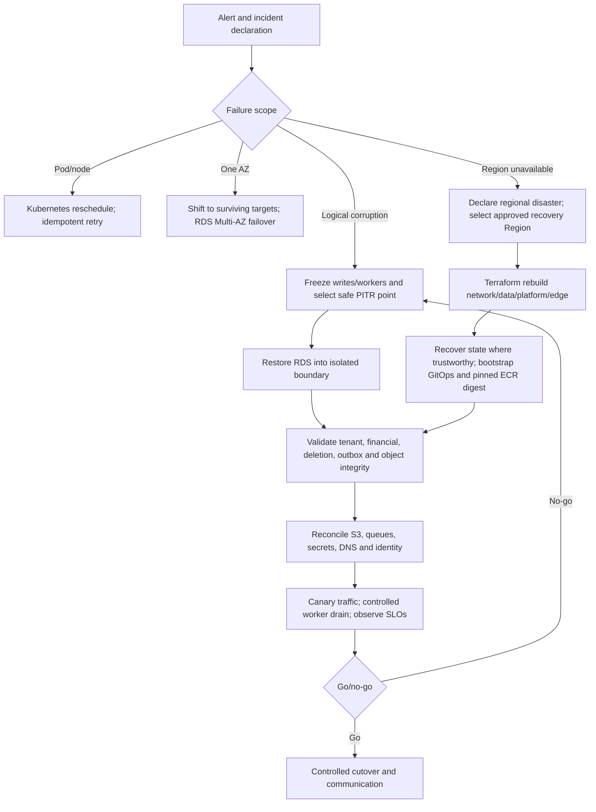

# Proposed Disaster Recovery Plan

## Purpose

Define the planned recovery sources, decision flow, roles, validation steps, and
evidence required before ClouDesk can claim recovery objectives.

## Status, Scope, And Objectives

This is a single-Region recovery design, not an active/active system or guarantee.
Initial proposed objectives are:

- PostgreSQL **RPO: 5–15 minutes**, bounded and proven by PITR configuration and drill;
- recoverable in-Region **RTO: 30–60 minutes**;
- regional RPO/RTO remain **uncommitted until a timed rebuild proves them**.

S3, Terraform state, GitOps, ECR, secrets/KMS, external DNS/identity, and manual
decision time have separate recovery points. The service-level RPO/RTO is the slowest
required dependency, not merely the RDS restore duration. See the architecture-level
[DR boundary](../architecture/disaster-recovery.md) and [backups](backups.md).

## Decision Flow

HA handles pod/node/AZ faults. Do not invoke destructive restore during an ordinary
failover. Logical corruption requires stopping propagation and choosing a point before
the bad write; regional loss requires a reviewed rebuild, not untested DNS failover.

## Recovery Roles And Sources

The incident commander declares disaster and owns go/no-go; database lead selects and
validates PITR; platform lead rebuilds Terraform/EKS/edge; application/domain owners
validate invariants; security controls access/keys/evidence; communications owns
status and customer/legal messaging. The operator performing restore is not the sole
validator.

Authoritative sources are RDS PITR/snapshots for business rows, S3 versions/copies for
objects, reviewed Terraform plus trustworthy state for AWS, Git/Helm/Argo desired
state for Kubernetes, immutable ECR digests for binaries, and Secrets Manager/KMS
procedures for credentials. SQS is transport; PostgreSQL outbox/inbox and reconciliation
decide what must be published or suppressed after restore.

## Recovery Sequence

1. Declare incident; freeze deployments, Terraform applies, migrations, writes, outbox
   publication and consumers as the failure requires. Preserve evidence and time.
2. Determine last-known-good transaction/object/config/release and quantify potential
   loss. Announce that objectives are targets until measurement completes.
3. Restore RDS in isolation; rebuild infrastructure roots in dependency order; recover
   state only after lineage/plan verification; bootstrap GitOps and deploy a verified
   prior digest; obtain/rotate secrets through approved identities.
4. Reapply deletion ledger, validate schema/constraints and sampled tenant/financial
   invariants, reconcile S3 metadata/versions, and identify outbox/SQS/DLQ overlap.
5. Start read-only smoke and synthetic writes, then controlled canary traffic. Resume
   publisher/workers at low concurrency, preserving event IDs/inbox deduplication and
   watching DB/provider budgets.
6. Cut DNS/traffic only after independent go/no-go. Continue integrity monitoring,
   backlog reconciliation and communications; record actual RPO/RTO.

Rollback of a failed recovery returns to isolation/freeze; never alternate production
writers or run two Regions without an explicit write-ownership design.

## Drills And Evidence

Quarterly once production exists: isolated RDS PITR plus S3/state/image/GitOps recovery
and timed application validation. Semiannually: EKS/Argo rebuild and queue reconciliation.
Annually: regional-loss tabletop followed by a sandbox rebuild when cost and access
permit. Each exercise records hypothesis, selected timestamp, versions, achieved RPO/
RTO by phase, data-loss expectation/result, alert/communication timing, security
access, cost, findings, owners and due dates. Failed objectives block external claims.

Multi-Region is reconsidered only for contractual availability, residency, latency,
or measured regional-loss impact. It requires a new ADR covering write ownership,
conflicts, tenant placement, identity, DNS, keys, deletion, queues and repeated
failover/failback evidence.
