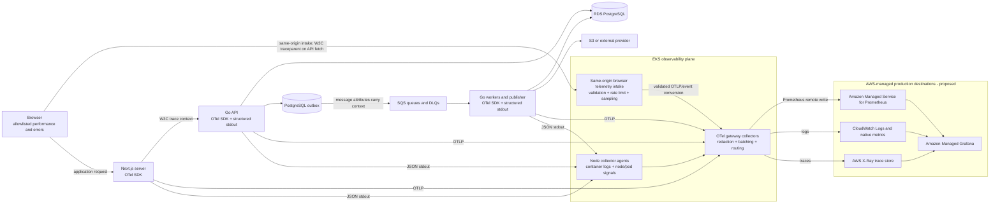

# Proposed Observability Architecture

## Purpose And Status

This document defines the target observability architecture for ClouDesk. Nothing in
this document is implemented or a production claim. OpenTelemetry (OTel) is the
portable instrumentation and transport boundary selected in
[ADR-018](../decisions/ADR-018-opentelemetry-observability.md); backend products may
change without changing application semantics.

Detailed signal contracts live in [logging](logging.md), [metrics](metrics.md), and
[tracing](tracing.md). Proposed objectives, paging policy, and operating procedures
live in [SLIs and SLOs](sli-slo.md), [alerting](alerting.md), and
[runbooks](runbooks.md). The deployment remains the single-Region, Multi-AZ target in
[ADR-013](../decisions/ADR-013-aws-single-region-multi-az.md).

## Outcomes And Non-Goals

The planned system should let an operator:

- follow one browser action through Next.js, the Go API, PostgreSQL, the transactional
  outbox, SQS, a worker, and S3 or an external provider;
- distinguish user impact from infrastructure symptoms with RED, domain, queue,
  database, and platform signals;
- diagnose tenant-scoped incidents without placing customer content or unbounded
  tenant identifiers in metrics;
- detect telemetry loss and cost/cardinality growth without making telemetry a
  runtime dependency; and
- connect every actionable alert to an owned dashboard and runbook.

Observability does not replace the PostgreSQL audit log, business invariants, health
probes, backup evidence, or security controls. A trace is diagnostic evidence, not an
authorization or financial record.

## Signal And Propagation Architecture



The public browser must never reach an in-cluster collector directly. A small
same-origin Next.js intake accepts only an allowlisted schema, enforces body size,
origin, rate, release, and sampling policy, strips cookies/headers/content, and then
exports server-side. Browser trace headers are untrusted correlation input: the API
validates their W3C syntax and sampling flags but never uses them for identity,
authorization, or log severity.

Next.js server instrumentation and Go services export OTLP to a private collector
Service. Applications use bounded batch processors and queues; export timeout,
collector outage, or full buffers drop telemetry with an internal counter instead of
blocking requests, commits, worker acknowledgement, readiness, or shutdown beyond a
small flush budget.

## Collector Topology And Ownership

The production target uses two collector roles:

| Role | Initial shape | Responsibility | Failure behavior |
| --- | --- | --- | --- |
| Node agent | DaemonSet on application nodes | Tail JSON container logs; add trusted Kubernetes resource metadata; collect approved node/pod signals | A missing agent creates a visible per-node signal gap; applications continue. It must not read secrets or arbitrary mounted files. |
| Gateway | At least two replicas behind ClusterIP with spread and a disruption policy | Receive private OTLP, enforce attribute/redaction rules, batch, cap memory/cardinality, route to backends, and expose pipeline health | SDK queues and gateway bounded queues absorb short interruption; oldest/drop/export-failure signals alert. It never becomes a readiness dependency. |

Gateways use memory limiting before batching, explicit per-exporter timeouts, bounded
retry with jitter, bounded sending queues, and disk-backed queueing only if its data
classification, encryption, eviction, and node-loss behavior are approved. Unlimited
retry or unbounded disk is prohibited. Collection of Kubernetes metadata uses a
dedicated read-only service account; AWS export uses a dedicated least-privilege
workload identity. The platform integration must use whichever workload-identity
mechanism is selected consistently for the cluster; no static AWS keys are permitted.

Collector configuration is versioned, rendered and validated in CI, promoted through
GitOps, and tested with synthetic canary telemetry. A canary periodically emits a
known log, metric, and trace and verifies each destination; SDK success alone does not
prove that data is queryable.

## Instrumentation By Runtime

### Browser And Next.js

- Instrument only route/navigation timing, Core Web Vitals, rendering failures, and
  selected critical query/mutation outcomes. Do not capture DOM text, form values,
  URLs with arbitrary query strings, replay sessions, or network bodies.
- Use a parent-based sampling decision and send W3C `traceparent`/`tracestate` only to
  the same-origin ClouDesk API. Never propagate to presigned S3 URLs, Cognito, email,
  analytics, or other third-party origins.
- Next.js server spans cover request routing, server rendering, generated API-client
  calls, and the safe telemetry intake. Route templates replace organization slugs,
  record IDs, and query values.
- Browser failures retain the API `requestId` for support. Source maps are private,
  release-scoped, access controlled, and excluded from public images.

### Go API, Publisher, And Workers

- Standard HTTP middleware creates the server span after request-ID validation and
  records route template, method, safe status/error code, service, release, and
  environment. Expected `4xx` results are not exception events.
- pgx/database instrumentation records operation class and a normalized query name or
  fingerprint. SQL text, bind values, table rows, and tenant/customer content are
  forbidden.
- AWS SDK spans cover SQS, S3, Secrets Manager, and provider adapter boundaries with
  safe service/operation/region attributes. S3 keys, presigned URLs, message bodies,
  receipt handles, and secrets are excluded.
- Application services add spans only around meaningful use cases or state changes;
  they do not create one span per helper function.
- SQS producers inject valid W3C context into message attributes. Consumers start a
  new processing trace/span linked to the producer context as specified in
  [tracing](tracing.md), preserving event, correlation, and causation IDs separately.

## Resource And Attribute Contract

Every server-side signal carries low-cardinality resource attributes:

```text
service.name
service.namespace = clouddesk
service.version = immutable release/digest identifier
deployment.environment.name = local|dev|staging|production
cloud.provider = aws                  # cloud only
cloud.region                         # cloud only
k8s.cluster.name / k8s.namespace.name / k8s.deployment.name / k8s.pod.name
```

Signal-specific fields may include `http.route`, `error.type`/stable `error_code`,
`messaging.destination.name`, `messaging.operation`, and a bounded worker/job class.
Raw `organization_id`, `user_id`, record IDs, request IDs, event IDs, trace IDs, pod
UIDs, S3 keys, URL paths, SQL text, exception messages, and queue message IDs are never
metric labels. Selected correlation IDs may appear in access-controlled logs and
traces under the rules in [logging](logging.md).

## Sampling, Retention, Cardinality, And Cost

Initial trace sampling is parent-based and deterministic by trace ID: high in local
and staging, and a small configurable baseline in production. Critical workflows may
use a reviewed higher head-sampling rate. Head sampling cannot retroactively retain
an error whose trace was dropped; therefore logs and metrics remain the complete
error accounting source. Tail sampling is deferred until volume justifies its
operational cost and all spans can be routed consistently through a capacity-tested
collector tier.

Retention is data-class and environment specific. The implementation decision must
set, at minimum, shorter high-volume application-log/trace retention, longer SLO
metric retention, and policy-owned security/audit retention. The database audit log
is governed independently. Quotas enforce daily ingested bytes, active time series,
trace spans, log groups, query cost, and per-service contribution; crossing 80% of a
budget warns before dropping or throttling.

Metric label additions and log/trace attribute additions require review against a
cardinality and privacy budget. Unknown attributes are dropped at the gateway, not
automatically forwarded. Emergency cost control raises trace/log sampling or reduces
debug detail; it never drops SLO counters, security alerts, backup status, or
telemetry-pipeline health silently.

## Backend Decision And Trade-Offs

The proposed first production backend is AWS managed: Amazon Managed Service for
Prometheus (AMP) for application/Prometheus metrics, Amazon Managed Grafana (AMG) for
dashboards, CloudWatch Logs and native AWS metrics, and X-Ray for traces. OTel remains
the only application instrumentation contract. This is a reversible operational
choice, not permission to add vendor APIs to domain code.

| Option | Advantages | Costs and risks | ClouDesk position |
| --- | --- | --- | --- |
| AWS managed: AMP + AMG + CloudWatch + X-Ray | No Prometheus/Loki/Grafana/trace-store clusters to patch or back up; AWS metrics/IAM integration; smaller initial on-call surface | Several query languages and billing models; cross-signal UX is less uniform; ingestion/query costs and AWS coupling at exporter/configuration layer | **Proposed production starting point.** Use budgets, retention caps, and dashboard links to bridge signals. |
| Self-managed Prometheus + Grafana + Loki, plus a trace store such as Tempo | One Grafana-centered experience, portable stack, direct tuning and potentially lower cost at sustained predictable scale | ClouDesk owns HA, storage, upgrades, sharding, compaction, query protection, tenant/security isolation, backups, and the observability stack's own incidents | Use locally or in a bounded evaluation; do not make it the first production stateful platform without a named team and measured cost advantage. Loki is not a trace store. |
| Fully hosted third-party observability | Fast onboarding, integrated search/analytics and support | Data-egress/privacy review, per-seat/ingest cost, vendor contract and lock-in | Reconsider when operational value and total cost are measured; OTel keeps migration possible. |

A formal backend review is required before M11 implementation because pricing,
regional availability, retention, and team skills are time-sensitive. The review must
compare representative bytes/series/spans, query performance, IAM/data residency,
on-call burden, recovery behavior, and exit cost. It may change destinations without
reopening ADR-018.

## Staged Adoption

| Stage | Required capability |
| --- | --- |
| Local V1 | Structured console logs, local OTel collector, developer-visible traces/metrics, deterministic correlation tests; no AWS dependency. |
| M10 async foundation | Stable request/event/correlation IDs, outbox/SQS/worker metrics, async trace links, and redaction tests. |
| M11 observability | SDKs, collector configs, destination evaluation, dashboards, proposed SLO recording rules, alert-rule tests, and telemetry-failure drills. |
| Staging/EKS | Agent/gateway topology, AWS exporters, three-AZ scheduling, synthetic telemetry canary, representative sampling/cardinality and cost load. |
| Production readiness | Valid SLI data, alert routing and runbooks, retention/access policy, owner rotation, cost ceilings, and a proven collector/backend outage path. |

No SLO target becomes an external promise merely because a dashboard can calculate
it. Production objectives require an owner, a valid-data review, an error-budget
policy, and measured evidence.

