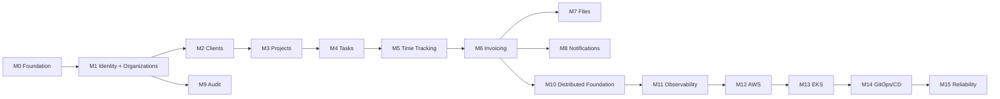

# ClouDesk Incremental Implementation Plan

## Purpose

This is the proposed implementation sequence after the architecture is explicitly approved. It is not evidence that implementation has started. Detailed milestone acceptance and risks live in [milestones](milestones.md).

## Delivery Rules

- Finish one vertical slice with tests and operational evidence before adding the next.
- Protect tenant isolation, authorization, and financial invariants from M1 onward.
- Keep the local system simple; infrastructure phases consume tested application contracts.
- Add a dependency only with an owner, failure policy, observability, and ADR.
- Use expand-and-contract migrations and backward-compatible OpenAPI/events after any shared environment exists.

## Phase 1: Local Application

M0 through M6 establish repository conventions, local development, identity/organizations, clients, projects, tasks/comments, time tracking, and basic invoicing. PostgreSQL and a local OIDC-compatible provider are the only required stateful foundations. Before SQS arrives in M10, a bounded local worker processes durable PostgreSQL `outbox_deliveries` behind the planned broker port; in-process fakes remain test doubles only and never replace the durable application path.

## Phase 2: Production Engineering Foundation

M7 through M11 add S3-compatible files and notifications, mature the minimal audit/idempotency/outbox foundations introduced in M1, add the SQS publisher/consumer/inbox/DLQ runtime, and instrument OpenTelemetry. Redis remains absent until a measured cache or distributed rate-limit need exists.

## Phase 3: AWS

M12 and M13 provision the staged AWS and EKS target with Terraform: network, IAM, RDS, S3, ECR, optional ElastiCache, cluster, workloads, and workload identity. Dev cost must remain intentionally lower than production.

## Phase 4: Platform Maturity

M14 introduces immutable image promotion, Helm, Argo CD, environment policy, autoscaling, dashboards, and alerts. Rolling deployments are the default; canary remains deferred.

## Phase 5: Reliability Engineering

M15 validates SLOs, load, soak, failover, backlog, chaos, restore, and runbooks. Canary and automated rollback are enabled only if telemetry and traffic make decisions reliable.

## Critical Path

## First Implementation Milestone

Begin with **M0 — Repository Foundation**. It should create a runnable but behavior-light local skeleton, CI feedback, contract locations, migration tooling, and architecture tests. Do not combine M0 with authentication or production infrastructure; its value is making every later slice repeatable and verifiable.

## Change Control

Before execution, translate the selected milestone into the repository's `/think` plan and approve it before `/forge`. Revisit ADRs when evidence contradicts a decision; do not silently drift from this architecture.
