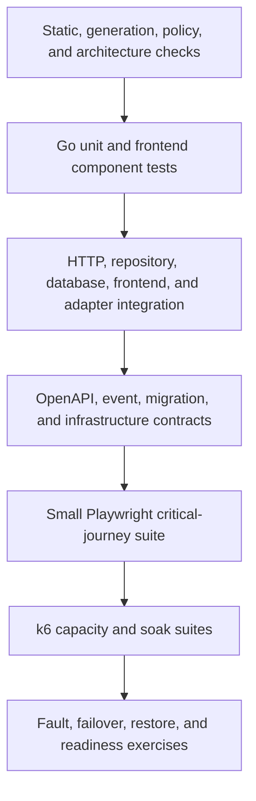

# Proposed Testing And Quality Strategy

## Purpose And Status

This document defines the planned quality model for ClouDesk. The repository is
currently documentation-only, so no suite, fixture, tool, threshold, or production
gate described here is implemented evidence. The strategy follows the proposed
[Go backend](../architecture/backend.md), [frontend](../architecture/frontend.md),
[OpenAPI contract](../api/openapi.md), [data model](../architecture/data-model.md),
[tenant boundary](../architecture/multi-tenancy.md), and
[production-readiness checklist](../roadmap/production-readiness.md).

The objective is risk reduction, not a maximum test count. Each behavior is proven at
the lowest layer that can observe the relevant failure, then repeated at a real
boundary when serialization, persistence, authorization, concurrency, deployment, or
recovery is part of the risk.

## Quality Principles

- Test observable outcomes and durable invariants, not private functions or generated
  implementation details.
- Treat authentication, authorization, `organization_id`, money, invoice history,
  timer uniqueness, idempotency, event deduplication, and migration compatibility as
  release-blocking correctness boundaries.
- Use hand-written fakes for application-owned ports in unit tests; use real
  PostgreSQL and faithful service adapters where integration semantics matter.
- Every negative test first establishes that the fixture really contains the foreign,
  forbidden, stale, duplicate, or conflicting state it intends to exercise.
- Keep tests deterministic: controlled clocks and IDs, explicit time zones, isolated
  databases, bounded waits, and polling on state rather than arbitrary sleeps.
- A retry may collect diagnostics, but a pass only after retry remains a flake. A
  quarantined test cannot silently remove a production gate; it needs an owner,
  issue, expiry, and equivalent temporary control.
- Synthetic data contains no copied customer data or production credentials. Test
  output, Playwright traces, k6 logs, and failure dumps follow the same secret and PII
  redaction policy as production telemetry.
- Coverage percentage is a diagnostic, not proof. The gate is explicit behavior and
  branch coverage for the changed risk, with mutation or property testing considered
  for compact financial and state-machine rules.

## Risk Matrix And Required Evidence

| Risk class | Representative ClouDesk behavior | Minimum evidence before merge | Additional evidence before production |
| --- | --- | --- | --- |
| Critical | Cross-tenant access, permission escalation, session/CSRF bypass, invoice totals/numbering/immutability, one active timer, idempotent acceptance, destructive migration or restore | Unit/domain rule plus real PostgreSQL/HTTP negative integration; contract evidence for public behavior; independent review for security or financial boundaries | Staging E2E where user-visible, concurrent/load proof, fault or restore exercise, and current security evidence |
| High | Outbox/inbox, worker crash recovery, files/presigned URLs, audit append-only behavior, IAM, Kubernetes rollout/probes, Terraform state and data-store policy | Boundary integration with duplicate/failure cases; static/policy checks; representative component or E2E journey | Staging provider/sandbox evidence, backlog/failover/disruption exercise, alerts and runbook validation |
| Medium | Tenant-scoped CRUD, pagination/filtering, forms, optimistic UI, reporting queries, notifications | Unit/component coverage plus HTTP/repository or frontend integration | Critical-journey E2E and representative performance evidence when the path affects an SLO |
| Low | Pure formatting, static presentation, documentation, non-behavioral refactors | Static checks, focused unit/component test, or documented inspection | No broader gate unless blast radius or dependency changes increase the risk |

Risk is assigned to the changed behavior, not the filename. A one-line query that
removes tenant scope is critical; a large internal refactor with unchanged boundaries
may be medium.

## Layered Test Model

The broad lower layers run frequently. Browser, performance, chaos, and restore tests
remain intentionally smaller and scenario-driven. They do not compensate for missing
unit or integration evidence.

| Level | Purpose and scope | Fixture boundary | CI placement | Release signal |
| --- | --- | --- | --- | --- |
| Static and generation | Format, lint, strict types, `go vet`, architecture imports, generated drift, schema and policy checks | Clean checkout with pinned tools and lock files | Every pull request | Any failure blocks merge |
| Go unit/application | Domain state machines, money, permissions, parsers, orchestration with narrow fakes | In-memory builders, deterministic clock/ID, no network | Every pull request; `-race` on concurrency packages and scheduled full run | Changed critical behavior must have direct passing cases |
| Frontend component | Accessible rendering, form behavior, permission projection, errors, optimistic rollback | DOM plus typed data builders; no real backend | Every pull request | Changed interaction states and accessibility assertions pass |
| HTTP/frontend integration | Middleware, generated transport, server/client state, schema errors, auth and tenant disclosure | Real handler or UI runtime; HTTP boundary stub only where the backend is not the subject | Every pull request, sharded | Public behavior and negative paths pass without hidden implementation mocks |
| Repository/database | SQL, constraints, RLS, locks, transactions, migrations, query plans | Migrated PostgreSQL Testcontainer using runtime roles and two or more tenants | Every pull request for affected modules; full suite after merge/nightly | No isolation, integrity, or concurrency violation; migration is repeatable |
| Contract | OpenAPI 3.1, generated Go/TS clients, event envelopes, compatibility, Helm/Terraform/module interfaces | Versioned schema and examples; clean regeneration | Every pull request | Drift or incompatible change blocks merge unless the approved versioning process is followed |
| End-to-end | Cross-boundary user journeys and browser security/accessibility behavior | Isolated app, database, local OIDC, queue/object adapters; per-role browser contexts | PR smoke for changed critical journeys; full suite after merge and on release candidate | Critical journey failures or flakes block promotion |
| Performance | Capacity, latency, saturation, fairness, concurrency and backlog recovery | Production-shaped staging with synthetic representative data | Script smoke in PR; scheduled baseline; release candidate and material topology changes | Approved budgets and exact invariants pass; regressions require disposition |
| Reliability and DR | Crash safety, probes, rollout, dependency failure, RDS failover, restore and rebuild | Production-shaped staging or isolated recovery account; never an unscoped shared target | Scheduled game days and pre-production gate | Hypothesis, recovery, data-loss, alert, and runbook expectations all pass |

Detailed responsibilities live in [backend](backend.md), [frontend](frontend.md),
[integration](integration.md), [E2E](e2e.md), [performance](performance.md), and
[reliability](reliability.md).

## Canonical Fixture Model

All suites derive from versioned builders rather than a large opaque database dump.
The minimum scenario contains:

- organizations A and B with deliberately similar names and similarly shaped
  clients, projects, tasks, files, invoices, cursors, and events;
- one user who is an active member of both organizations, one user belonging only to
  A, one belonging only to B, and suspended/revoked memberships;
- OWNER, ADMIN, MANAGER, MEMBER, and VIEWER memberships with the canonical permission
  mapping;
- restricted and ordinary projects, a global active-timer candidate, billable and
  non-billable entries, draft/issued/sent/void invoice fixtures, and immutable history;
- incomplete/quarantined/ready file states; pending/succeeded/failed jobs; duplicate,
  stale, out-of-order, malformed, and tenant-mismatched event envelopes;
- valid, expired, revoked, wrong-issuer, wrong-audience, and CSRF-invalid session
  material generated only from local test keys.

Builders accept an explicit organization and refuse to infer a default tenant for a
tenant-owned resource. Cross-tenant references require an intentionally named unsafe
fixture helper so the negative setup is visible in review. Time is fixed at an RFC
3339 UTC instant and tests explicitly select IANA zones for DST behavior. Currency
fixtures include zero-decimal and fractional-rate cases without using floating point.

Database tests normally receive an isolated database or schema migrated from empty.
Tests of commits, locks, pool context, crashes, and concurrent clients must not hide
behavior inside a rollback-only test transaction. Browser workers receive unique
tenant/user namespaces and their own storage state. Cleanup is bounded, verified, and
must never target a non-test account, bucket, queue, database, or hostname.

## Pipeline Placement

### Developer And Pull Request

Run affected format/lint/type/generation checks, Go unit/HTTP tests, frontend
component/integration tests, affected PostgreSQL Testcontainer suites, OpenAPI/event
contracts, migration checks, Terraform/Helm/Kubernetes policy checks, and a narrow
Playwright smoke when a critical journey changes. Parallel jobs publish JUnit-style
results and sanitized artifacts. Merge requires all mandatory jobs from a clean
checkout.

### Main/Dev And Nightly

Run the full race-enabled Go suite, complete database and worker integration,
cross-platform generation drift, all Playwright projects, dependency/container
scans, migration upgrades from the supported previous release, k6 baseline, and
scheduled fuzz/property corpora. Nightly failures open an owned release-blocking
finding when they affect the current candidate; they are not normalized as expected.

### Release Candidate In Staging

Promote one immutable digest and run deployment smoke, migrations, critical E2E,
production-shaped k6 load/burst/backlog, graceful termination, rolling rollback,
tenant/IAM denial probes, and the reliability experiments appropriate to the change.
The same digest, schema artifact, Helm templates, and Terraform module revision are
the candidate for production.

### Production

Run only bounded, non-destructive post-deploy smoke and telemetry checks by default.
Active load, chaos, failover, or restore tests require a separately scoped operational
exercise with abort controls; production is not the first environment in which an
experiment runs.

## Evidence And Flake Policy

Each gate records the source revision and immutable artifact digest, environment and
configuration revision, suite/tool versions, exact command, start/end time, test and
fixture version, result, sanitized logs/artifacts, and links to metrics or traces.
Performance and reliability evidence additionally records workload, data scale,
hypothesis, abort thresholds, observed recovery, data checks, and alert timing.

Tests use bounded condition polling and deterministic ownership, not arbitrary long
sleeps. A flaky critical test blocks promotion until fixed or until an explicitly
owned temporary control proves the same risk. Retry counts are reported separately;
they never convert instability into a green quality signal.

## Production Go/No-Go Gates

Production promotion remains blocked until current evidence proves all of the
following for the candidate and target configuration:

1. Required static, unit, component, HTTP, repository/database, OpenAPI/event, and
   critical Playwright suites pass from a clean checkout.
2. Every protected route and job has explicit authentication, permission, tenant,
   foreign-parent, and disclosure-negative coverage; actual runtime database roles
   prove RLS context set/reset behavior.
3. Repeated and concurrent timer/invoice/idempotency commands cause exactly the
   documented committed effect, audit fact, outbox delivery, and response replay.
4. Fresh and previous-release migration paths, resumable backfills, mixed-version
   compatibility, application rollback, and delayed contraction are proven against
   representative data.
5. Terraform, Helm, Kubernetes, IAM, secret, image, dependency, and policy gates pass;
   sandbox or staging evidence proves selected denial paths and actual cloud controls.
6. Approved normal, burst, sustained, soak, report, invoice, concurrent-timer, and
   backlog budgets pass without unbounded memory, goroutine, connection, lock, queue,
   or telemetry growth.
7. Required pod/worker/node/dependency/RDS experiments and a timed restore demonstrate
   the documented no-loss boundary, readiness behavior, alerting, and runbook steps.
8. Residual failures have named owners and an explicit go-live disposition; no
   unresolved critical or high security, tenant, data-integrity, migration, or
   recoverability defect is accepted implicitly.

## Ownership And Evolution

Feature owners maintain unit, component, HTTP, and repository coverage with their
code. API owners maintain OpenAPI generation and compatibility. Platform owners
maintain Terraform, Helm, Kubernetes, deployment, and sandbox tests. Security owns
the threat-derived negative matrix and scanner triage policy. SRE/platform owns k6,
chaos, failover, restore, alerts, and runbook exercises, with domain owners validating
business invariants.

M0 selects and pins exact test tool versions through compatibility fixtures. Proposed
defaults are Go's standard test tooling, Testcontainers for PostgreSQL, Vitest plus
Testing Library for React, MSW at the frontend HTTP boundary, Playwright for browser
flows, and k6 for performance. A tool may change when the spike shows incompatibility;
the risk coverage and release signals in this strategy may not be weakened silently.
